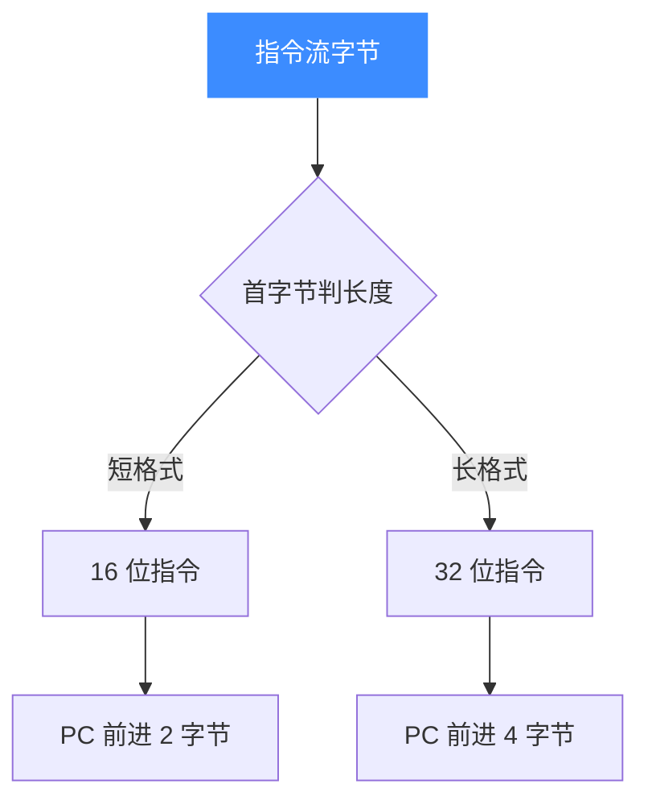

# TriCore 指令与特性

本页介绍 TriCore 指令集的关键特性——**16/32 位混合变长指令**，以及如何用 [UC_HOOK_CODE](/hooks/code) 单步观察每条指令的执行。读完你能理解为什么同一段代码里指令长度不一，并能给引擎挂上逐指令回调。

## 🧩 变长指令：16 位与 32 位混合

TriCore 为提高代码密度，采用**混合长度编码**：常用指令有 16 位短格式，复杂或需要大立即数的指令用 32 位格式。二者可在同一指令流中自由交替，反汇编器需按操作码首字节判断本条指令占几个字节。



以官方示例 `sample_tricore.c` 的机器码为例：

| 机器码字节 | 汇编 | 长度 |
|------------|------|------|
| `82 11` | `mov d1, #0x1` | 16 位 |
| `bb 00 00 08` | `mov.u d0, #0x8000` | 32 位 |

`mov d1, #0x1` 用 2 字节把小立即数写入 D1；`mov.u d0, #0x8000` 需要 16 位无符号立即数，因此用 4 字节的 32 位格式。两条指令紧邻，正体现了变长混排。

## 🪝 用 UC_HOOK_CODE 单步观察

`UC_HOOK_CODE` 会在**每条指令执行前**回调，把当前地址与指令长度（`size`）交给你——这正好用来观察变长指令：短指令 `size=2`，长指令 `size=4`。

```c
#include <unicorn/unicorn.h>

static void hook_code(uc_engine *uc, uint64_t address, uint32_t size,
                      void *user_data)
{
    printf(">>> 执行指令 @ 0x%" PRIx64 ", 指令长度 = 0x%x\n",
           address, size);
}

// ... uc_open(UC_ARCH_TRICORE, UC_MODE_LITTLE_ENDIAN, &uc) 之后 ...
uc_hook trace;
uc_hook_add(uc, &trace, UC_HOOK_CODE, hook_code, NULL,
            ADDRESS, ADDRESS + code_size);
```

::: tip size 字段揭示指令边界
在 TriCore 上，`hook_code` 的 `size` 参数会随指令格式在 2 与 4 之间变化。把它打印出来即可直观看到 16/32 位指令交替出现。
:::

## 🧠 立即数加载示例走读

以 `mov.u d0, #0x8000` 为例：`mov.u` 把一个 16 位无符号立即数装入数据寄存器的低半部并零扩展。执行后 `D0 = 0x00008000`。你可以在仿真结束后读回验证：

```c
uint32_t d0 = 0;
uc_reg_read(uc, UC_TRICORE_REG_D0, &d0);
printf(">>> d0 = 0x%x\n", d0);   // 预期 0x8000
```

::: warning 越界与非法指令
若给 `uc_emu_start` 的结束地址正好落在一条长指令中间，或代码区未映射足够内存，引擎会因取指越界返回错误。确保映射区覆盖全部机器码，并按指令边界设置起止地址。
:::

## 📂 相关源码

| 文件 | 角色 |
|------|------|
| [`include/unicorn/tricore.h`](https://github.com/android-security-engineer/unicorn-skills/blob/master/include/unicorn/tricore.h#L32) | `UC_TRICORE_REG_*` 寄存器枚举与 `uc_cpu_*` CPU 型号定义 |
| [`qemu/target/tricore/unicorn.c`](https://github.com/android-security-engineer/unicorn-skills/blob/master/qemu/target/tricore/unicorn.c) | 后端：`reg_read`/`reg_write`/`uc_init` 等函数指针实现 |
| [`qemu/target/tricore/translate.c`](https://github.com/android-security-engineer/unicorn-skills/blob/master/qemu/target/tricore/translate.c) | 前端：机器码翻译（TCG） |
| [`samples/sample_tricore.c`](https://github.com/android-security-engineer/unicorn-skills/blob/master/samples/sample_tricore.c) | 该架构的 C 示例程序 |
| [`include/unicorn/unicorn.h`](https://github.com/android-security-engineer/unicorn-skills/blob/master/include/unicorn/unicorn.h#L108) | `UC_ARCH_TRICORE` 架构常量与 `UC_MODE_*` 公共模式定义 |

## 相关页面

- [UC_HOOK_CODE 逐指令回调](/hooks/code)
- [TriCore 实战示例](/arch/tricore/example)
- [TriCore 寄存器参考](/arch/tricore/registers)
- [TriCore 架构概览](/arch/tricore/)
