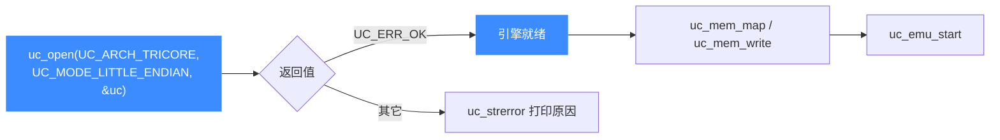
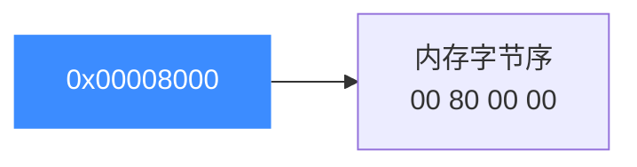

# TriCore 模式与字节序

本页说明打开 TriCore 引擎时该传什么 `mode`：TriCore 使用**小端**字节序（`UC_MODE_LITTLE_ENDIAN`）。读完你能正确调用 [uc_open](/api/open) 并理解字节序对内存读写的影响。

## ⚡ 一张表看懂

| 维度 | TriCore 取值 | 说明 |
|------|--------------|------|
| 架构常量 | [`UC_ARCH_TRICORE`](https://github.com/android-security-engineer/unicorn-skills/blob/master/include/unicorn/unicorn.h#L108) | 传给 `uc_open` 的第一个参数 |
| 字节序 | `UC_MODE_LITTLE_ENDIAN` | 小端 |
| 位宽 | 32 位 | 由架构隐含，无需在 mode 中另行指定 |

## 🧩 打开流程



## 🔧 代码示例

```c
#include <unicorn/unicorn.h>

uc_engine *uc;
uc_err err = uc_open(UC_ARCH_TRICORE, UC_MODE_LITTLE_ENDIAN, &uc);
if (err != UC_ERR_OK) {
    printf("uc_open 失败: %s\n", uc_strerror(err));
    return -1;
}
// 引擎已按小端配置，后续内存读写按小端解释多字节数据
uc_close(uc);
```

## 🧠 小端意味着什么

小端（little-endian）指多字节整数在内存中**低位字节存放在低地址**。例如 32 位值 `0x00008000` 写入内存时的字节顺序为 `00 80 00 00`。这解释了为什么示例代码里 `mov.u d0, #0x8000` 的机器码字节排列是低位在前。



::: tip 与 M68K/大端架构的区别
TriCore 是小端，而 M68K、部分 PPC/MIPS 配置是大端。跨架构移植字节缓冲区时务必确认字节序，否则读到的多字节数值会高低位颠倒。详见 [字节序](/features/endianness)。
:::

::: warning 不要臆造 mode 位
对 TriCore 而言位宽由架构固定，无需（也不应）在 `mode` 里叠加 `UC_MODE_32` 之类的位。按示例传 `UC_MODE_LITTLE_ENDIAN` 即可。
:::

## 📂 相关源码

| 文件 | 角色 |
|------|------|
| [`include/unicorn/tricore.h`](https://github.com/android-security-engineer/unicorn-skills/blob/master/include/unicorn/tricore.h#L32) | `UC_TRICORE_REG_*` 寄存器枚举与 `uc_cpu_*` CPU 型号定义 |
| [`qemu/target/tricore/unicorn.c`](https://github.com/android-security-engineer/unicorn-skills/blob/master/qemu/target/tricore/unicorn.c) | 后端：`reg_read`/`reg_write`/`uc_init` 等函数指针实现 |
| [`qemu/target/tricore/translate.c`](https://github.com/android-security-engineer/unicorn-skills/blob/master/qemu/target/tricore/translate.c) | 前端：机器码翻译（TCG） |
| [`samples/sample_tricore.c`](https://github.com/android-security-engineer/unicorn-skills/blob/master/samples/sample_tricore.c) | 该架构的 C 示例程序 |
| [`include/unicorn/unicorn.h`](https://github.com/android-security-engineer/unicorn-skills/blob/master/include/unicorn/unicorn.h#L108) | `UC_ARCH_TRICORE` 架构常量与 `UC_MODE_*` 公共模式定义 |

## 相关页面

- [字节序（Endianness）](/features/endianness)
- [uc_open](/api/open)
- [TriCore 架构概览](/arch/tricore/)
- [TriCore 寄存器参考](/arch/tricore/registers)
