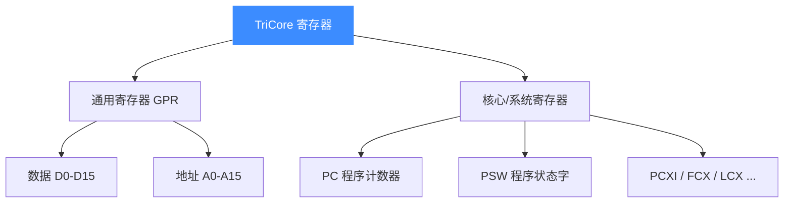

# TriCore 寄存器参考

本页列出 Unicorn 中 TriCore 的寄存器及其 `UC_TRICORE_REG_*` 常量：包括数据寄存器 D0-D15、地址寄存器 A0-A15，以及 PC、PSW 等核心/系统寄存器。读完你能用 [uc_reg_read](/api/reg-read) / `uc_reg_write` 正确读写任意 TriCore 寄存器。

## 🧩 寄存器分组一览



所有常量的权威来源是 [`include/unicorn/tricore.h`](https://github.com/android-security-engineer/unicorn-skills/blob/master/include/unicorn/tricore.h) 中的 `uc_tricore_reg` 枚举。以下表格中的常量名与该枚举一一对应，**不存在的寄存器不会出现在此**。

## 📥 数据寄存器（Data GPR）

16 个 32 位数据寄存器，用于算术逻辑运算。

| 寄存器 | 常量 | 说明 |
|--------|------|------|
| D0-D15 | `UC_TRICORE_REG_D0` … `UC_TRICORE_REG_D15` | 通用数据寄存器 |
| D15 别名 | `UC_TRICORE_REG_ID` | `= UC_TRICORE_REG_D15`（隐式数据寄存器） |

## 📤 地址寄存器（Address GPR）

16 个 32 位地址寄存器，用于指针与访存寻址；部分带有专用别名。

| 寄存器 | 常量 | 别名常量 | 用途 |
|--------|------|----------|------|
| A0 | `UC_TRICORE_REG_A0` | `UC_TRICORE_REG_GA0` | 全局地址寄存器 |
| A1 | `UC_TRICORE_REG_A1` | `UC_TRICORE_REG_GA1` | 全局地址寄存器 |
| A8 | `UC_TRICORE_REG_A8` | `UC_TRICORE_REG_GA8` | 全局地址寄存器 |
| A9 | `UC_TRICORE_REG_A9` | `UC_TRICORE_REG_GA9` | 全局地址寄存器 |
| A10 | `UC_TRICORE_REG_A10` | `UC_TRICORE_REG_SP` | 栈指针 SP |
| A11 | `UC_TRICORE_REG_A11` | `UC_TRICORE_REG_LR` | 返回地址 LR |
| A15 | `UC_TRICORE_REG_A15` | `UC_TRICORE_REG_IA` | 隐式地址寄存器 |
| 其余 | `UC_TRICORE_REG_A2` … `UC_TRICORE_REG_A14` | — | 通用地址寄存器 |

::: tip 别名与本体是同一个寄存器
`UC_TRICORE_REG_SP` 与 `UC_TRICORE_REG_A10` 在头文件里是同一枚举值，读写任一个效果相同。别名只是让代码更易读。
:::

## 🧠 核心与系统寄存器（节选）

| 寄存器 | 常量 | 说明 |
|--------|------|------|
| PC | `UC_TRICORE_REG_PC` | 程序计数器 |
| PSW | `UC_TRICORE_REG_PSW` | 程序状态字 |
| PCXI | `UC_TRICORE_REG_PCXI` | 上一上下文信息 |
| FCX | `UC_TRICORE_REG_FCX` | 空闲上下文列表头指针 |
| LCX | `UC_TRICORE_REG_LCX` | 上下文列表限界指针 |
| ISP | `UC_TRICORE_REG_ISP` | 中断栈指针 |
| BTV | `UC_TRICORE_REG_BTV` | 陷阱向量基址 |
| BIV | `UC_TRICORE_REG_BIV` | 中断向量基址 |
| SYSCON | `UC_TRICORE_REG_SYSCON` | 系统配置 |

::: details 更多系统寄存器
头文件还定义了 PSW 标志缓存（`UC_TRICORE_REG_PSW_USB_C/V/SV/AV/SAV`）、内存保护寄存器（`DPR*`/`CPR*`/`DPM*`/`CPM*`）、MMU 寄存器（`UC_TRICORE_REG_MMU_CON` 等）以及调试寄存器（`UC_TRICORE_REG_DBGSR`、`UC_TRICORE_REG_CCNT` 等）。完整清单以 [`include/unicorn/tricore.h`](https://github.com/android-security-engineer/unicorn-skills/blob/master/include/unicorn/tricore.h) 为准。
:::

## 🔧 读写寄存器示例

```c
#include <unicorn/unicorn.h>

uint32_t d0 = 0, d1 = 0;

// 写入初值到 D1
uint32_t init = 0x1;
uc_reg_write(uc, UC_TRICORE_REG_D1, &init);

// 运行后读回结果
uc_reg_read(uc, UC_TRICORE_REG_D0, &d0);
uc_reg_read(uc, UC_TRICORE_REG_D1, &d1);
printf("d0=0x%x d1=0x%x\n", d0, d1);

// 读栈指针（A10 的别名 SP）
uint32_t sp = 0;
uc_reg_read(uc, UC_TRICORE_REG_SP, &sp);
```

::: warning 寄存器宽度
TriCore 的 D/A 寄存器均为 32 位，读写时对应 `uint32_t`。传入过小或过大的缓冲区会导致读写越界或数据被截断。
:::

## 📂 相关源码

| 文件 | 角色 |
|------|------|
| [`include/unicorn/tricore.h`](https://github.com/android-security-engineer/unicorn-skills/blob/master/include/unicorn/tricore.h#L32) | `UC_TRICORE_REG_*` 寄存器枚举与 `uc_cpu_*` CPU 型号定义 |
| [`qemu/target/tricore/unicorn.c`](https://github.com/android-security-engineer/unicorn-skills/blob/master/qemu/target/tricore/unicorn.c) | 后端：`reg_read`/`reg_write`/`uc_init` 等函数指针实现 |
| [`qemu/target/tricore/translate.c`](https://github.com/android-security-engineer/unicorn-skills/blob/master/qemu/target/tricore/translate.c) | 前端：机器码翻译（TCG） |
| [`samples/sample_tricore.c`](https://github.com/android-security-engineer/unicorn-skills/blob/master/samples/sample_tricore.c) | 该架构的 C 示例程序 |
| [`include/unicorn/unicorn.h`](https://github.com/android-security-engineer/unicorn-skills/blob/master/include/unicorn/unicorn.h#L108) | `UC_ARCH_TRICORE` 架构常量与 `UC_MODE_*` 公共模式定义 |

## 相关页面

- [uc_reg_read / uc_reg_write](/api/reg-read)
- [TriCore 架构概览](/arch/tricore/)
- [TriCore 指令与特性](/arch/tricore/instructions)
- [TriCore 实战示例](/arch/tricore/example)
