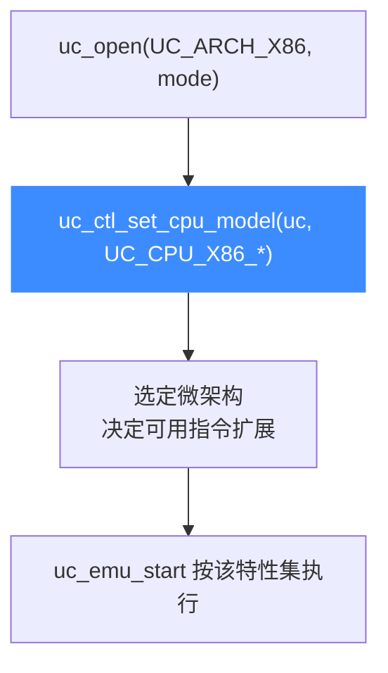

# X86 CPU 型号

本页讲清 Unicorn 如何为 x86 引擎选择具体的 CPU 型号（QEMU64、Haswell、Skylake、EPYC 等）。读完你能用 `uc_ctl_set_cpu_model` 指定型号，从而决定仿真时可用的指令集扩展与 CPU 特性。

## 🧩 为什么型号很重要

x86 是一个持续演进的架构：`SSE4`、`AVX`、`AVX-512`、`BMI`、`AES-NI` 等扩展是逐代加入的。Unicorn（基于 QEMU）用**CPU 型号**来界定"这颗虚拟 CPU 支持哪些特性"。若你的代码用到 AVX2，却把型号设成老旧的 `PENTIUM`，仿真会因非法指令而失败。

不显式设置时，各模式使用 QEMU 的默认型号（32/64 位下通常为 `QEMU32`/`QEMU64`）。默认型号偏保守，追求最大兼容性而非最新特性。



## 📋 可选型号列表

以下 `UC_CPU_X86_*` 常量全部来自 [`include/unicorn/x86.h`](https://github.com/android-security-engineer/unicorn-skills/blob/master/include/unicorn/x86.h) 的 `uc_cpu_x86` 枚举（节选代表性型号，完整列表以头文件为准）：

| 常量 | 大致对应 | 代表特性 |
| --- | --- | --- |
| `UC_CPU_X86_QEMU64` | QEMU 默认 64 位 | 通用兼容基线（值为 0，默认） |
| `UC_CPU_X86_QEMU32` | QEMU 默认 32 位 | 32 位通用基线 |
| `UC_CPU_X86_486` | Intel 486 | 早期 32 位，无 SSE |
| `UC_CPU_X86_PENTIUM` / `PENTIUM2` / `PENTIUM3` | 奔腾系列 | MMX / 早期 SSE |
| `UC_CPU_X86_CORE2DUO` / `COREDUO` | Core 2 | SSE3/SSSE3 |
| `UC_CPU_X86_NEHALEM` / `WESTMERE` | Nehalem | SSE4.2 |
| `UC_CPU_X86_SANDYBRIDGE` / `IVYBRIDGE` | Sandy/Ivy Bridge | AVX |
| `UC_CPU_X86_HASWELL` / `BROADWELL` | Haswell | AVX2、BMI、FMA |
| `UC_CPU_X86_SKYLAKE_CLIENT` / `SKYLAKE_SERVER` | Skylake | AVX-512（Server） |
| `UC_CPU_X86_CASCADELAKE_SERVER` / `COOPERLAKE` | Cascade/Cooper Lake | AVX-512 扩展 |
| `UC_CPU_X86_ICELAKE_CLIENT` / `ICELAKE_SERVER` | Ice Lake | 新一代 AVX-512 |
| `UC_CPU_X86_OPTERON_G1`…`G5` | AMD Opteron | AMD 各代 |
| `UC_CPU_X86_EPYC` / `EPYC_ROME` / `DHYANA` | AMD EPYC | 现代 AMD 服务器 |

::: tip 完整枚举
头文件里还包含 `PHENOM`、`KVM64`、`KVM32`、`N270`、`CONROE`、`PENRYN`、`ATHLON`、`DENVERTON`、`SNOWRIDGE`、`KNIGHTSMILL` 等。枚举以 `UC_CPU_X86_ENDING` 收尾，用它可判断取值上界。
:::

## 🔧 设置型号

型号通过 [`uc_ctl`](/ctl/set-cpu-model) 控制接口设置，需在 `uc_open` 之后、`uc_emu_start` 之前调用：

```c
uc_engine *uc;
uc_err err = uc_open(UC_ARCH_X86, UC_MODE_64, &uc);
if (err != UC_ERR_OK) {
    printf("uc_open 失败: %s\n", uc_strerror(err));
    return -1;
}

// 选择 Haswell 型号，以启用 AVX2 / BMI / FMA 等扩展
err = uc_ctl_set_cpu_model(uc, UC_CPU_X86_HASWELL);
if (err != UC_ERR_OK) {
    printf("设置 CPU 型号失败: %s\n", uc_strerror(err));
    return -1;
}

// ... 映射内存、写代码、跑仿真 ...
uc_close(uc);
```

`uc_ctl_set_cpu_model` 是宏 `uc_ctl` 的便捷封装，等价于对 `UC_CTL_CPU_MODEL` 执行写操作。

::: warning 先设型号，再跑仿真
CPU 型号必须在**开始仿真之前**确定。一旦 `uc_emu_start` 运行，型号即固定；型号与位宽也要匹配——给 64 位引擎选 `QEMU32` 之类的 32 位型号会得不到预期特性。
:::

## 📂 相关源码

| 文件 | 角色 |
|------|------|
| [`include/unicorn/x86.h`](https://github.com/android-security-engineer/unicorn-skills/blob/master/include/unicorn/x86.h#L90) | `UC_X86_REG_*` 寄存器枚举与 `uc_cpu_*` CPU 型号定义 |
| [`qemu/target/i386/unicorn.c`](https://github.com/android-security-engineer/unicorn-skills/blob/master/qemu/target/i386/unicorn.c) | 后端：`reg_read`/`reg_write`/`uc_init` 等函数指针实现 |
| [`qemu/target/i386/translate.c`](https://github.com/android-security-engineer/unicorn-skills/blob/master/qemu/target/i386/translate.c) | 前端：机器码翻译（TCG） |
| [`samples/sample_x86.c`](https://github.com/android-security-engineer/unicorn-skills/blob/master/samples/sample_x86.c) | 该架构的 C 示例程序 |
| [`include/unicorn/unicorn.h`](https://github.com/android-security-engineer/unicorn-skills/blob/master/include/unicorn/unicorn.h#L102) | `UC_ARCH_X86` 架构常量与 `UC_MODE_*` 公共模式定义 |

## 相关页面

- [uc_ctl 设置 CPU 型号](/ctl/set-cpu-model)
- [CPU 型号特性总览](/features/cpu-models)
- [X86 架构概览](/arch/x86/)
- [X86 指令级 Hook](/arch/x86/instructions)
