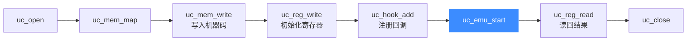

# X86 实战示例

本页给出一个**完整可运行**的 x86-64 仿真程序，逐段拆解 Unicorn 的标准工作流：打开引擎 → 映射内存 → 写入机器码 → 设置寄存器 → 注册 Hook → 启动仿真 → 读回结果。代码取自官方 [`samples/sample_x86.c`](https://github.com/android-security-engineer/unicorn-skills/blob/master/samples/sample_x86.c) 的 `test_x86_64`，读完你能独立写出自己的 x86 仿真程序。

## 🎯 工作流总览



## 🧩 完整代码

```c
#include <unicorn/unicorn.h>
#include <string.h>

// 待仿真的 x86-64 机器码（一段算术/逻辑运算序列）
#define X86_CODE64 "\x48\x31\xc0" // xor rax, rax（示意，实际可替换为你的字节码）

// 仿真起始地址
#define ADDRESS 0x1000000

// 指令级 Hook：每条指令执行前打印 RIP
static void hook_code64(uc_engine *uc, uint64_t address, uint32_t size,
                        void *user_data)
{
    uint64_t rip;
    uc_reg_read(uc, UC_X86_REG_RIP, &rip);
    printf(">>> Tracing instruction at 0x%" PRIx64
           ", instruction size = 0x%x\n", address, size);
    printf(">>> RIP is 0x%" PRIx64 "\n", rip);
}

int main(void)
{
    uc_engine *uc;
    uc_err err;
    uc_hook trace;

    int64_t rax = 0x71f3029efd49d41d;
    int64_t rbx = 0xd87b45277f133ddb;
    int64_t rsp = ADDRESS + 0x200000; // 栈指针指向已映射区域内

    printf("Emulate x86_64 code\n");

    // 1. 以 64 位长模式打开引擎
    err = uc_open(UC_ARCH_X86, UC_MODE_64, &uc);
    if (err) {
        printf("Failed on uc_open() with error returned: %u\n", err);
        return -1;
    }

    // 2. 映射 2MB 内存（可读可写可执行）
    uc_mem_map(uc, ADDRESS, 2 * 1024 * 1024, UC_PROT_ALL);

    // 3. 把机器码写入内存
    if (uc_mem_write(uc, ADDRESS, X86_CODE64, sizeof(X86_CODE64) - 1)) {
        printf("Failed to write emulation code to memory, quit!\n");
        return -1;
    }

    // 4. 初始化寄存器
    uc_reg_write(uc, UC_X86_REG_RSP, &rsp);
    uc_reg_write(uc, UC_X86_REG_RAX, &rax);
    uc_reg_write(uc, UC_X86_REG_RBX, &rbx);

    // 5. 注册指令 Hook（begin=ADDRESS, end=ADDRESS+20 限定范围）
    uc_hook_add(uc, &trace, UC_HOOK_CODE, hook_code64, NULL,
                ADDRESS, ADDRESS + 20);

    // 6. 启动仿真：从 ADDRESS 跑到码尾，超时=0（无限），指令数=0（不限）
    err = uc_emu_start(uc, ADDRESS, ADDRESS + sizeof(X86_CODE64) - 1, 0, 0);
    if (err) {
        printf("Failed on uc_emu_start() with error returned %u: %s\n",
               err, uc_strerror(err));
    }

    // 7. 读回寄存器结果
    printf(">>> Emulation done. Below is the CPU context\n");
    uc_reg_read(uc, UC_X86_REG_RAX, &rax);
    uc_reg_read(uc, UC_X86_REG_RBX, &rbx);
    printf(">>> RAX = 0x%" PRIx64 "\n", rax);
    printf(">>> RBX = 0x%" PRIx64 "\n", rbx);

    // 8. 释放引擎
    uc_close(uc);
    return 0;
}
```

## 🔧 逐段讲解

| 步骤 | 函数 | 说明 |
| --- | --- | --- |
| 1 | `uc_open` | 用 [`UC_ARCH_X86`](https://github.com/android-security-engineer/unicorn-skills/blob/master/include/unicorn/unicorn.h#L102) + `UC_MODE_64` 创建 64 位长模式引擎 |
| 2 | `uc_mem_map` | 在 `ADDRESS` 处映射 2MB，`UC_PROT_ALL` = 读+写+执行 |
| 3 | `uc_mem_write` | 把字节码拷进虚拟内存；`sizeof-1` 去掉结尾 `\0` |
| 4 | `uc_reg_write` | 用 `UC_X86_REG_*` 常量设置初始寄存器，`RSP` 要落在已映射区 |
| 5 | `uc_hook_add` | 注册 [`UC_HOOK_CODE`](/features/hooks)，逐条指令回调 |
| 6 | `uc_emu_start` | 参数为 `(uc, 起始, 结束, 超时us, 指令数)` |
| 7 | `uc_reg_read` | 仿真结束后读回寄存器观察副作用 |
| 8 | `uc_close` | 释放所有资源 |

::: tip RSP 必须指向有效内存
若被仿真代码含 `push`/`call`/`ret`，`RSP` 指向的地址必须已 `uc_mem_map`，否则会触发未映射内存异常。示例中 `rsp = ADDRESS + 0x200000` 正落在 2MB 映射区末端。
:::

## 📤 预期输出

运行后会看到每条指令的跟踪行，以及仿真结束后的寄存器快照，形如：

```text
Emulate x86_64 code
>>> Tracing instruction at 0x1000000, instruction size = 0x3
>>> RIP is 0x1000000
>>> Emulation done. Below is the CPU context
>>> RAX = 0x0
>>> RBX = 0xd87b45277f133ddb
```

（具体寄存器值取决于你填入 `X86_CODE64` 的实际字节码。）

::: warning 编译与链接
需安装 Unicorn 开发库，编译时链接 `-lunicorn`，例如：`gcc example.c -o example -lunicorn`。详见 [第一个程序](/guide/first-program)。
:::

## 📂 相关源码

| 文件 | 角色 |
|------|------|
| [`include/unicorn/x86.h`](https://github.com/android-security-engineer/unicorn-skills/blob/master/include/unicorn/x86.h#L90) | `UC_X86_REG_*` 寄存器枚举与 `uc_cpu_*` CPU 型号定义 |
| [`qemu/target/i386/unicorn.c`](https://github.com/android-security-engineer/unicorn-skills/blob/master/qemu/target/i386/unicorn.c) | 后端：`reg_read`/`reg_write`/`uc_init` 等函数指针实现 |
| [`qemu/target/i386/translate.c`](https://github.com/android-security-engineer/unicorn-skills/blob/master/qemu/target/i386/translate.c) | 前端：机器码翻译（TCG） |
| [`samples/sample_x86.c`](https://github.com/android-security-engineer/unicorn-skills/blob/master/samples/sample_x86.c) | 该架构的 C 示例程序 |
| [`include/unicorn/unicorn.h`](https://github.com/android-security-engineer/unicorn-skills/blob/master/include/unicorn/unicorn.h#L102) | `UC_ARCH_X86` 架构常量与 `UC_MODE_*` 公共模式定义 |

## 相关页面

- [官方 X86 示例讲解](/samples/sample-x86)
- [第一个程序](/guide/first-program)
- [X86 架构概览](/arch/x86/)
- [X86 指令级 Hook](/arch/x86/instructions)
