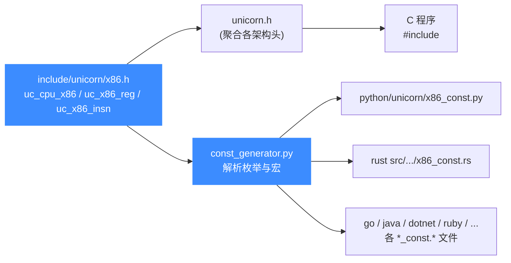

# X86 头文件常量参考

本页讲 [`include/unicorn/x86.h`](https://github.com/android-security-engineer/unicorn-skills/blob/master/include/unicorn/x86.h)：它是 x86 架构所有公开常量的 **唯一真源（source of truth）**，定义了 CPU 型号、寄存器 ID、指令 ID 三大枚举，以及 `uc_x86_mmr` / `uc_x86_msr` 等辅助结构体。读完你能清楚每类常量的用途，以及它们如何被各语言绑定的常量生成器消费。

## 📌 概述

`x86.h` 是 x86 架构的公开常量头，被 [`include/unicorn/unicorn.h`](https://github.com/android-security-engineer/unicorn-skills/blob/master/include/unicorn/unicorn.h) 聚合后对外暴露。它本身不声明任何函数原型，只提供以下内容：

1. **CPU 型号枚举** `uc_cpu_x86` —— `UC_CPU_X86_*`，选择具体型号（Haswell、Skylake、EPYC 等）。
2. **寄存器 ID 枚举** `uc_x86_reg` —— `UC_X86_REG_*`，供 `uc_reg_read` / `uc_reg_write` 使用。
3. **指令 ID 枚举** `uc_x86_insn` —— `UC_X86_INS_*`，供 `UC_HOOK_INSN` 按指令拦截。
4. **辅助结构体** `uc_x86_mmr`（描述符表寄存器）、`uc_x86_msr`（模型专属寄存器），以及两条回调 typedef。
5. **模式位** —— x86 复用 `unicorn.h` 中的 `UC_MODE_16/32/64`，本头文件不重复定义。

::: tip 这是绑定的常量来源
C 头文件是**唯一真源**。Python / Rust / Go / Java / .NET / Ruby / Pascal / Haskell / VB6 / Zig 等绑定里的 `UC_X86_REG_*`、`UC_X86_INS_*`、`UC_CPU_X86_*` 常量，全部由 [`bindings/const_generator.py`](/bindings/const-generator) 从本文件解析生成。**改了本头文件就必须重跑生成器**，否则各语言常量会漂移。
:::

## 🧩 头文件如何被消费



C 代码经 `unicorn.h` 间接 include 本头；各语言绑定则由生成器把这里的枚举常量**单向产出**到对应的 `*_const.*` 文件，运行时再映射回 C 数值。

## 💻 用法

直接 include 公共头即可获得全部 x86 常量，无需单独 include `x86.h`：

```c
#include <unicorn/unicorn.h>

uc_engine *uc;
uc_open(UC_ARCH_X86, UC_MODE_64, &uc);

// 用 uc_x86_reg 常量读写寄存器
uint64_t rax = 0xdeadbeef;
uc_reg_write(uc, UC_X86_REG_RAX, &rax);

// 用 uc_x86_insn 常量按指令 hook
uc_hook hh;
uc_hook_add(uc, &hh, UC_HOOK_INSN, cb_in, NULL, 1,
            UC_X86_INS_SYSCALL, UC_X86_INS_ENDING);

// 用 uc_cpu_x86 常量切换 CPU 型号
uc_ctl_set_cpu_model(uc, UC_CPU_X86_HASWELL);
```

```bash
# 改了 x86.h 后重新生成本语言常量（以 Python 为例）
python bindings/const_generator.py
```

## 🔧 CPU 型号枚举 uc_cpu_x86

`uc_cpu_x86` 列出可选择的 x86 CPU 型号，传给 `uc_ctl_set_cpu_model`。型号决定了仿真时可用的指令集扩展（SSE/AVX/AVX2/AVX-512 等）与 CPU 特性位。完整列表见 [X86 CPU 型号](/arch/x86/cpu-models)，下表摘录常用型号。

| 常量 | 说明 |
| --- | --- |
| `UC_CPU_X86_QEMU64` | 默认 64 位型号，特性较基础 |
| `UC_CPU_X86_QEMU32` | 默认 32 位型号 |
| `UC_CPU_X86_486` | Intel 80486 |
| `UC_CPU_X86_PENTIUM` / `PENTIUM2` / `PENTIUM3` | 经典 Pentium 系列 |
| `UC_CPU_X86_CORE2DUO` / `COREDUO` | Core 系列双核 |
| `UC_CPU_X86_N270` | Atom N270 |
| `UC_CPU_X86_NEHALEM` / `WESTMERE` | Nehalem / Westmere 微架构 |
| `UC_CPU_X86_SANDYBRIDGE` / `IVYBRIDGE` | Sandy / Ivy Bridge |
| `UC_CPU_X86_HASWELL` / `BROADWELL` | Haswell（含 AVX2）/ Broadwell |
| `UC_CPU_X86_SKYLAKE_CLIENT` / `SKYLAKE_SERVER` | Skylake 客户端 / 服务器 |
| `UC_CPU_X86_ICELAKE_CLIENT` / `ICELAKE_SERVER` | Ice Lake，含 AVX-512 |
| `UC_CPU_X86_CASCADELAKE_SERVER` / `COOPERLAKE` | 级联湖 / 库珀湖 |
| `UC_CPU_X86_KNIGHTSMILL` | Xeon Phi (KNM) |
| `UC_CPU_X86_ATHLON` | AMD Athlon |
| `UC_CPU_X86_OPTERON_G1`…`OPTERON_G5` | AMD Opteron 各代 |
| `UC_CPU_X86_EPYC` / `EPYC_ROME` | AMD EPYC / EPYC Rome (Zen2) |
| `UC_CPU_X86_DHYANA` | Hygon Dhhyana (国产 x86) |
| `UC_CPU_X86_ENDING` | 结束标记，非有效型号 |

## 📖 寄存器 ID 枚举 uc_x86_reg

`uc_x86_reg` 是本头文件最大的枚举，覆盖 16/32/64 位全部寄存器族。下表列出最常用的若干常量（完整分类见 [X86 寄存器参考](/arch/x86/registers)）。

| 常量 | 含义 |
| --- | --- |
| `UC_X86_REG_INVALID` | 无效占位（=0） |
| `UC_X86_REG_AH` / `AL` / `AX` | RAX 的高 8 / 低 8 / 低 16 位视图 |
| `UC_X86_REG_BH` / `BL` / `BX` / `BP` / `BPL` | RBX / RBP 的子视图 |
| `UC_X86_REG_CH` / `CL` / `CX` | RCX 的子视图 |
| `UC_X86_REG_DH` / `DL` / `DX` / `DI` / `DIL` | RDX / RDI 的子视图 |
| `UC_X86_REG_SI` / `SIL` / `SP` / `SPL` | RSI / RSP 的子视图 |
| `UC_X86_REG_EAX`…`EDI` / `EBP` / `ESP` | 32 位通用寄存器 |
| `UC_X86_REG_RAX`…`R15` | 64 位通用寄存器（含 R8–R15） |
| `UC_X86_REG_IP` / `EIP` / `RIP` | 指令指针（16/32/64 位） |
| `UC_X86_REG_FLAGS` / `EFLAGS` / `RFLAGS` | 标志寄存器（16/32/64 位） |
| `UC_X86_REG_CS` / `DS` / `SS` / `ES` / `FS` / `GS` | 段选择子 |
| `UC_X86_REG_FS_BASE` / `GS_BASE` | 64 位段基址 |
| `UC_X86_REG_CR0`…`CR4` / `CR8` | 控制寄存器 |
| `UC_X86_REG_DR0`…`DR7` | 调试寄存器（硬件断点） |
| `UC_X86_REG_GDTR` / `IDTR` / `LDTR` / `TR` | 描述符表寄存器（配 `uc_x86_mmr`） |
| `UC_X86_REG_MSR` | 模型专属寄存器（配 `uc_x86_msr`） |
| `UC_X86_REG_ST0`…`ST7` / `FP0`…`FP7` | x87 FPU 80 位栈寄存器 |
| `UC_X86_REG_MM0`…`MM7` | MMX 64 位 SIMD |
| `UC_X86_REG_XMM0`…`XMM31` | SSE 128 位 |
| `UC_X86_REG_YMM0`…`YMM31` | AVX 256 位 |
| `UC_X86_REG_ZMM0`…`ZMM31` | AVX-512 512 位 |
| `UC_X86_REG_K0`…`K7` | AVX-512 掩码寄存器 |
| `UC_X86_REG_FPCW` / `FPSW` / `FPTAG` / `MXCSR` | FPU/SSE 控制状态字 |
| `UC_X86_REG_ENDING` | 结束标记，非有效寄存器 |

::: details 枚举值为什么有跳号
枚举里多处用显式表达式对齐数值，例如 `UC_X86_REG_ES = UC_X86_REG_EIP + 2`、`UC_X86_REG_RSI = UC_X86_REG_RIP + 2`、`UC_X86_REG_CR8 = UC_X86_REG_CR4 + 4`、`UC_X86_REG_DR0 = UC_X86_REG_CR8 + 8`、`UC_X86_REG_FP0 = UC_X86_REG_DR7 + 9`。这些跳号是为了与 QEMU 内部的寄存器编号表保持一致，让 `uc_reg_read/write` 能直接索引后端数组。绑定侧只需按符号名使用，无需关心具体数值。
:::

## 🧮 X86 模式位 UC_MODE_*

x86 没有 `UC_MODE_X86_*` 这类专属前缀，而是复用 `unicorn.h` 中通用的位宽模式位。三者互斥，`uc_open` 时三选一，且整个引擎生命周期不可中途切换。

| 模式位 | 值 | 说明 |
| --- | --- | --- |
| `UC_MODE_16` | `1 << 1` | 16 位实模式（8086），段:偏移寻址 |
| `UC_MODE_32` | `1 << 2` | 32 位保护模式（i386），EAX/EBP/ESP/EIP/EFLAGS |
| `UC_MODE_64` | `1 << 3` | 64 位长模式（x86-64），RAX..R15/RIP/RFLAGS |

另有 `UC_MODE_LITTLE_ENDIAN`（=0，默认）与 `UC_MODE_BIG_ENDIAN`，x86 永远用小端，无需显式指定。模式与字节序细节见 [X86 模式与字节序](/arch/x86/modes)。

## ⚡ 指令 ID 枚举 uc_x86_insn

`uc_x86_insn` 是 x86 特有的指令 ID 枚举，仅用于 `UC_HOOK_INSN`：注册 hook 时把若干 `UC_X86_INS_*` 作为变参传入，引擎在执行这些指令时回调。枚举条目上千条（覆盖从 8086 到 AVX-512、SHA、AES-NI 的几乎所有助记符），下表摘录几类代表性指令。

| 类别 | 代表常量 | 说明 |
| --- | --- | --- |
| 系统调用 / 入口 | `UC_X86_INS_SYSCALL` / `SYSENTER` / `SYSEXIT` / `SYSRET` | 拦截系统调用与快速入口 |
| I/O | `UC_X86_INS_IN` / `OUT` / `INSB` / `OUTSB` | 拦截端口读写 |
| 特权指令 | `UC_X86_INS_CPUID` / `RDMSR` / `WRMSR` / `RDTSC` | CPUID、MSR、时间戳 |
| 控制流 | `UC_X86_INS_CALL` / `RET` / `JMP` / `JE` / `LOOP` | 调用、返回、跳转 |
| 算术逻辑 | `UC_X86_INS_ADD` / `SUB` / `MUL` / `DIV` / `XOR` | 基本运算 |
| 字符串操作 | `UC_X86_INS_MOVSB` / `CMPSD` / `STOSD` / `SCASB` | 串指令（带 rep 前缀） |
| 向量/SIMD | `UC_X86_INS_ADDPS` / `MULPD` / `PSHUFB` / `VFMADD132PS` | SSE/AVX/FMA |
| 加密哈希 | `UC_X86_INS_AESENC` / `AESKEYGENASSIST` / `SHA1RNDS4` / `SHA256RNDS2` | AES-NI / SHA 扩展 |
| 内存屏障 | `UC_X86_INS_MFENCE` / `LFENCE` / `SFENCE` | 串行化指令 |
| 退出标记 | `UC_X86_INS_ENDING` | 变参区间终点，非有效指令 |

::: tip 区分 INS_ENDING 与变参区间
`uc_hook_add(uc, &hh, UC_HOOK_INSN, cb, NULL, 1, UC_X86_INS_IN, UC_X86_INS_OUT)` 表示只拦 `IN` 与 `OUT` 两条；要拦截一段连续区间可传起止常量，再用 `UC_X86_INS_ENDING` 作为终结哨兵。`UC_X86_INS_INVALID`（=0）只是占位，不要用于匹配。完整指令表见 [X86 指令级 Hook](/arch/x86/instructions)。
:::

## 🔧 辅助结构体与回调 typedef

除枚举外，`x86.h` 还定义了几个与寄存器读写、Hook 配套的类型：

| 类型 | 用途 |
| --- | --- |
| `uc_x86_mmr` | 描述 GDTR/IDTR/LDTR/TR，含 `selector`/`base`/`limit`/`flags`，配 `UC_X86_REG_GDTR` 等 |
| `uc_x86_msr` | 描述 MSR，含 `rid`/`value`，配 `UC_X86_REG_MSR` |
| `uc_cb_insn_syscall_t` | SYSCALL/SYSENTER 回调签名（用于 `uc_hook_intr`） |
| `uc_cb_insn_cpuid_t` | CPUID 回调签名，返回非 0 表示已覆盖该指令 |

这几类结构体的实际读写示例见 [X86 寄存器参考](/arch/x86/registers)。

## ⚠️ 注意

- **改了头文件就要重生常量**。新增/重命名/删除任何 `UC_CPU_X86_*`、`UC_X86_REG_*`、`UC_X86_INS_*` 后，务必运行 [`const_generator.py`](/bindings/const-generator)，否则 Python/Rust/Go 等绑定会引用不存在的常量或漏掉新常量。
- **不要手改 `*_const.*`**。这些文件是生成产物，下次跑生成器会被覆盖；真源只在 C 头。
- **枚举值会跳号且非稳定**。如 `UC_X86_REG_ES = UC_X86_REG_EIP + 2` 这类显式表达式是为了对齐 QEMU 后端，版本间可能调整。绑定侧一律按符号名引用，禁止硬编码数值。
- **`*_ENDING` / `*_INVALID` 不是有效项**。它们只作枚举边界与哨兵，不可作为寄存器/指令/CPU 型号传入 API。

## 📖 参考

- 头文件源码：[`include/unicorn/x86.h`](https://github.com/android-security-engineer/unicorn-skills/blob/master/include/unicorn/x86.h)（约 1680 行，三大枚举 + 辅助结构体）。
- 聚合入口：[`include/unicorn/unicorn.h`](https://github.com/android-security-engineer/unicorn-skills/blob/master/include/unicorn/unicorn.h)（include 各架构头）。
- 生成器：`bindings/const_generator.py`，输入头列表第 9 行即含 `'x86.h'`，按架构前缀产出各语言常量。

## 📂 相关源码

| 文件 | 角色 |
|------|------|
| [`include/unicorn/x86.h`](https://github.com/android-security-engineer/unicorn-skills/blob/master/include/unicorn/x86.h#L90) | `UC_X86_REG_*` 寄存器枚举与 `uc_cpu_*` CPU 型号定义 |
| [`qemu/target/i386/unicorn.c`](https://github.com/android-security-engineer/unicorn-skills/blob/master/qemu/target/i386/unicorn.c) | 后端：`reg_read`/`reg_write`/`uc_init` 等函数指针实现 |
| [`qemu/target/i386/translate.c`](https://github.com/android-security-engineer/unicorn-skills/blob/master/qemu/target/i386/translate.c) | 前端：机器码翻译（TCG） |
| [`samples/sample_x86.c`](https://github.com/android-security-engineer/unicorn-skills/blob/master/samples/sample_x86.c) | 该架构的 C 示例程序 |
| [`include/unicorn/unicorn.h`](https://github.com/android-security-engineer/unicorn-skills/blob/master/include/unicorn/unicorn.h#L102) | `UC_ARCH_X86` 架构常量与 `UC_MODE_*` 公共模式定义 |

## 相关页面

- [X86 架构概览](/arch/x86/)
- [X86 寄存器参考](/arch/x86/registers)
- [X86 CPU 型号](/arch/x86/cpu-models)
- [常量生成器 const_generator.py](/bindings/const-generator)
- [unicorn.h — 公共 C API 头文件](/headers/unicorn-h)
