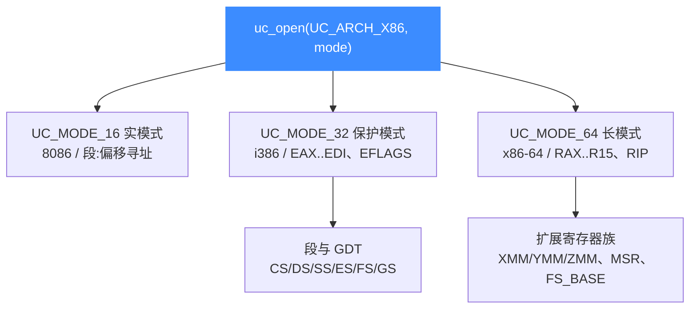

# X86 架构概览

本页讲清 Unicorn 如何模拟 Intel/AMD x86 系列 CPU：支持 16 / 32 / 64 位三种模式，用 [`UC_ARCH_X86`](https://github.com/android-security-engineer/unicorn-skills/blob/master/include/unicorn/unicorn.h#L102) 搭配 `UC_MODE_16/32/64` 打开引擎。读完你能知道 x86 各模式的差异、寄存器族的全貌，以及本架构其余文档的入口。

## 🚀 一句话上手

x86 是 Unicorn 支持最完整的架构：从 8086 实模式到 x86-64 长模式全覆盖，是 **shellcode 提取、恶意代码分析、CTF pwn、固件仿真** 等场景的首选。打开引擎只需一行：

```c
uc_engine *uc;
// 64 位长模式；改成 UC_MODE_32 / UC_MODE_16 即切换位宽
uc_err err = uc_open(UC_ARCH_X86, UC_MODE_64, &uc);
if (err != UC_ERR_OK) {
    printf("uc_open 失败: %s\n", uc_strerror(err));
    return -1;
}
// ... 映射内存、写代码、跑仿真 ...
uc_close(uc);
```

`UC_ARCH_X86` 与 `UC_MODE_*` 定义在 [`include/unicorn/unicorn.h`](https://github.com/android-security-engineer/unicorn-skills/blob/master/include/unicorn/unicorn.h)，寄存器/指令/型号常量定义在 [`include/unicorn/x86.h`](https://github.com/android-security-engineer/unicorn-skills/blob/master/include/unicorn/x86.h)。

## 🧩 模式与寄存器族全景



x86 的寄存器可分成若干大族，详见 [X86 寄存器参考](/arch/x86/registers)：

| 寄存器族 | 代表常量 | 用途 |
| --- | --- | --- |
| 通用寄存器 | `UC_X86_REG_RAX` … `UC_X86_REG_R15` | 算术、传参、寻址 |
| 段寄存器 | `UC_X86_REG_CS/DS/SS/ES/FS/GS` | 分段与选择子 |
| 标志/指令指针 | `UC_X86_REG_EFLAGS`、`UC_X86_REG_RIP` | 条件与执行位置 |
| 控制/调试 | `UC_X86_REG_CR0`…`CR4`、`DR0`…`DR7` | 分页、保护、硬件断点 |
| 浮点/向量 | `UC_X86_REG_ST0`、`MM0`、`XMM0`、`YMM0`、`ZMM0` | FPU / MMX / SSE / AVX |
| 系统表 | `UC_X86_REG_GDTR/IDTR/LDTR/TR`、`MSR` | 描述符表、MSR |

## 📌 典型用途

::: tip 为什么用 x86 模拟
- **提取 shellcode 行为**：把一段字节码 map 进内存、设好寄存器、跑起来观察对内存与寄存器的副作用，无需真机。
- **恶意样本分析**：配合 [Hook 体系](/features/hooks) 拦截 IN/OUT、SYSCALL、CPUID，观察样本与"外部世界"的交互。
- **CTF / 漏洞研究**：单步跟踪、快照回滚、上下文保存，方便反复实验。
:::

::: warning 模式一旦确定不可中途切换
`uc_open` 时选定的 `UC_MODE_*` 决定了整个引擎生命周期的位宽与寻址规则。要换模式必须 `uc_close` 后重新 `uc_open`。详见 [X86 模式与字节序](/arch/x86/modes)。
:::

## 📚 本架构文档索引

- [X86 寄存器参考](/arch/x86/registers) — 全部 `UC_X86_REG_*` 常量与读写方法。
- [X86 模式与字节序](/arch/x86/modes) — 16/32/64 位、实模式/保护模式/长模式、段与 GDT。
- [X86 指令级 Hook](/arch/x86/instructions) — `UC_HOOK_INSN` 拦截 IN/OUT/SYSCALL/CPUID。
- [X86 CPU 型号](/arch/x86/cpu-models) — 用 `uc_ctl_set_cpu_model` 选择 CPU 特性集。
- [X86 实战示例](/arch/x86/example) — 完整可运行的 64 位仿真。

## 📂 相关源码

| 文件 | 角色 |
|------|------|
| [`include/unicorn/x86.h`](https://github.com/android-security-engineer/unicorn-skills/blob/master/include/unicorn/x86.h#L90) | `UC_X86_REG_*` 寄存器枚举与 `uc_cpu_*` CPU 型号定义 |
| [`qemu/target/i386/unicorn.c`](https://github.com/android-security-engineer/unicorn-skills/blob/master/qemu/target/i386/unicorn.c) | 后端：`reg_read`/`reg_write`/`uc_init` 等函数指针实现 |
| [`qemu/target/i386/translate.c`](https://github.com/android-security-engineer/unicorn-skills/blob/master/qemu/target/i386/translate.c) | 前端：机器码翻译（TCG） |
| [`samples/sample_x86.c`](https://github.com/android-security-engineer/unicorn-skills/blob/master/samples/sample_x86.c) | 该架构的 C 示例程序 |
| [`include/unicorn/unicorn.h`](https://github.com/android-security-engineer/unicorn-skills/blob/master/include/unicorn/unicorn.h#L102) | `UC_ARCH_X86` 架构常量与 `UC_MODE_*` 公共模式定义 |

## 相关页面

- [官方 X86 示例讲解](/samples/sample-x86)
- [X86 寄存器参考](/arch/x86/registers)
- [uc_open](/api/open)
- [支持的架构总览](/features/architectures)
