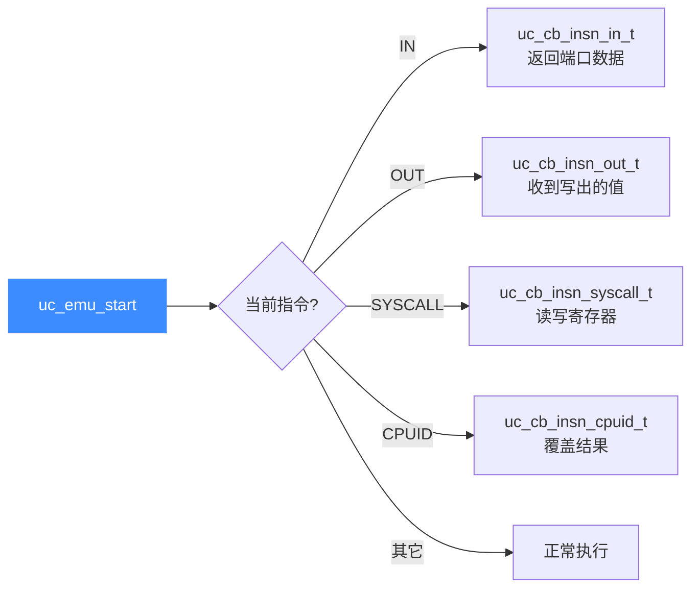

# X86 指令级 Hook

本页讲清如何用 `UC_HOOK_INSN` 精确拦截 x86 的特定指令：端口 IO 的 `IN`/`OUT`、系统调用 `SYSCALL`/`SYSENTER`、以及 `CPUID`。读完你能为这些指令注册专用回调，在仿真中"接管"它们的行为，实现虚拟外设、系统调用模拟与 CPUID 伪造。

## 🪝 什么是指令级 Hook

普通的 [`UC_HOOK_CODE`](/features/hooks) 会在**每条指令**执行前触发；而 `UC_HOOK_INSN` 只在**你指定的那一类指令**上触发，粒度更细、开销更小。注册时在 `uc_hook_add` 末尾追加一个 `UC_X86_INS_*` 指令 ID，即可只监听该指令。

x86 目前支持作为 `UC_HOOK_INSN` 目标的指令（均来自 [`include/unicorn/x86.h`](https://github.com/android-security-engineer/unicorn-skills/blob/master/include/unicorn/x86.h)）：

| 指令 ID 常量 | 指令 | 回调类型 | 典型用途 |
| --- | --- | --- | --- |
| `UC_X86_INS_IN` | `IN AL/AX/EAX, port` | `uc_cb_insn_in_t` | 模拟从端口读入数据 |
| `UC_X86_INS_OUT` | `OUT port, AL/AX/EAX` | `uc_cb_insn_out_t` | 观察/拦截向端口写出 |
| `UC_X86_INS_SYSCALL` | `SYSCALL` | `uc_cb_insn_syscall_t` | 拦截 64 位系统调用 |
| `UC_X86_INS_SYSENTER` | `SYSENTER` | `uc_cb_insn_syscall_t` | 拦截快速系统调用入口 |
| `UC_X86_INS_CPUID` | `CPUID` | `uc_cb_insn_cpuid_t` | 伪造 CPU 特性/厂商信息 |



## 📥 端口 IO：拦截 IN / OUT

`IN` 从 IO 端口读数据到 `AL/AX/EAX`，`OUT` 把 `AL/AX/EAX` 写到端口。真机上这背后是硬件外设，仿真里我们用回调充当"虚拟外设"。

- `IN` 回调返回一个 `uint32_t`，Unicorn 会把它写进目标寄存器（按 `size` 取低 1/2/4 字节）。
- `OUT` 回调拿到写出的 `value`，无返回值。

```c
// IN 回调：返回读到的端口数据（写入 AL/AX/EAX）
static uint32_t hook_in(uc_engine *uc, uint32_t port, int size, void *user_data)
{
    uint32_t eip;
    uc_reg_read(uc, UC_X86_REG_EIP, &eip);
    printf("--- reading from port 0x%x, size: %u, address: 0x%x\n", port, size, eip);
    switch (size) {
    case 1:  return 0xf1; // 读 1 字节到 AL
    case 2:  return 0xf2; // 读 2 字节到 AX
    case 4:  return 0xf4; // 读 4 字节到 EAX
    default: return 0;
    }
}

// OUT 回调：观察写向端口的值
static void hook_out(uc_engine *uc, uint32_t port, int size, uint32_t value, void *user_data)
{
    printf("--- writing to port 0x%x, size: %u, value: 0x%x\n", port, size, value);
}

// 注册：注意末尾追加指令 ID
uc_hook trace_in, trace_out;
uc_hook_add(uc, &trace_in,  UC_HOOK_INSN, hook_in,  NULL, 1, 0, UC_X86_INS_IN);
uc_hook_add(uc, &trace_out, UC_HOOK_INSN, hook_out, NULL, 1, 0, UC_X86_INS_OUT);
```

::: tip 参数 1, 0 是什么
`uc_hook_add(..., begin, end, ...)` 中 `begin=1, end=0` 表示 `begin > end`，即**全地址范围**都生效。要限定范围就把它们改成真实地址区间。
:::

## 📤 拦截 SYSCALL

64 位模式下 `SYSCALL` 是进内核的标准方式。回调里读 `RAX`（系统调用号）即可分派，并可直接改写寄存器返回结果——这正是"模拟系统调用"的核心手法。

```c
// SYSCALL 回调：把 rax==0x100 的调用结果改写为 0x200
static void hook_syscall(uc_engine *uc, void *user_data)
{
    uint64_t rax;
    uc_reg_read(uc, UC_X86_REG_RAX, &rax);
    if (rax == 0x100) {
        rax = 0x200;
        uc_reg_write(uc, UC_X86_REG_RAX, &rax);
    }
}

// SYSCALL 需 64 位引擎；SYSENTER 同样用 uc_cb_insn_syscall_t 签名
uc_hook trace;
uc_hook_add(uc, &trace, UC_HOOK_INSN, hook_syscall, NULL, 1, 0, UC_X86_INS_SYSCALL);
```

::: warning IN/OUT 与位宽
`IN`/`OUT` 端口指令在 16/32 位实/保护模式最常见；`SYSCALL` 需 `UC_MODE_64`。指令 ID 用错模式会导致回调永不触发。
:::

## 🧠 CPUID

`CPUID` 回调类型为 `uc_cb_insn_cpuid_t`，**返回值有语义**：返回 `true`（非 0）表示回调已覆盖该指令、Unicorn 不再执行原生 `CPUID`；返回 `false` 则继续执行原生指令。可借此伪造厂商字符串或屏蔽某些特性位。

## 📂 相关源码

| 文件 | 角色 |
|------|------|
| [`include/unicorn/x86.h`](https://github.com/android-security-engineer/unicorn-skills/blob/master/include/unicorn/x86.h#L90) | `UC_X86_REG_*` 寄存器枚举与 `uc_cpu_*` CPU 型号定义 |
| [`qemu/target/i386/unicorn.c`](https://github.com/android-security-engineer/unicorn-skills/blob/master/qemu/target/i386/unicorn.c) | 后端：`reg_read`/`reg_write`/`uc_init` 等函数指针实现 |
| [`qemu/target/i386/translate.c`](https://github.com/android-security-engineer/unicorn-skills/blob/master/qemu/target/i386/translate.c) | 前端：机器码翻译（TCG） |
| [`samples/sample_x86.c`](https://github.com/android-security-engineer/unicorn-skills/blob/master/samples/sample_x86.c) | 该架构的 C 示例程序 |
| [`include/unicorn/unicorn.h`](https://github.com/android-security-engineer/unicorn-skills/blob/master/include/unicorn/unicorn.h#L102) | `UC_ARCH_X86` 架构常量与 `UC_MODE_*` 公共模式定义 |

## 相关页面

- [指令级 Hook（UC_HOOK_INSN）](/hooks/insn)
- [中断与异常 Hook（UC_HOOK_INTR）](/hooks/intr)
- [X86 寄存器参考](/arch/x86/registers)
- [X86 实战示例](/arch/x86/example)
