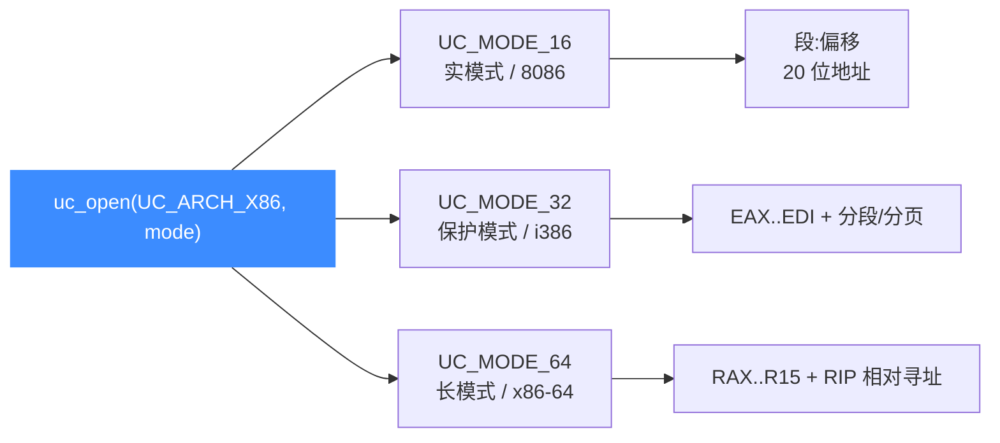
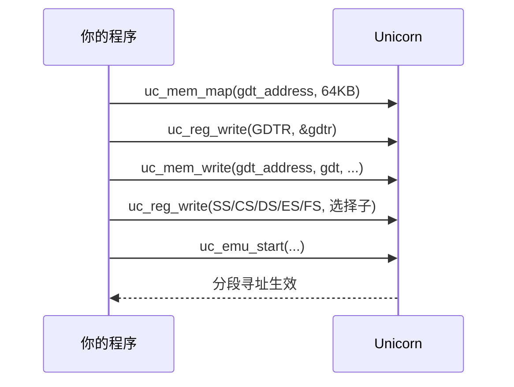

# X86 模式与字节序

本页讲清 Unicorn 中 x86 的三种执行模式 `UC_MODE_16` / `UC_MODE_32` / `UC_MODE_64`，对应实模式、保护模式与长模式的差异，以及分段机制与 GDT（全局描述符表）的设置方法。读完你能为不同位宽的目标代码选对模式，并能在保护模式下正确操纵段寄存器。

## 🧭 三种模式一览



| 模式常量 | 位宽 | 典型场景 | 指令指针 |
| --- | --- | --- | --- |
| `UC_MODE_16` | 16 位 | 引导扇区、DOS、8086 实模式 | `UC_X86_REG_IP` |
| `UC_MODE_32` | 32 位 | i386 用户态 shellcode、经典 PE | `UC_X86_REG_EIP` |
| `UC_MODE_64` | 64 位 | x86-64 样本、现代二进制 | `UC_X86_REG_RIP` |

::: tip 字节序
x86 全系为 **小端（little-endian）**。写入内存的多字节立即数、指针都按小端排列，`uc_mem_write` 不会替你翻转字节；准备机器码时请按小端手工排布。
:::

## 🔹 实模式（UC_MODE_16）

实模式下地址由"段:偏移"组合而成，内存可从 0 开始映射。下例取自官方示例 `sample_x86.c`：

```c
uc_engine *uc;
uc_open(UC_ARCH_X86, UC_MODE_16, &uc);      // 16 位实模式

uc_mem_map(uc, 0, 8 * 1024, UC_PROT_ALL);   // 从地址 0 映射 8KB
uc_mem_write(uc, 0, X86_CODE16, sizeof(X86_CODE16) - 1);

int32_t eax = 7, ebx = 5, esi = 6;
uc_reg_write(uc, UC_X86_REG_EAX, &eax);
uc_reg_write(uc, UC_X86_REG_EBX, &ebx);
uc_reg_write(uc, UC_X86_REG_ESI, &esi);

uc_emu_start(uc, 0, sizeof(X86_CODE16) - 1, 0, 0);
uc_close(uc);
```

## 🔹 保护模式（UC_MODE_32）与分段

保护模式引入描述符表：段寄存器里放的是"选择子"，真正的段基址/界限/属性存在 GDT 描述符中。**操纵任何段寄存器之前必须先建立 GDT**。

## 🔹 长模式（UC_MODE_64）

64 位长模式下分段大多被"扁平化"（基址 0），但 `FS`/`GS` 仍常用于线程本地存储，可用 `UC_X86_REG_FS_BASE` / `UC_X86_REG_GS_BASE` 直接设置段基址，无需完整 GDT。

## 🧩 GDT 设置流程（32 位）

下图与代码摘自官方示例 `sample_x86_32_gdt_and_seg_regs.c`：



```c
uc_x86_mmr gdtr;
gdtr.base  = gdt_address;                    // GDT 所在虚拟地址
gdtr.limit = 31 * sizeof(struct SegmentDescriptor) - 1;

// 为 GDT 分配一页并登记 GDTR（务必在写段寄存器之前）
uc_mem_map(uc, gdt_address, 0x10000, UC_PROT_WRITE | UC_PROT_READ);
uc_reg_write(uc, UC_X86_REG_GDTR, &gdtr);
uc_mem_write(uc, gdt_address, gdt, 31 * sizeof(struct SegmentDescriptor));

// 选择子（低位含 RPL）。设 SS 时需 rpl == cpl && dpl == cpl
int r_cs = 0x73, r_ss = 0x88, r_ds = 0x7b, r_es = 0x7b, r_fs = 0x83;
uc_reg_write(uc, UC_X86_REG_SS, &r_ss);
uc_reg_write(uc, UC_X86_REG_CS, &r_cs);
uc_reg_write(uc, UC_X86_REG_DS, &r_ds);
uc_reg_write(uc, UC_X86_REG_ES, &r_es);
uc_reg_write(uc, UC_X86_REG_FS, &r_fs);      // fs:0 从此指向描述符设定的基址
```

::: warning 顺序与权限
- **先 GDTR，后段寄存器**：未建描述符表就写选择子会触发异常。
- **SS 的特权级**：写 `SS` 要求 `rpl == cpl && dpl == cpl`。Unicorn 启动时 `cpl == 0`，因此对应描述符需 `dpl == 0` 且选择子 `rpl == 0`。
:::

::: tip 换模式 = 重开引擎
模式由 `uc_open` 一次性确定，不能中途从 32 位切到 64 位。需要不同位宽时先 `uc_close` 再重新 `uc_open`。
:::

## 📂 相关源码

| 文件 | 角色 |
|------|------|
| [`include/unicorn/x86.h`](https://github.com/android-security-engineer/unicorn-skills/blob/master/include/unicorn/x86.h#L90) | `UC_X86_REG_*` 寄存器枚举与 `uc_cpu_*` CPU 型号定义 |
| [`qemu/target/i386/unicorn.c`](https://github.com/android-security-engineer/unicorn-skills/blob/master/qemu/target/i386/unicorn.c) | 后端：`reg_read`/`reg_write`/`uc_init` 等函数指针实现 |
| [`qemu/target/i386/translate.c`](https://github.com/android-security-engineer/unicorn-skills/blob/master/qemu/target/i386/translate.c) | 前端：机器码翻译（TCG） |
| [`samples/sample_x86.c`](https://github.com/android-security-engineer/unicorn-skills/blob/master/samples/sample_x86.c) | 该架构的 C 示例程序 |
| [`include/unicorn/unicorn.h`](https://github.com/android-security-engineer/unicorn-skills/blob/master/include/unicorn/unicorn.h#L102) | `UC_ARCH_X86` 架构常量与 `UC_MODE_*` 公共模式定义 |

## 相关页面

- [GDT 与段寄存器示例](/samples/sample-x86-gdt)
- [X86 架构概览](/arch/x86/)
- [X86 寄存器参考](/arch/x86/registers)
- [字节序说明](/features/endianness)
