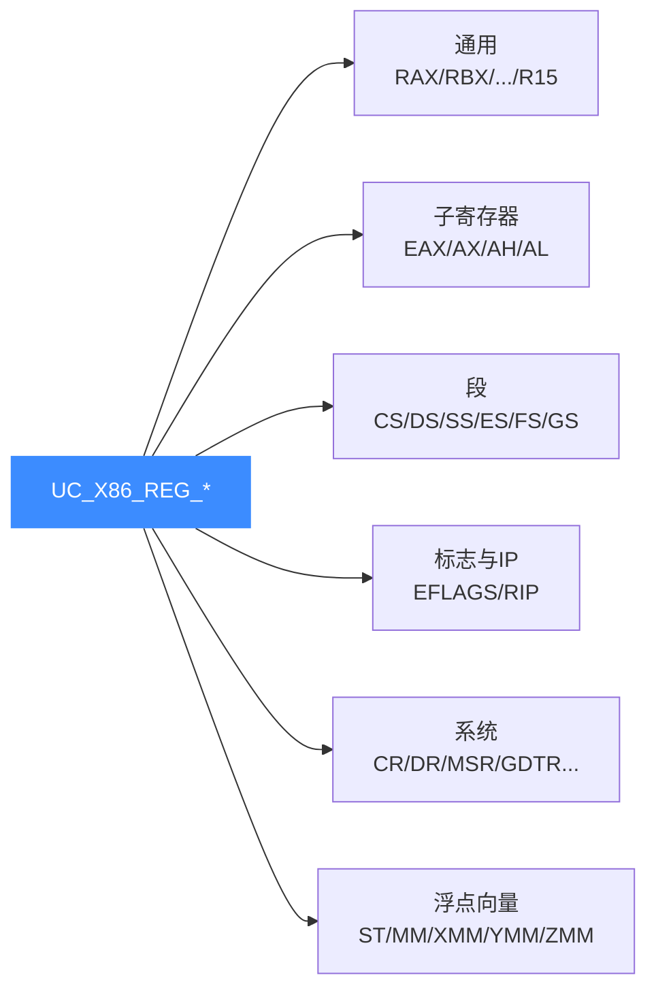

# X86 寄存器参考

本页把 [`include/unicorn/x86.h`](https://github.com/android-security-engineer/unicorn-skills/blob/master/include/unicorn/x86.h) 里的 `UC_X86_REG_*` 枚举按类别整理成表格，并讲清如何用 `uc_reg_read` / `uc_reg_write` 读写普通寄存器，以及段、内存管理寄存器（`uc_x86_mmr`）、MSR（`uc_x86_msr`）这类复杂寄存器的结构体用法。读完你能准确挑选常量并正确传参。

## 🧠 寄存器分类总览



## 📋 通用寄存器与子寄存器

x86-64 的每个 64 位通用寄存器都有 32/16/8 位的子视图，Unicorn 为它们各自提供了独立常量。写子寄存器只影响对应的低位。

| 64 位 | 32 位 | 16 位 | 8 位(低) | 8 位(高) |
| --- | --- | --- | --- | --- |
| `UC_X86_REG_RAX` | `UC_X86_REG_EAX` | `UC_X86_REG_AX` | `UC_X86_REG_AL` | `UC_X86_REG_AH` |
| `UC_X86_REG_RBX` | `UC_X86_REG_EBX` | `UC_X86_REG_BX` | `UC_X86_REG_BL` | `UC_X86_REG_BH` |
| `UC_X86_REG_RCX` | `UC_X86_REG_ECX` | `UC_X86_REG_CX` | `UC_X86_REG_CL` | `UC_X86_REG_CH` |
| `UC_X86_REG_RDX` | `UC_X86_REG_EDX` | `UC_X86_REG_DX` | `UC_X86_REG_DL` | `UC_X86_REG_DH` |
| `UC_X86_REG_RSI` | `UC_X86_REG_ESI` | `UC_X86_REG_SI` | `UC_X86_REG_SIL` | — |
| `UC_X86_REG_RDI` | `UC_X86_REG_EDI` | `UC_X86_REG_DI` | `UC_X86_REG_DIL` | — |
| `UC_X86_REG_RBP` | `UC_X86_REG_EBP` | `UC_X86_REG_BP` | `UC_X86_REG_BPL` | — |
| `UC_X86_REG_RSP` | `UC_X86_REG_ESP` | `UC_X86_REG_SP` | `UC_X86_REG_SPL` | — |

64 位新增的 8 个通用寄存器 `UC_X86_REG_R8` … `UC_X86_REG_R15`，也各有子视图：`R8D`（32 位）、`R8W`（16 位）、`R8B`（8 位），以此类推到 `R15D/R15W/R15B`。

## 🚩 段、标志与指令指针

| 类别 | 常量 | 说明 |
| --- | --- | --- |
| 段寄存器 | `UC_X86_REG_CS/DS/SS/ES/FS/GS` | 段选择子；64 位下另有 `UC_X86_REG_FS_BASE`、`UC_X86_REG_GS_BASE` |
| 标志 | `UC_X86_REG_EFLAGS`、`UC_X86_REG_FLAGS`、`UC_X86_REG_RFLAGS` | 条件/状态标志 |
| 指令指针 | `UC_X86_REG_IP`、`UC_X86_REG_EIP`、`UC_X86_REG_RIP` | 当前执行地址 |

## 🔧 控制、调试与系统表寄存器

| 类别 | 常量 | 说明 |
| --- | --- | --- |
| 控制寄存器 | `UC_X86_REG_CR0`…`UC_X86_REG_CR4`、`UC_X86_REG_CR8` | 分页(CR3)、保护/分页开关(CR0/CR4) |
| 调试寄存器 | `UC_X86_REG_DR0`…`UC_X86_REG_DR7` | 硬件断点 |
| 系统表 | `UC_X86_REG_GDTR/IDTR/LDTR/TR` | 描述符表，配合 `uc_x86_mmr` |
| 模型专属 | `UC_X86_REG_MSR` | 配合 `uc_x86_msr` 读写指定 MSR |

## 🎨 浮点与向量寄存器

| 类别 | 常量范围 | 说明 |
| --- | --- | --- |
| x87 FPU | `UC_X86_REG_ST0`…`UC_X86_REG_ST7`、`UC_X86_REG_FP0`…`FP7` | 80 位浮点栈 |
| MMX | `UC_X86_REG_MM0`…`UC_X86_REG_MM7` | 64 位 SIMD |
| SSE | `UC_X86_REG_XMM0`…`UC_X86_REG_XMM31` | 128 位 |
| AVX | `UC_X86_REG_YMM0`…`UC_X86_REG_YMM31` | 256 位 |
| AVX-512 | `UC_X86_REG_ZMM0`…`UC_X86_REG_ZMM31`、掩码 `K0`…`K7` | 512 位 |
| FPU 控制 | `UC_X86_REG_FPCW/FPSW/FPTAG/MXCSR` | 控制/状态/标记字 |

## 📥 基础读写：uc_reg_read / uc_reg_write

普通整数寄存器传入对应宽度的变量地址即可。XMM 这类 128 位寄存器用两个 `uint64_t`（低 qword 在前）。

```c
int r_ecx = 0x1234;
uint64_t r_xmm0[2] = {0x08090a0b0c0d0e0f, 0x0001020304050607};

uc_reg_write(uc, UC_X86_REG_ECX, &r_ecx);   // 写 32 位
uc_reg_write(uc, UC_X86_REG_XMM0, &r_xmm0); // 写 128 位

uc_reg_read(uc, UC_X86_REG_ECX, &r_ecx);    // 读回
uc_reg_read(uc, UC_X86_REG_XMM0, &r_xmm0);
printf("XMM0 = 0x%.16" PRIx64 "%.16" PRIx64 "\n", r_xmm0[1], r_xmm0[0]);
```

## 🧩 复杂寄存器的结构体用法

段/系统表寄存器（GDTR、IDTR、LDTR、TR）用 `uc_x86_mmr` 结构体，字段来自 `x86.h`：

```c
// 定义于 include/unicorn/x86.h
// typedef struct uc_x86_mmr {
//     uint16_t selector; // GDTR/IDTR 不使用
//     uint64_t base;     // 兼容 32/64 位
//     uint32_t limit;
//     uint32_t flags;    // GDTR/IDTR 不使用
// } uc_x86_mmr;

uc_x86_mmr gdtr;
gdtr.base  = 0xc0000000;
gdtr.limit = 31 * sizeof(struct SegmentDescriptor) - 1;
uc_reg_write(uc, UC_X86_REG_GDTR, &gdtr);   // 操纵段前先设 GDT
```

MSR 用 `uc_x86_msr`：`rid` 指定 MSR 编号，`value` 是值。下例读写 `IA32_EFER`（0xC0000080）：

```c
// typedef struct uc_x86_msr { uint32_t rid; uint64_t value; } uc_x86_msr;
uc_x86_msr msr = {.rid = 0xC0000080, .value = 0};
uc_reg_read(uc, UC_X86_REG_MSR, &msr);      // 读出当前 EFER
msr.value |= 1UL << 8;                       // 置 LME 位
uc_reg_write(uc, UC_X86_REG_MSR, &msr);     // 写回
```

::: tip 变量宽度要匹配
读 64 位寄存器请用 `uint64_t`，读 32 位用 `int`/`uint32_t`。宽度不匹配会读到脏数据或越界。段寄存器本身（如 `UC_X86_REG_CS`）传整数选择子即可，只有 `GDTR/IDTR/LDTR/TR` 才用 `uc_x86_mmr`。
:::

::: warning 段寄存器需先建 GDT
在保护模式下直接写 `UC_X86_REG_SS/CS/DS` 等选择子，必须先通过 `UC_X86_REG_GDTR` 建好合法的描述符表，否则会触发异常。参见 [X86 模式与字节序](/arch/x86/modes)。
:::

## 📂 相关源码

| 文件 | 角色 |
|------|------|
| [`include/unicorn/x86.h`](https://github.com/android-security-engineer/unicorn-skills/blob/master/include/unicorn/x86.h#L90) | `UC_X86_REG_*` 寄存器枚举与 `uc_cpu_*` CPU 型号定义 |
| [`qemu/target/i386/unicorn.c`](https://github.com/android-security-engineer/unicorn-skills/blob/master/qemu/target/i386/unicorn.c) | 后端：`reg_read`/`reg_write`/`uc_init` 等函数指针实现 |
| [`qemu/target/i386/translate.c`](https://github.com/android-security-engineer/unicorn-skills/blob/master/qemu/target/i386/translate.c) | 前端：机器码翻译（TCG） |
| [`samples/sample_x86.c`](https://github.com/android-security-engineer/unicorn-skills/blob/master/samples/sample_x86.c) | 该架构的 C 示例程序 |
| [`include/unicorn/unicorn.h`](https://github.com/android-security-engineer/unicorn-skills/blob/master/include/unicorn/unicorn.h#L102) | `UC_ARCH_X86` 架构常量与 `UC_MODE_*` 公共模式定义 |

## 相关页面

- [uc_reg_read](/api/reg-read)
- [uc_reg_write](/api/reg-write)
- [X86 架构概览](/arch/x86/)
- [X86 模式与字节序](/arch/x86/modes)
