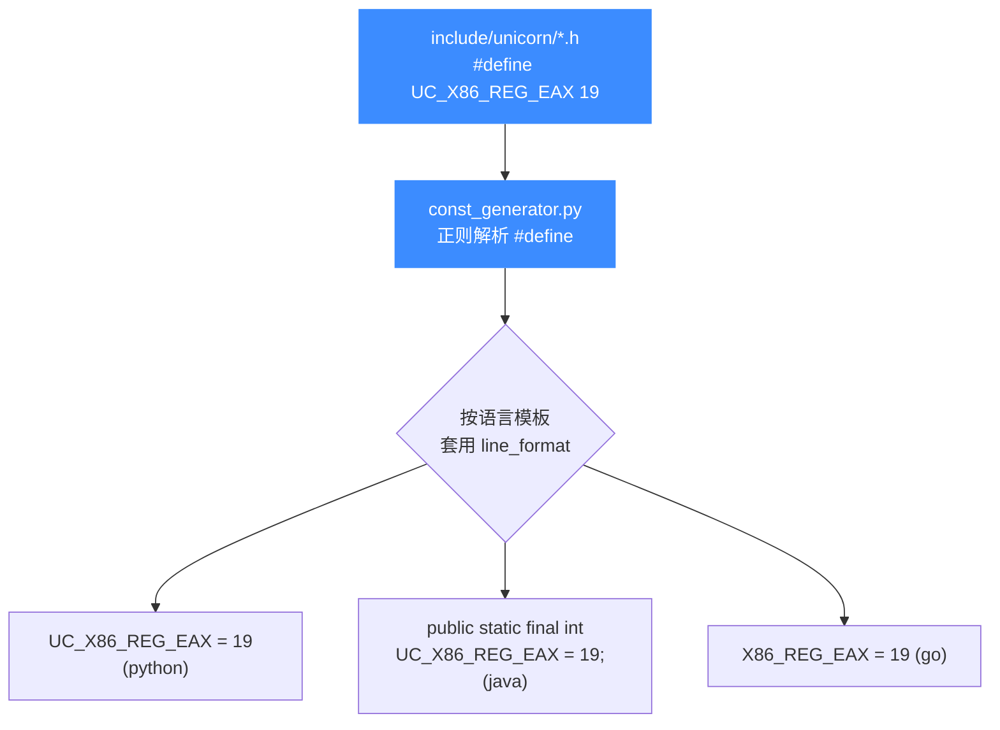
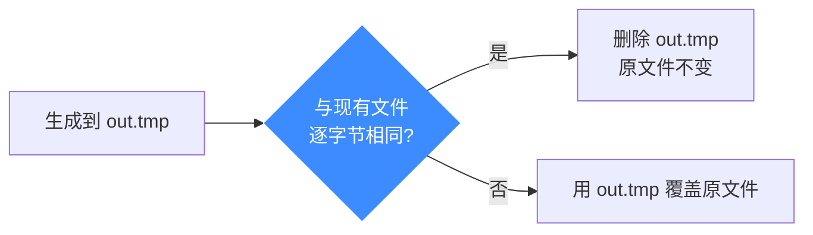

# 常量生成器 const_generator.py

本页讲清 [[`bindings/const_generator.py`](https://github.com/android-security-engineer/unicorn-skills/blob/master/bindings/const_generator.py)](https://github.com/android-security-engineer/unicorn-skills/blob/master/bindings/const_generator.py) 的工作机制:它从哪些 C 头文件读入、为哪些语言产出常量文件、命名前缀如何映射、以及如何保持全语言常量同步。读完你能自己跑一次生成、并知道为什么绝不能手改 `*_const.*` 文件。

## 🧠 它解决什么问题

Unicorn 有大量常量——每个架构的寄存器 ID(如 `UC_X86_REG_EAX`)、[Hook 类型](/features/hooks)、错误码、内存权限位等,都定义在 `include/unicorn/<arch>.h` 里。若让每种语言各自手写一份,极易漂移。生成器让 C 头文件成为**唯一真源**,单向产出各语言常量。



## 📥 输入:头文件清单

生成器顶部写死了要处理的头文件与包含目录:

```python
INCL_DIR = os.path.join('..', 'include', 'unicorn')

include = [ 'arm.h', 'arm64.h', 'mips.h', 'x86.h', 'sparc.h', 'm68k.h',
            'ppc.h', 'riscv.h', 's390x.h', 'tricore.h', 'unicorn.h' ]
```

它逐行扫描这些头文件里的 `#define UC_...` 宏,提取常量名与值。

## 📤 输出:支持的语言

每种语言在脚本里对应一个模板字典,规定输出格式。当前支持的语言键为:

| 语言键 | 输出路径示例 | 行格式 |
|--------|--------------|--------|
| `python` | `./python/unicorn/%s_const.py` | `UC_%s = %s` |
| `ruby` | `./ruby/unicorn_gem/lib/unicorn_engine/%s_const.rb` | `\tUC_%s = %s` |
| `go` | `./go/unicorn/%s_const.go` | `\t%s = %s` |
| `java` | `./java/src/main/java/unicorn/%sConst.java` | `public static final int UC_%s = %s;` |
| `dotnet` | `dotnet/UnicornEngine/Const/%s.fs` | `let UC_%s = %s` |
| `pascal` | Pascal `*Const.pas` 单元 | 依模板而定 |
| `zig` | `./zig/unicorn/%s_const.zig` | 依模板而定 |

::: tip 命名前缀映射
每个模板还给每个头文件配了输出文件名前缀,注意大小写差异:Java 里 `x86.h` → `X86Const.java`、`m68k.h` → `M68k`、`tricore.h` → `TriCore`;Python/Go 则用小写 `x86`、`m68k`、`tricore`。
:::

## 🔧 如何运行

脚本用一个命令行参数选择语言,`all` 表示全部生成:

```bash
cd bindings
python3 const_generator.py python     # 只生成 Python 常量
python3 const_generator.py all        # 生成所有语言
```

`main()` 的逻辑很直接:

```python
def main():
    lang = sys.argv[1]
    if lang == "all":
        for lang in template.keys():
            print("Generating constants for {}".format(lang))
            gen(lang)
    else:
        if not lang in template:
            raise RuntimeError("Unsupported binding %s" % lang)
        gen(lang)
```

传入未支持的语言会抛 `Unsupported binding`。

## ✅ 幂等写回

生成器写出到 `*.tmp`,再与现有文件逐字节比较:内容相同就删掉临时文件(不动原文件时间戳),不同才替换。因此在 CI 里重复运行是安全的、无副作用的。



## ⚠️ 保持同步的纪律

::: danger 绝不要手改 *_const 文件
所有生成文件顶部都有 `AUTO-GENERATED FILE, DO NOT EDIT`。修改常量的正确流程:

1. 改 `include/unicorn/<arch>.h` 里的 `#define`;
2. 运行 `python3 const_generator.py all`;
3. 提交头文件与所有重新生成的常量文件。

跳过第 2 步会让 C 头文件与绑定常量不一致,埋下"同名常量在不同语言取值不同"的隐患。
:::

## 📂 相关源码

| 文件/目录 | 角色 |
|------|------|
| [`bindings/const_generator.py`](https://github.com/android-security-engineer/unicorn-skills/blob/master/bindings/const_generator.py) | 常量生成器脚本：解析 C 头文件产出各语言常量 |
| [`include/unicorn/`](https://github.com/android-security-engineer/unicorn-skills/blob/master/include/unicorn/) | 被读取的架构头文件目录（`<arch>.h`） |

## 相关页面

- [语言绑定总览](/bindings/overview)
- [Python API 详解](/bindings/python-api)
- [架构支持](/features/architectures)
