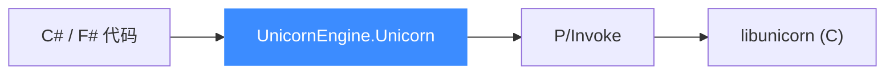

# .NET 绑定

本页讲清 Unicorn 的 .NET 绑定:它用 P/Invoke 调用底层 C 库,核心类型是 `UnicornEngine.Unicorn`。读完你能在 C#/F# 里创建引擎、映射内存、注册 Hook 并跑一段 x86 代码。

## 🧩 机制:P/Invoke 封装

.NET 绑定位于 [`bindings/dotnet/`](https://github.com/android-security-engineer/unicorn-skills/blob/master/bindings/dotnet/)。引擎实现 `UnicornEngine.Unicorn`(用 F# 编写,见 `Unicorn.fs`),通过 **P/Invoke** 调用 `libunicorn` 的导出函数。常量在 `UnicornEngine.Const` 命名空间下按架构分文件(如 `X86.fs`),由 [常量生成器](/bindings/const-generator) 生成。



## 📤 常用方法

| 方法 | 说明 |
|------|------|
| `new Unicorn(int arch, int mode)` | 创建引擎(`IDisposable`) |
| `MemMap(long address, ulong size, int perm)` | 映射内存 |
| `MemWrite(long address, byte[] value)` | 写内存 |
| `RegWrite(int regId, long value)` | 写寄存器(也有 `byte[]` 重载) |
| `EmuStart(long begin, long until, long timeout, long count)` | 开始仿真 |
| `AddCodeHook(callback, begin, end)` | 指令级 Hook |
| `AddEventMemHook(callback, type)` | 非法内存事件 Hook |
| `AddInterruptHook(callback)` | 中断 Hook |
| `HookDel(callback)` | 注销 Hook |

## 🚀 基本用法

以下取自官方 `X86Sample32.cs` 的风格,常量来自 `UnicornEngine.Const`:

```csharp
using UnicornEngine;
using UnicornEngine.Const;

byte[] code = { 0x41, 0x4a };       // INC ecx; DEC edx
long address = 0x1000000;

using var u = new Unicorn(Common.UC_ARCH_X86, Common.UC_MODE_32);

// 映射 2MB 内存
u.MemMap(address, 2 * 1024 * 1024, Common.UC_PROT_ALL);

// 初始化寄存器
u.RegWrite(X86.UC_X86_REG_ECX, 0x1234);
u.RegWrite(X86.UC_X86_REG_EDX, 0x7890);

// 写入机器码
u.MemWrite(address, code);

// 追踪所有指令:begin > end 表示全地址空间
u.AddCodeHook((uc, addr, size, userData) =>
    Console.WriteLine($">>> 执行 @0x{addr:x}, 大小={size}"), 1, 0);

u.EmuStart(address, address + code.Length, 0u, 0u);
```

::: tip 命名空间与前缀
架构常量在 `UnicornEngine.Const` 下,通用常量在 `Common`(如 `Common.UC_ARCH_X86`、`Common.UC_PROT_ALL`),架构专属常量带架构类前缀(如 `X86.UC_X86_REG_ECX`)。
:::

## 🪝 更多 Hook

`X86Sample32.cs` 展示了多种 Hook 一起使用:

```csharp
u.AddInHook(InHookCallback);            // x86 IN 指令
u.AddOutHook(OutHookCallback);          // x86 OUT 指令
u.AddInterruptHook(InterruptHookCallback);
u.AddSyscallHook(SyscallHookCallback);
u.AddEventMemHook(MemMapHookCallback,
    Common.UC_HOOK_MEM_READ_UNMAPPED | Common.UC_HOOK_MEM_WRITE_UNMAPPED);
```

::: warning 资源释放
`Unicorn` 实现 `IDisposable`,请用 `using` 确保底层引擎被释放。API 出错时抛出 `UnicornEngineException`。
:::

## 📂 相关源码

| 文件/目录 | 角色 |
|------|------|
| [`bindings/dotnet/`](https://github.com/android-security-engineer/unicorn-skills/blob/master/bindings/dotnet/) | .NET 绑定源码（F# 实现） |
| [`bindings/const_generator.py`](https://github.com/android-security-engineer/unicorn-skills/blob/master/bindings/const_generator.py) | 生成 `X86.fs` 等常量 |

## 相关页面

- [语言绑定总览](/bindings/overview)
- [Hook 体系](/features/hooks)
- [uc_emu_start](/api/emu-start)
