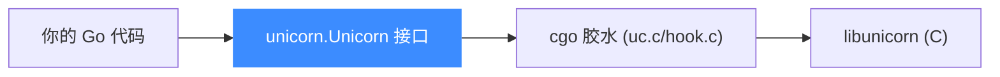

# Go 绑定

本页讲清 Unicorn 的 Go 绑定:它基于 cgo 封装底层 C 库,入口是 `unicorn.NewUnicorn`。读完你能在 Go 里创建引擎、映射内存、注册 Hook 并跑一段 x86-64 代码。

## 🧩 机制:cgo 薄封装

Go 绑定位于 [`bindings/go/unicorn/`](https://github.com/android-security-engineer/unicorn-skills/blob/master/bindings/go/unicorn/),通过 **cgo** 直接调用 `libunicorn` 的 C 符号(`uc.c`/`uc.h`/`hook.c` 是胶水层),对外暴露 `Unicorn` 接口类型。常量文件如 `x86_const.go` 由 [常量生成器](/bindings/const-generator) 生成。



## 📤 常用方法

| 方法 | 说明 |
|------|------|
| `NewUnicorn(arch, mode int) (Unicorn, error)` | 创建引擎 |
| `MemMap(addr, size uint64) error` | 映射内存(`UC_PROT_ALL`) |
| `MemMapProt(addr, size uint64, prot int) error` | 指定权限映射 |
| `MemWrite(addr uint64, data []byte) error` | 写内存 |
| `MemRead(addr, size uint64) ([]byte, error)` | 读内存 |
| `RegWrite(reg int, value uint64) error` | 写寄存器 |
| `RegRead(reg int) (uint64, error)` | 读寄存器 |
| `Start(begin, until uint64) error` | 开始仿真 |
| `Stop() error` | 停止仿真 |
| `HookAdd(...)` | 注册 Hook |
| `Close() error` | 释放引擎 |

## 🚀 基本用法

以下取自官方 `sample.go` 的风格,导入路径与真实包一致:

```go
package main

import (
    "fmt"
    uc "github.com/unicorn-engine/unicorn/bindings/go/unicorn"
)

func main() {
    // mov rax, 3; syscall
    code := []byte{0x48, 0xc7, 0xc0, 0x03, 0x00, 0x00, 0x00, 0x0f, 0x05}

    mu, err := uc.NewUnicorn(uc.ARCH_X86, uc.MODE_64)
    if err != nil {
        panic(err)
    }

    mu.MemMap(0x1000, 0x1000)
    mu.MemWrite(0x1000, code)

    // 每条指令触发的代码 Hook
    mu.HookAdd(uc.HOOK_CODE, func(mu uc.Unicorn, addr uint64, size uint32) {
        fmt.Printf("Code: 0x%x, 0x%x\n", addr, size)
    }, 1, 0)

    if err := mu.Start(0x1000, 0x1000+uint64(len(code))); err != nil {
        panic(err)
    }

    rax, _ := mu.RegRead(uc.X86_REG_RAX)
    fmt.Printf("RAX = 0x%x\n", rax)
}
```

::: tip 常量命名
Go 绑定的常量**不带 `UC_` 前缀**(生成模板的 `line_format` 是 `%s = %s`),所以是 `uc.ARCH_X86`、`uc.HOOK_CODE`、`uc.X86_REG_RAX`,而非 `UC_ARCH_X86`。
:::

## 🪝 Hook 回调签名

`HookAdd` 的回调类型随 Hook 类型不同。`sample.go` 展示了 BLOCK/CODE/MEM/INSN 多种:

```go
mu.HookAdd(uc.HOOK_BLOCK, func(mu uc.Unicorn, addr uint64, size uint32) { /* ... */ }, 1, 0)
mu.HookAdd(uc.HOOK_MEM_READ|uc.HOOK_MEM_WRITE,
    func(mu uc.Unicorn, access int, addr uint64, size int, value int64) { /* ... */ }, 1, 0)
// HOOK_INSN 需额外传指令 id,例如 X86_INS_SYSCALL
mu.HookAdd(uc.HOOK_INSN, func(mu uc.Unicorn) { /* ... */ }, 1, 0, uc.X86_INS_SYSCALL)
```

::: warning cgo 构建
使用 Go 绑定需要能链接到 `libunicorn`(动态或静态,见 `cgo_dynamic.go`/`cgo_static.go`)。因此构建环境需具备 C 工具链,交叉编译时要额外配置。
:::

## 📂 相关源码

| 文件/目录 | 角色 |
|------|------|
| [`bindings/go/unicorn/`](https://github.com/android-security-engineer/unicorn-skills/blob/master/bindings/go/unicorn/) | Go 绑定源码（`Unicorn` 接口与 cgo 胶水） |
| [`bindings/const_generator.py`](https://github.com/android-security-engineer/unicorn-skills/blob/master/bindings/const_generator.py) | 生成 `x86_const.go` 等常量 |

## 相关页面

- [语言绑定总览](/bindings/overview)
- [Hook 体系](/features/hooks)
- [uc_emu_start](/api/emu-start)
