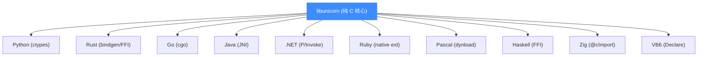
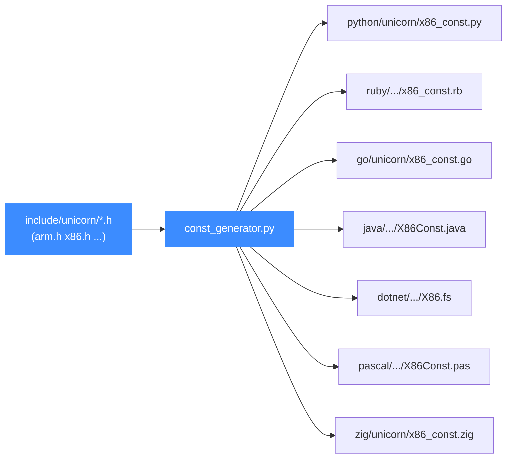

# 语言绑定总览

本页讲清 Unicorn 的"核心 C 库 + 各语言薄封装"分层模型:16+ 种语言绑定如何共用同一份 `libunicorn`,以及各架构常量如何由 `const_generator.py` 从 `include/unicorn/*.h` 自动生成、保持全语言同步。读完你能知道该用哪种语言、去哪找它的入口文件。

## 🧩 分层模型

Unicorn 的所有能力都在纯 C 写就的核心库 `libunicorn` 里(公共 API 见 [`uc_open`](/api/open)、[`uc_emu_start`](/api/emu-start))。每种语言绑定都只是一层**薄封装**——通过 FFI / JNI / P/Invoke / cgo 等机制调用同一套 C 符号,自己几乎不含仿真逻辑。



::: tip 为什么这样设计
核心逻辑只维护一份 C 代码,行为在所有语言里**完全一致**。绑定只做类型转换与内存管理,升级核心即可让所有语言同时受益。
:::

## 📋 语言与目录对照

以下是仓库 [`bindings/`](https://github.com/android-security-engineer/unicorn-skills/blob/master/bindings/) 下随源码维护的官方绑定,以及它们的入口文件:

| 语言 | 目录 | FFI 机制 | 入口/类 |
|------|------|----------|---------|
| Python | `bindings/python/` | ctypes | `unicorn.Uc` |
| Rust | `bindings/rust/` | bindgen + FFI | `unicorn_engine::Unicorn` |
| Go | `bindings/go/` | cgo | `unicorn.NewUnicorn` |
| Java | `bindings/java/` | JNI | `unicorn.Unicorn` |
| .NET | `bindings/dotnet/` | P/Invoke | `UnicornEngine.Unicorn` |
| Ruby | `bindings/ruby/` | native ext | `UnicornEngine::Uc` |
| Pascal/Delphi | `bindings/pascal/` | 动态加载 | `Unicorn_dyn` 单元 |
| Haskell | `bindings/haskell/` | FFI | `Unicorn` 模块 |
| Zig | `bindings/zig/` | `@cImport` | `unicorn` 模块 |
| VB6 | `bindings/vb6/` | `Declare` | `uc_def.bas` |

::: details README 提到的更多社区绑定
Unicorn 的 README 还列出 Crystal、Clojure、Perl、Pharo、Lua 等社区绑定。它们不随本仓库维护,但同样调用 `libunicorn` C API。本文档站聚焦仓库内官方绑定。
:::

## ⚙️ 常量如何自动生成

各架构的寄存器 ID、Hook 类型、错误码等**常量**数量庞大且随架构更新。为避免每种语言手工维护、彼此漂移,Unicorn 用 [[`bindings/const_generator.py`](https://github.com/android-security-engineer/unicorn-skills/blob/master/bindings/const_generator.py)](https://github.com/android-security-engineer/unicorn-skills/blob/master/bindings/const_generator.py) 从 C 头文件**单向生成**各语言的常量文件:



生成器读取的头文件清单(`const_generator.py` 里 `include` 列表)为:

```python
include = [ 'arm.h', 'arm64.h', 'mips.h', 'x86.h', 'sparc.h', 'm68k.h',
            'ppc.h', 'riscv.h', 's390x.h', 'tricore.h', 'unicorn.h' ]
```

每个生成的文件顶部都带 `AUTO-GENERATED FILE, DO NOT EDIT` 标记。

::: warning 不要手改常量文件
凡带 `*_const.*` 后缀的文件都是生成产物。要改常量,请改 `include/unicorn/<arch>.h` 后重新运行生成器,而不是手改任一语言的常量文件——否则下次生成会覆盖你的改动,还会造成语言间不一致。详见 [常量生成器](/bindings/const-generator)。
:::

## 🎯 选型建议

- **快速原型 / CTF / 逆向脚本** → [Python](/bindings/python),API 最完整、生态最丰富。
- **高性能 / 嵌入到 Rust 项目** → [Rust](/bindings/rust),所有权模型保证内存安全。
- **服务端工具链** → [Go](/bindings/go)、[Java](/bindings/java)、[.NET](/bindings/dotnet)。
- **特定历史环境** → [Pascal](/bindings/pascal)、[VB6](/bindings/vb6) 等。

无论哪种语言,支持的架构由核心库决定,完整清单见 [架构支持](/features/architectures)。

## 📂 相关源码

| 文件/目录 | 角色 |
|------|------|
| [`bindings/`](https://github.com/android-security-engineer/unicorn-skills/blob/master/bindings/) | 全部官方语言绑定的根目录 |
| [`bindings/const_generator.py`](https://github.com/android-security-engineer/unicorn-skills/blob/master/bindings/const_generator.py) | 从 C 头文件生成各语言常量 |
| [`include/unicorn/unicorn.h`](https://github.com/android-security-engineer/unicorn-skills/blob/master/include/unicorn/unicorn.h) | C 公共 API 与 `UC_ARCH_*`/`UC_MODE_*`/`UC_HOOK_*` 常量真源 |

## 相关页面

- [常量生成器](/bindings/const-generator)
- [Python 快速上手](/bindings/python)
- [架构支持](/features/architectures)
