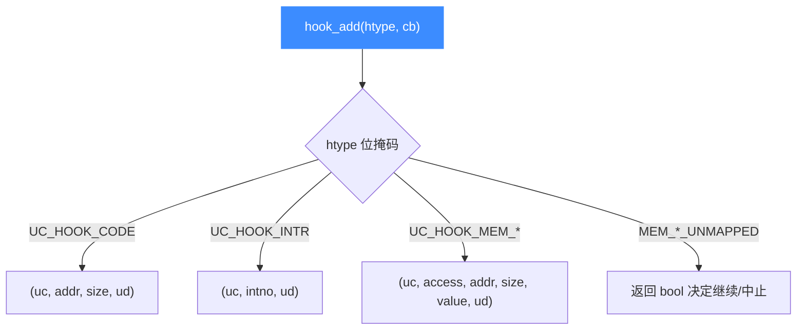

# Python API 详解

本页系统梳理 Unicorn Python 绑定 `Uc` 类的方法:构造、内存、寄存器、仿真控制、Hook 注册,并给出与底层 C API 的对照表。读完你能准确对应每个 Python 方法背后的 C 函数与参数语义。基础入门见 [Python 快速上手](/bindings/python)。

## 🧩 Uc 类构造

```python
class Uc:
    def __init__(self, arch: int, mode: int, cpu: Optional[int] = None) -> None: ...
```

- `arch`:架构常量,如 `UC_ARCH_X86`、`UC_ARCH_ARM`、`UC_ARCH_ARM64`;
- `mode`:模式/位宽/字节序,如 `UC_MODE_32`、`UC_MODE_64`、`UC_MODE_ARM | UC_MODE_LITTLE_ENDIAN`;
- `cpu`:可选 CPU 型号(见 [CPU 型号](/features/cpu-models))。

底层对应 [`uc_open`](/api/open)。对象析构时自动释放引擎句柄。

## 📤 与 C API 对照表

Python 方法名基本是 C 函数去掉 `uc_` 前缀:

| Python 方法 | C 函数 | 说明 |
|-------------|--------|------|
| `Uc(arch, mode)` | `uc_open` | 创建引擎 |
| `mem_map(addr, size, perms)` | `uc_mem_map` | 映射内存,`perms` 默认 `UC_PROT_ALL` |
| `mem_map_ptr(addr, size, perms, ptr)` | `uc_mem_map_ptr` | 映射到宿主已有缓冲 |
| `mem_unmap(addr, size)` | `uc_mem_unmap` | 解除映射 |
| `mem_protect(addr, size, perms)` | `uc_mem_protect` | 改权限 |
| `mem_write(addr, data)` | `uc_mem_write` | 写内存(`bytes`) |
| `mem_read(addr, size)` | `uc_mem_read` | 读内存,返回 `bytearray` |
| `reg_write(reg_id, value)` | `uc_reg_write` | 写寄存器 |
| `reg_read(reg_id)` | `uc_reg_read` | 读寄存器 |
| `emu_start(begin, until, timeout, count)` | `uc_emu_start` | 开始仿真 |
| `emu_stop()` | `uc_emu_stop` | 停止仿真 |
| `hook_add(...)` | `uc_hook_add` | 注册 Hook |
| `hook_del(handle)` | `uc_hook_del` | 注销 Hook |
| `mmio_map(...)` | `uc_mmio_map` | 映射 MMIO 区 |
| `query(prop)` | `uc_query` | 查询属性 |
| `context_save()` / `context_restore()` | `uc_context_save/restore` | 保存/恢复上下文 |

## 🎯 emu_start 参数

```python
def emu_start(self, begin: int, until: int,
              timeout: int = 0, count: int = 0) -> None: ...
```

| 参数 | 含义 |
|------|------|
| `begin` | 起始执行地址 |
| `until` | 执行到该地址(不含)停止;传 0 表示不用地址停止 |
| `timeout` | 超时(微秒),0 = 不限时 |
| `count` | 最多执行指令数,0 = 不限 |

细节见 [`uc_emu_start`](/api/emu-start)。

## 🪝 hook_add 与回调签名

```python
def hook_add(self, htype: int, callback: Callable, user_data: Any = None,
             begin: int = 1, end: int = 0, aux1: int = 0, aux2: int = 0) -> int: ...
```

`htype` 是 `UC_HOOK_*` 位掩码,可按位或组合。`begin > end`(默认 `1 > 0`)表示全地址空间生效。不同 Hook 类型对应不同回调签名——Python 绑定内部按类型分派:

| Hook 类型 | 回调签名 |
|-----------|----------|
| `UC_HOOK_CODE` / `UC_HOOK_BLOCK` | `(uc, address, size, user_data)` |
| `UC_HOOK_INTR` | `(uc, intno, user_data)` |
| `UC_HOOK_MEM_READ/WRITE/FETCH` | `(uc, access, address, size, value, user_data)` |
| `UC_HOOK_MEM_*_UNMAPPED/PROT` | `(uc, access, address, size, value, user_data) -> bool` |
| `UC_HOOK_INSN_INVALID` | `(uc, user_data) -> bool` |
| `UC_HOOK_EDGE_GENERATED` | `(uc, cur_tb, prev_tb, user_data)` |
| `UC_HOOK_TLB_FILL` | `(uc, vaddr, access, entry, user_data) -> bool` |



::: tip UC_HOOK_* 常量来自哪
`UC_HOOK_CODE`、`UC_HOOK_MEM_WRITE` 等定义在 `unicorn.unicorn_const` 里,由 [常量生成器](/bindings/const-generator) 从 [[`include/unicorn/unicorn.h`](https://github.com/android-security-engineer/unicorn-skills/blob/master/include/unicorn/unicorn.h)](https://github.com/android-security-engineer/unicorn-skills/blob/master/include/unicorn/unicorn.h) 生成。`from unicorn import *` 即可使用。
:::

## 🧠 内存 Hook 完整示例

```python
def hook_mem_access(uc, access, address, size, value, user_data):
    if access == UC_MEM_WRITE:
        print(">>> 写 0x%x, 大小=%u, 值=0x%x" % (address, size, value))
    else:
        print(">>> 读 0x%x, 大小=%u" % (address, size))

def hook_mem_invalid(uc, access, address, size, value, user_data):
    if access == UC_MEM_WRITE_UNMAPPED:
        uc.mem_map(0xaaaa0000, 2 * 1024 * 1024)  # 按需补映射
        return True   # 已处理,继续仿真
    return False       # 中止仿真

mu.hook_add(UC_HOOK_MEM_WRITE | UC_HOOK_MEM_READ, hook_mem_access)
mu.hook_add(UC_HOOK_MEM_WRITE_UNMAPPED, hook_mem_invalid)
```

::: warning 返回值语义
未映射/保护违例类 Hook 返回 `True` 表示"已修复,继续",返回 `False` 表示"中止仿真"。CODE/BLOCK 类的返回值无意义,要停止请调用 `uc.emu_stop()`。
:::

## ✅ 寄存器读写与批处理

单个寄存器用 `reg_read` / `reg_write`;批量用 `reg_read_batch` / `reg_write_batch`(见 [批量寄存器 API](/features/batch-api))。寄存器 ID 常量按架构分文件,例如:

```python
from unicorn.x86_const import UC_X86_REG_RAX, UC_X86_REG_RIP
from unicorn.arm_const import UC_ARM_REG_R0
```

## 📂 相关源码

| 文件/目录 | 角色 |
|------|------|
| [`bindings/python/`](https://github.com/android-security-engineer/unicorn-skills/blob/master/bindings/python/) | Python 绑定源码（`Uc` 类实现） |
| [`bindings/const_generator.py`](https://github.com/android-security-engineer/unicorn-skills/blob/master/bindings/const_generator.py) | 生成 `unicorn_const` 常量 |
| [`include/unicorn/unicorn.h`](https://github.com/android-security-engineer/unicorn-skills/blob/master/include/unicorn/unicorn.h) | `UC_HOOK_*` 等常量真源 |

## 相关页面

- [Python 快速上手](/bindings/python)
- [uc_emu_start](/api/emu-start)
- [Hook 体系](/features/hooks)
