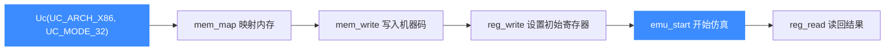

# Python 快速上手

本页带你从零跑起 Unicorn 的 Python 绑定:安装、`Uc` 类的基本用法,并给出一个可直接运行的最小 x86 仿真脚本。读完你能仿真一段机器码并读回寄存器。更细的 API 见 [Python API 详解](/bindings/python-api)。

## 📥 安装

Python 绑定通过 PyPI 分发预编译 wheel,直接 pip 安装即可:

```bash
python3 -m pip install unicorn
```

::: tip 版本要求
Unicorn2 的 Python 绑定面向 Python 3.7+。若你需要在 Python2 下使用,只能获得 Unicorn1 级别的功能(见 `unicorn/unicorn_py2`)。开发模式安装(可编辑)见仓库 `bindings/python/README.md`。
:::

## 🧩 核心对象:Uc

一切从 `Uc(arch, mode)` 开始。`arch` 选架构、`mode` 选位宽/字节序,取值都是生成的常量(如 `UC_ARCH_X86`、`UC_MODE_32`)。典型仿真流程:



## 🚀 最小 x86 仿真脚本

下面这段代码仿真两条 x86 指令 `INC ecx; DEC edx`,取自官方样例风格,可直接运行:

```python
from unicorn import *
from unicorn.x86_const import *

# INC ecx; DEC edx
X86_CODE32 = b"\x41\x4a"

# 仿真起始地址
ADDRESS = 0x1000000

# 1) 创建引擎:x86, 32 位模式
mu = Uc(UC_ARCH_X86, UC_MODE_32)

# 2) 映射 2MB 内存供本次仿真使用
mu.mem_map(ADDRESS, 2 * 1024 * 1024)

# 3) 把机器码写入这块内存
mu.mem_write(ADDRESS, X86_CODE32)

# 4) 设置初始寄存器
mu.reg_write(UC_X86_REG_ECX, 0x1234)
mu.reg_write(UC_X86_REG_EDX, 0x7890)

# 5) 开始仿真:从 ADDRESS 执行到码尾
mu.emu_start(ADDRESS, ADDRESS + len(X86_CODE32))

# 6) 读回结果
r_ecx = mu.reg_read(UC_X86_REG_ECX)
r_edx = mu.reg_read(UC_X86_REG_EDX)
print(">>> ECX = 0x%x" % r_ecx)   # 0x1235
print(">>> EDX = 0x%x" % r_edx)   # 0x788f
```

运行后 `ECX` 自增为 `0x1235`、`EDX` 自减为 `0x788f`,说明两条指令确实被执行。

::: warning 内存必须先映射
`emu_start` 执行的代码和它访问的数据都必须落在已 `mem_map` 的区域内,否则触发未映射访问错误。映射地址与大小通常要按页(默认 4KB)对齐。相关背景见 [内存映射](/features/memory)。
:::

## 🪝 加一个指令级 Hook

`hook_add` 让你在每条指令执行前插入回调,常用于追踪与断点:

```python
def hook_code(uc, address, size, user_data):
    print(">>> 执行指令 @0x%x, 大小=%u" % (address, size))

mu.hook_add(UC_HOOK_CODE, hook_code)
```

回调签名与更多 Hook 类型见 [Python API 详解](/bindings/python-api) 与通用的 [Hook 体系](/features/hooks)。

## ❌ 错误处理

API 出错时抛出 `UcError` 异常,携带错误码:

```python
try:
    mu.emu_start(ADDRESS, ADDRESS + len(X86_CODE32))
except UcError as e:
    print("仿真失败: %s" % e)
```

## 📂 相关源码

| 文件/目录 | 角色 |
|------|------|
| [`bindings/python/`](https://github.com/android-security-engineer/unicorn-skills/blob/master/bindings/python/) | Python 绑定源码（`unicorn/` 包） |
| [`bindings/const_generator.py`](https://github.com/android-security-engineer/unicorn-skills/blob/master/bindings/const_generator.py) | 生成 `unicorn/x86_const.py` 等常量 |

## 相关页面

- [Python API 详解](/bindings/python-api)
- [快速上手](/guide/quickstart)
- [Hook 体系](/features/hooks)
