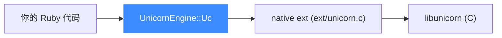

# Ruby 绑定

本页讲清 Unicorn 的 Ruby 绑定:它以 native extension 形式封装底层 C 库,核心类是 `UnicornEngine::Uc`。读完你能在 Ruby 里创建引擎、映射内存、注册 Hook 并跑一段 x86 代码。

## 🧩 机制:native extension

Ruby 绑定位于 [`bindings/ruby/`](https://github.com/android-security-engineer/unicorn-skills/blob/master/bindings/ruby/),gem 源码在 `unicorn_gem/`,原生扩展在 `ext/unicorn.c`,通过 C 扩展调用 `libunicorn`。常量在 `UnicornEngine` 模块下按架构分文件(如 `unicorn_engine/x86_const.rb`),由 [常量生成器](/bindings/const-generator) 生成。



## 📤 常用方法

引入方式:`require 'unicorn_engine'` 并 `include UnicornEngine`。

| 方法 | 说明 |
|------|------|
| `Uc.new(arch, mode)` | 创建引擎 |
| `mem_map(addr, size)` | 映射内存 |
| `mem_write(addr, data)` | 写内存 |
| `mem_read(addr, size)` | 读内存 |
| `reg_write(regid, value)` | 写寄存器 |
| `reg_read(regid)` | 读寄存器 |
| `emu_start(begin, until)` | 开始仿真 |
| `emu_stop` | 停止仿真 |
| `hook_add(type, callback)` | 注册 Hook |

## 🚀 基本用法

以下取自官方 `sample_x86.rb` 的风格:

```ruby
require 'unicorn_engine'
require 'unicorn_engine/x86_const'

include UnicornEngine

X86_CODE32 = "\x41\x4a"   # INC ecx; DEC edx
ADDRESS = 0x1000000

# 指令级 Hook(Proc)
HOOK_CODE = Proc.new do |uc, address, size, user_data|
    puts(">>> 执行 @0x%x, 大小=%u" % [address, size])
end

mu = Uc.new UC_ARCH_X86, UC_MODE_32

# 映射 2MB 内存并写入机器码
mu.mem_map(ADDRESS, 2 * 1024 * 1024)
mu.mem_write(ADDRESS, X86_CODE32)

# 初始化寄存器
mu.reg_write(UC_X86_REG_ECX, 0x1234)
mu.reg_write(UC_X86_REG_EDX, 0x7890)

# 注册 Hook
mu.hook_add(UC_HOOK_CODE, HOOK_CODE)

# 开始仿真
mu.emu_start(ADDRESS, ADDRESS + X86_CODE32.bytesize)

puts(">>> ECX = 0x%x" % mu.reg_read(UC_X86_REG_ECX))
puts(">>> EDX = 0x%x" % mu.reg_read(UC_X86_REG_EDX))
```

::: tip 机器码是字符串
Ruby 里机器码以二进制字符串表示(`"\x41\x4a"`),长度用 `.bytesize` 取,而非 `.length`(多字节编码下二者可能不同)。
:::

## 🪝 处理未映射内存

```ruby
HOOK_MEM_INVALID = lambda do |uc, access, address, size, value, user_data|
    if access == UC_MEM_WRITE_UNMAPPED
        uc.mem_map(0xaaaa0000, 2 * 1024 * 1024)   # 补映射
        return true    # 已处理,继续
    else
        return false   # 中止仿真
    end
end

mu.hook_add(UC_HOOK_MEM_READ_UNMAPPED, HOOK_MEM_INVALID)
```

::: warning 常量前缀
Ruby 绑定的常量带 `UC_` 前缀(生成模板 `line_format` 为 `\tUC_%s = %s`),且封装在 `UnicornEngine` 模块里,`include UnicornEngine` 后可直接用 `UC_ARCH_X86`。
:::

## 📂 相关源码

| 文件/目录 | 角色 |
|------|------|
| [`bindings/ruby/`](https://github.com/android-security-engineer/unicorn-skills/blob/master/bindings/ruby/) | Ruby 绑定源码（gem 与原生扩展） |
| [`bindings/const_generator.py`](https://github.com/android-security-engineer/unicorn-skills/blob/master/bindings/const_generator.py) | 生成 `x86_const.rb` 等常量 |

## 相关页面

- [语言绑定总览](/bindings/overview)
- [Hook 体系](/features/hooks)
- [内存映射](/features/memory)
