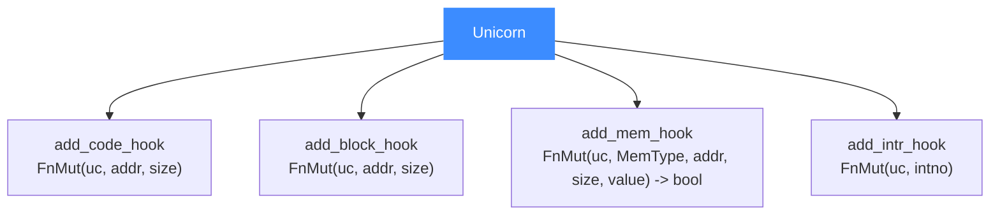

# Rust API 详解

本页梳理 Unicorn Rust 绑定的核心类型与方法:`Unicorn<'a, D>`、内存/寄存器操作、各类 Hook,以及所有权、可变借用、生命周期与回调闭包相关的注意点。读完你能安全地在 Rust 里组织仿真逻辑而不撞借用检查器。入门见 [Rust 快速上手](/bindings/rust)。

## 🧩 核心类型 Unicorn

引擎类型带一个生命周期与一个用户数据泛型:

```rust
pub struct Unicorn<'a, D: 'a> { /* ... */ }

impl<'a> Unicorn<'a, ()> {
    pub fn new(arch: Arch, mode: Mode) -> Result<Unicorn<'a, ()>, uc_error> { ... }
}

impl<'a, D> Unicorn<'a, D> {
    pub fn new_with_data(arch: Arch, mode: Mode, data: D)
        -> Result<Unicorn<'a, D>, uc_error> { ... }
}
```

- `Unicorn::new` 创建不带用户数据的引擎(`D = ()`);
- `new_with_data` 附带任意用户数据 `D`,可在回调中通过 `get_data()` / `get_data_mut()` 访问;
- `Drop` 时自动 `uc_close`,你无需手动释放。

## 📤 内存与寄存器方法

| 方法 | self 借用 | C 对应 | 说明 |
|------|-----------|--------|------|
| `mem_map(addr, size, perms: Prot)` | `&mut` | `uc_mem_map` | 映射内存 |
| `mem_unmap(addr, size)` | `&mut` | `uc_mem_unmap` | 解除映射 |
| `mem_protect(addr, size, perms)` | `&mut` | `uc_mem_protect` | 改权限 |
| `mem_write(addr, &[u8])` | `&mut` | `uc_mem_write` | 写内存 |
| `mem_read(addr, &mut [u8])` | `&` | `uc_mem_read` | 读入缓冲 |
| `mem_read_as_vec(addr, size)` | `&` | `uc_mem_read` | 读为 `Vec<u8>` |
| `reg_write(regid, value)` | `&mut` | `uc_reg_write` | 写寄存器 |
| `reg_read(regid)` | `&` | `uc_reg_read` | 读寄存器 |
| `mmio_map / mmio_map_ro / mmio_map_wo` | `&mut` | `uc_mmio_map` | 映射 MMIO |

::: tip 可变 vs 只读借用
凡改变引擎状态的方法都要 `&mut self`(`mem_map`、`mem_write`、`reg_write`、`emu_start`),读方法要 `&self`。这直接映射到 Rust 的借用规则:仿真进行中不能同时持有另一个可变引用。
:::

## 🎯 emu_start / emu_stop

```rust
pub fn emu_start(&mut self, begin: u64, until: u64,
                 timeout: u64, count: usize) -> Result<(), uc_error>;
pub fn emu_stop(&mut self) -> Result<(), uc_error>;
```

`timeout` 单位微秒(可用 `SECOND_SCALE` 换算),`count` 为最大指令数,二者为 0 表示不限。参数语义同底层 [`uc_emu_start`](/api/emu-start)。

::: warning emu_stop 的时机
`emu_stop` 通常在 Hook 回调里调用,但**当前基本块执行完才真正停止**,不是立刻停在下一条指令。
:::

## 🪝 Hook 方法与闭包签名

Rust 用不同方法注册不同 Hook,回调是闭包:

```rust
pub fn add_code_hook<F>(&mut self, begin: u64, end: u64, callback: F)
    -> Result<UcHookId, uc_error>
where F: FnMut(&mut Unicorn<D>, u64, u32) + 'a;

pub fn add_block_hook<F>(&mut self, begin: u64, end: u64, callback: F)
    -> Result<UcHookId, uc_error>;

pub fn add_mem_hook<F>(&mut self, hook_type: HookType, begin: u64, end: u64, callback: F)
    -> Result<UcHookId, uc_error>
where F: FnMut(&mut Unicorn<D>, MemType, u64, usize, i64) -> bool + 'a;

pub fn add_intr_hook<F>(&mut self, callback: F) -> Result<UcHookId, uc_error>;
pub fn add_insn_invalid_hook<F>(&mut self, callback: F) -> Result<UcHookId, uc_error>;
```



内存 Hook 回调返回 `bool`:`true` 表示已处理/继续,`false` 表示中止,语义同 [Hook 体系](/features/hooks)。

## 🧠 所有权与生命周期注意点

::: danger 闭包借用的 'a 约束
所有 Hook 闭包都带 `+ 'a` 约束——它们的生命周期不能超过 `Unicorn<'a, D>`。若闭包要捕获外部可变状态,惯用做法是把状态放进 `new_with_data` 的用户数据 `D`,在回调里通过第一个参数 `&mut Unicorn<D>` 的 `get_data_mut()` 访问,避免同时可变借用外部变量导致的编译错误。
:::

- 回调第一个参数就是 `&mut Unicorn<D>`,可在回调内继续调用引擎方法(如补映射内存、`emu_stop`)。
- `Unicorn` 内部用引用计数持有底层句柄,`Clone` 是浅拷贝共享同一引擎。
- 用户数据 `D` 是把"回调需要的可变上下文"安全传入的推荐通道。

## 🚀 带用户数据的示例

```rust
use unicorn_engine::{Arch, Mode, Unicorn};

let mut emu = Unicorn::new_with_data(Arch::X86, Mode::MODE_32, 0u64)
    .expect("init failed");

// 在代码 Hook 里累加已执行指令数,存入用户数据
emu.add_code_hook(1, 0, |uc, _addr, _size| {
    *uc.get_data_mut() += 1;
}).expect("hook failed");
```

## 📂 相关源码

| 文件/目录 | 角色 |
|------|------|
| [`bindings/rust/`](https://github.com/android-security-engineer/unicorn-skills/blob/master/bindings/rust/) | Rust 绑定源码（`Unicorn` 类型与 Hook） |
| [`bindings/const_generator.py`](https://github.com/android-security-engineer/unicorn-skills/blob/master/bindings/const_generator.py) | 生成常量 |

## 相关页面

- [Rust 快速上手](/bindings/rust)
- [Hook 体系](/features/hooks)
- [uc_emu_start](/api/emu-start)
