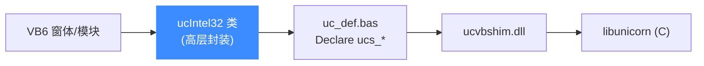

# Visual Basic 6 绑定

本页讲清 Unicorn 的 Visual Basic 6 绑定:它通过 VB6 的 `Declare` 语句声明一个 shim DLL(`ucvbshim.dll`)导出的函数,并提供一个高层封装类 `ucIntel32`。读完你能在 VB6 里映射内存、注册 Hook 并跑一段 x86-32 代码。

## 🧩 机制:Declare + shim DLL

VB6 绑定位于 [`bindings/vb6/`](https://github.com/android-security-engineer/unicorn-skills/blob/master/bindings/vb6/),由 FireEye FLARE 团队贡献。因为 VB6 无法直接调用某些 C 调用约定与回调,绑定引入了一个中间层 `ucvbshim.dll`(源码 `main.cpp`/`ucvbshim.vcproj`),把 Unicorn 的 C API 包装成 VB6 友好的 `ucs_*` 导出函数;VB6 端用 `Declare Function` 声明它们(见 `uc_def.bas`)。此外提供高层类 `ucIntel32` 封装常见流程。



## 📤 底层 Declare 与高层方法

`uc_def.bas` 中的 `Declare` 直接对应 C API,例如:

```vb
Public Declare Function ucs_open Lib "ucvbshim.dll" _
    (ByVal arch As uc_arch, ByVal mode As uc_mode, ByRef hEngine As Long) As uc_err
Public Declare Function ucs_mem_map Lib "ucvbshim.dll" _
    (ByVal hEngine As Long, ByVal addr As Currency, ByVal size As Currency, ByVal perms As uc_prot) As uc_err
Public Declare Function ucs_emu_start Lib "ucvbshim.dll" _
    (ByVal hEngine As Long, ByVal startAt As Currency, ByVal endAt As Currency, ByVal timeout As Currency, ByVal count As Long) As uc_err
```

`ucIntel32` 类把它们封装成更易用的方法:

| 高层方法 | 底层 | 说明 |
|----------|------|------|
| `New ucIntel32` | `ucs_open` | 构造即打开 x86-32 引擎 |
| `mapMem(address, size)` | `ucs_mem_map` | 映射内存 |
| `writeMem(address, b())` | `ucs_mem_write` | 写内存 |
| `readMem(address, b2, len)` | `ucs_mem_read` | 读内存 |
| `reg32(r) = v` / `reg8(r)` | `ucs_reg_write/read` | 读写寄存器 |
| `addHook type` | `ucs_hook_add` | 注册 Hook |
| `startEmu(address, endAt)` | `ucs_emu_start` | 开始仿真 |

## 🚀 基本用法

以下取自官方示例 `Form1.frm`,演示 `ucIntel32` 类的用法:

```vb
Dim uc As ucIntel32
Dim b() As Byte
Dim address As Long, size As Long, endAt As Long

Set uc = New ucIntel32           ' 构造即打开 x86-32 引擎
If uc.hadErr Then
    List1.AddItem uc.errMsg
    Exit Sub
End If

' 机器码:...; INC ecx; DEC edx
b() = toBytes("4141414141414242cc\x89\x0D\xAA\xAA\xAA\xAA\x41\x4a")

address = &H1000000
size = &H200000
endAt = address + UBound(b) + 1

' 映射 2MB 内存并写入机器码
If Not uc.mapMem(address, size) Then Exit Sub
If Not uc.writeMem(address, b()) Then Exit Sub

' 初始化寄存器
uc.reg32(ecx_r) = 3
uc.reg32(edx_r) = 15

' 注册 Hook:指令级 + 未映射内存 + 中断
uc.addHook hc_code, UC_HOOK_CODE
uc.addHook hc_memInvalid, UC_HOOK_MEM_READ_UNMAPPED Or UC_HOOK_MEM_WRITE_UNMAPPED
uc.addHook hc_int, UC_HOOK_INTR

' 开始仿真
If Not uc.startEmu(address, endAt) Then List1.AddItem uc.errMsg

' 读回寄存器
Dim ecx As Long
ecx = uc.reg32(ecx_r)
```

::: tip Currency 承载 64 位
VB6 的 `Long` 只有 32 位,绑定用 `Currency` 类型承载地址/大小等 64 位量(见各 `Declare` 的参数类型)。高层类已帮你处理这些细节。
:::

::: warning 平台限制
VB6 绑定针对 32 位 x86,依赖 `ucvbshim.dll`。它是社区(FireEye FLARE)贡献的历史环境支持,采用 Apache 2.0 许可,与核心库许可不同。使用前需先编译或获取 `ucvbshim.dll`。
:::

## 📂 相关源码

| 文件/目录 | 角色 |
|------|------|
| [`bindings/vb6/`](https://github.com/android-security-engineer/unicorn-skills/blob/master/bindings/vb6/) | VB6 绑定源码（`ucvbshim` 与 `uc_def.bas`） |
| [`bindings/const_generator.py`](https://github.com/android-security-engineer/unicorn-skills/blob/master/bindings/const_generator.py) | 生成常量 |

## 相关页面

- [语言绑定总览](/bindings/overview)
- [Hook 体系](/features/hooks)
- [uc_emu_start](/api/emu-start)
