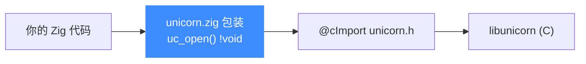

# Zig 绑定

本页讲清 Unicorn 的 Zig 绑定:它用 `@cImport` 直接导入 C 头文件,并为每个 C 函数提供返回 Zig error union 的薄包装。读完你能在 Zig 里打开引擎、映射内存、注册 Hook 并跑一段 RISC-V 代码。

## 🧩 机制:@cImport + error union 包装

Zig 绑定位于 [`bindings/zig/`](https://github.com/android-security-engineer/unicorn-skills/blob/master/bindings/zig/),核心模块 `unicorn/unicorn.zig` 用 `@cImport(@cInclude("unicorn/unicorn.h"))` 导入整个 C API(暴露为 `unicorn.c`),再为常用函数提供**返回 `!void` 的包装**——把 C 的 `uc_err` 返回码转成 Zig 的错误类型,可直接 `try`。常量文件(`x86_const.zig` 等)由 [常量生成器](/bindings/const-generator) 生成。



## 📤 包装函数

包装保持 C 命名,但返回错误联合类型,失败可 `try` 或 `catch`:

| 包装函数 | 说明 |
|----------|------|
| `uc_open(arch, mode, &uc) !void` | 创建引擎 |
| `uc_mem_map(uc, addr, size, perms) !void` | 映射内存 |
| `uc_mem_write(uc, addr, bytes, size) !void` | 写内存 |
| `uc_reg_write(uc, regid, *value) !void` | 写寄存器(指针传值) |
| `uc_reg_read(uc, regid, *value) !void` | 读寄存器 |
| `uc_emu_start(uc, begin, until, timeout, count) !void` | 开始仿真 |
| `uc_hook_add(uc, &hh, type, callback, ud, begin, end) !void` | 注册 Hook |
| `uc_close(uc) !void` | 释放引擎 |

原始 C 类型与常量通过 `unicorn.c`(即 `@cImport` 结果)访问,如 `unicornC.uc_engine`、`unicornC.UC_ARCH_RISCV`。

## 🚀 基本用法

以下取自官方 `sample/sample_riscv_zig.zig`:

```zig
const unicorn = @import("unicorn");
const unicornC = unicorn.c;
const log = unicorn.log;

const RISCV_CODE = "\x13\x05\x10\x00\x93\x85\x05\x02";
const ADDRESS = 0x10000;

pub fn main() !void {
    var uc: ?*unicornC.uc_engine = null;
    var trace1: unicornC.uc_hook = undefined;
    var a0: u64 = 0x1234;
    var a1: u64 = 0x7890;

    // 以 RISCV64 模式初始化引擎
    try unicorn.uc_open(unicornC.UC_ARCH_RISCV, unicornC.UC_MODE_RISCV64, &uc);

    // 初始化寄存器(指针传值)
    try unicorn.uc_reg_write(uc, unicornC.UC_RISCV_REG_A0, &a0);
    try unicorn.uc_reg_write(uc, unicornC.UC_RISCV_REG_A1, &a1);

    // 映射 2MB 内存并写入机器码
    try unicorn.uc_mem_map(uc, ADDRESS, 2 * 1024 * 1024, unicornC.UC_PROT_ALL);
    try unicorn.uc_mem_write(uc, ADDRESS, RISCV_CODE, RISCV_CODE.len);

    // 注册块级 Hook
    try unicorn.uc_hook_add(uc, &trace1, unicornC.UC_HOOK_BLOCK,
        @as(?*anyopaque, @ptrCast(@constCast(&hook_block))), null, 1, 0);

    // 开始仿真
    try unicorn.uc_emu_start(uc, ADDRESS, ADDRESS + RISCV_CODE.len, 0, 0);

    try unicorn.uc_reg_read(uc, unicornC.UC_RISCV_REG_A0, &a0);
    log.info(">>> A0 = 0x{x}", .{a0});

    try unicorn.uc_close(uc);
}
```

::: tip 回调需要 C 调用约定
Hook 回调必须用 `callconv(.C)` 声明,并在 `uc_hook_add` 里 `@ptrCast`/`@constCast` 成 `?*anyopaque` 传入。例如:

```zig
fn hook_block(uc: ?*unicornC.uc_engine, address: u64, size: u32,
              user_data: ?*anyopaque) callconv(.C) void {
    log.info(">>> Block @0x{x}, size=0x{x}", .{ address, size });
}
```
:::

::: warning 错误处理是显式的
所有包装返回 `!void`,你必须 `try` 或 `catch`。示例里 `uc_open` 有时用 `catch |err|` 打印错误,常规调用直接 `try`。
:::

## 📂 相关源码

| 文件/目录 | 角色 |
|------|------|
| [`bindings/zig/`](https://github.com/android-security-engineer/unicorn-skills/blob/master/bindings/zig/) | Zig 绑定源码（`unicorn/unicorn.zig`） |
| [`bindings/const_generator.py`](https://github.com/android-security-engineer/unicorn-skills/blob/master/bindings/const_generator.py) | 生成 `x86_const.zig` 等常量 |

## 相关页面

- [语言绑定总览](/bindings/overview)
- [Hook 体系](/features/hooks)
- [uc_emu_start](/api/emu-start)
