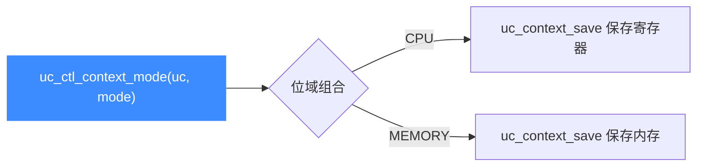

# uc_ctl_context_mode

设置 **context 快照的范围**：仅 CPU 寄存器、仅内存，或两者组合（位域）。读完你会知道如何让 `uc_context_save/restore` 一并保存内存状态，实现完整快照。

## 🧩 便捷宏定义与展开

来自 `include/unicorn/unicorn.h`：

```c
#define uc_ctl_context_mode(uc, mode) \
    uc_ctl(uc, UC_CTL_WRITE(UC_CTL_CONTEXT_MODE, 1), (mode))
```

> 📄 声明：[`unicorn.h`](https://github.com/android-security-engineer/unicorn-skills/blob/master/include/unicorn/unicorn.h#L690)（便捷宏）· [`unicorn.h`](https://github.com/android-security-engineer/unicorn-skills/blob/master/include/unicorn/unicorn.h#L607)（`UC_CTL_CONTEXT_MODE` 控制码）· 实现：[`uc.c`](https://github.com/android-security-engineer/unicorn-skills/blob/master/uc.c#L2965)（`case UC_CTL_CONTEXT_MODE`）

展开为写方向、1 个参数、控制类型 `UC_CTL_CONTEXT_MODE`。

## 📤 参数与方向

| 项目 | 值 |
| --- | --- |
| 控制类型 | `UC_CTL_CONTEXT_MODE` |
| 方向 | `UC_CTL_IO_WRITE`（只写） |
| 参数个数 | 1 |
| `mode` 类型 | `int`（`uc_context_content` 的位或组合） |
| 返回 | `uc_err`，成功为 `UC_ERR_OK` |

取值来自 `uc_context_content` 枚举（`include/unicorn/unicorn.h`）：

| 取值 | 语义 |
| --- | --- |
| `UC_CTL_CONTEXT_CPU`（1） | 保存 CPU 寄存器状态（默认） |
| `UC_CTL_CONTEXT_MEMORY`（2） | 保存内存状态（内部指针，快照式） |

二者可位或组合，如 `UC_CTL_CONTEXT_CPU | UC_CTL_CONTEXT_MEMORY` 表示同时保存寄存器与内存。`uc.c` 写分支把值存入 `uc->context_content`。



## 🔧 何时用 / 示例

需要保存并回滚完整机器状态（寄存器 + 内存）时：

```c
uc_engine *uc;
uc_open(UC_ARCH_X86, UC_MODE_64, &uc);

// 让 context 同时覆盖 CPU 与内存
uc_err err = uc_ctl_context_mode(
    uc, UC_CTL_CONTEXT_CPU | UC_CTL_CONTEXT_MEMORY);
if (err) {
    printf("设置 context 模式失败: %u\n", err);
    return;
}

uc_context *ctx;
uc_context_alloc(uc, &ctx);
uc_context_save(uc, ctx);   // 现在也快照内存
// ... 运行、修改 ...
uc_context_restore(uc, ctx); // 回滚寄存器与内存
```

::: warning ⚠️ 危险：内存 context 不可跨引擎
头文件指出：`UC_CTL_CONTEXT_MEMORY` 保存的是指向**内部分配内存的指针**，因此该 context **不能用于另一个 unicorn 实例**。默认仅为 `UC_CTL_CONTEXT_CPU`。
:::

## 📂 相关源码

| 文件 | 角色 |
|------|------|
| [`include/unicorn/unicorn.h`](https://github.com/android-security-engineer/unicorn-skills/blob/master/include/unicorn/unicorn.h#L690) | `uc_ctl_context_mode` 便捷宏定义 |
| [`uc.c`](https://github.com/android-security-engineer/unicorn-skills/blob/master/uc.c#L2965) | `case UC_CTL_CONTEXT_MODE` 实现，写入 `uc->context_content` |

## 相关页面

- [uc_ctl 总览](/ctl/)
- [Context 上下文](/features/context)
- [快照机制](/features/snapshot)
- [uc_context_save](/api/context-save)
