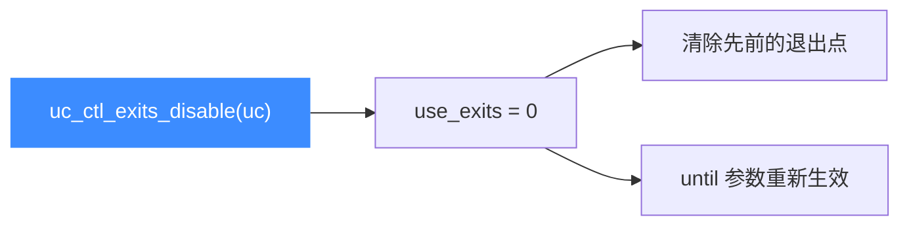

# uc_ctl_exits_disable

**关闭多退出点机制**，恢复 `uc_emu_start` 的 `until` 参数语义并清除已设置的退出点。读完你会知道如何回到默认停机行为。

## 🧩 便捷宏定义与展开

来自 `include/unicorn/unicorn.h`：

```c
#define uc_ctl_exits_disable(uc) \
    uc_ctl(uc, UC_CTL_WRITE(UC_CTL_UC_USE_EXITS, 1), 0)
```

> 📄 声明：[`unicorn.h`](https://github.com/android-security-engineer/unicorn-skills/blob/master/include/unicorn/unicorn.h#L666)（便捷宏）· [`unicorn.h`](https://github.com/android-security-engineer/unicorn-skills/blob/master/include/unicorn/unicorn.h#L567)（`UC_CTL_UC_USE_EXITS` 控制码）· 实现：[`uc.c`](https://github.com/android-security-engineer/unicorn-skills/blob/master/uc.c#L2707)（`case UC_CTL_UC_USE_EXITS`）

与 [exits-enable](/ctl/exits-enable) 同类型，只是写入的是 `0`（关闭）。

## 📤 参数与方向

| 项目 | 值 |
| --- | --- |
| 控制类型 | `UC_CTL_UC_USE_EXITS` |
| 方向 | `UC_CTL_IO_WRITE`（只写） |
| 参数个数 | 1 |
| 传入值 | 常量 `0`（关闭） |
| 返回 | `uc_err`，成功为 `UC_ERR_OK` |

`uc.c` 写分支把 `uc->use_exits = 0`。



## 🔧 何时用 / 示例

用完多退出点、想恢复常规 `until` 停机时：

```c
uc_err err = uc_ctl_exits_disable(uc);
if (err) {
    printf("关闭 exits 失败: %u\n", err);
    return;
}

// until 恢复生效：在 0x2000 处停机
uc_emu_start(uc, 0x1000, 0x2000, 0, 0);
```

::: warning ⚠️ 时机限制
如头文件所述：关闭后**先前设置的所有退出点都会被清除**，`until` 参数重新生效。关闭状态下再调用 `set/get_exits` 会返回 `UC_ERR_ARG`。
:::

## 📂 相关源码

| 文件 | 角色 |
|------|------|
| [`include/unicorn/unicorn.h`](https://github.com/android-security-engineer/unicorn-skills/blob/master/include/unicorn/unicorn.h#L666) | `uc_ctl_exits_disable` 便捷宏定义 |
| [`uc.c`](https://github.com/android-security-engineer/unicorn-skills/blob/master/uc.c#L2707) | `case UC_CTL_UC_USE_EXITS` 实现，写 `uc->use_exits = 0` |

## 相关页面

- [uc_ctl 总览](/ctl/)
- [uc_ctl_exits_enable](/ctl/exits-enable)
- [uc_ctl_set_exits](/ctl/set-exits)
- [多退出点机制](/features/exits)
