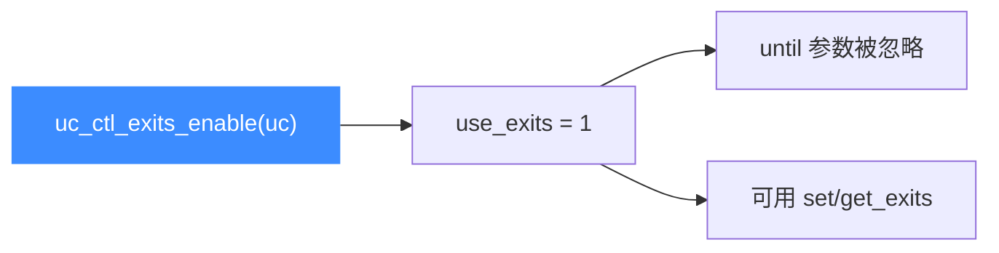

# uc_ctl_exits_enable

**启用多退出点机制**。开启后 `uc_emu_start` 的 `until` 参数失效，改由退出点集合控制停机。读完你会知道为何必须先启用才能读写退出点。

## 🧩 便捷宏定义与展开

来自 `include/unicorn/unicorn.h`：

```c
#define uc_ctl_exits_enable(uc) \
    uc_ctl(uc, UC_CTL_WRITE(UC_CTL_UC_USE_EXITS, 1), 1)
```

> 📄 声明：[`unicorn.h`](https://github.com/android-security-engineer/unicorn-skills/blob/master/include/unicorn/unicorn.h#L664)（便捷宏）· [`unicorn.h`](https://github.com/android-security-engineer/unicorn-skills/blob/master/include/unicorn/unicorn.h#L567)（`UC_CTL_UC_USE_EXITS` 控制码）· 实现：[`uc.c`](https://github.com/android-security-engineer/unicorn-skills/blob/master/uc.c#L2707)（`case UC_CTL_UC_USE_EXITS`）

它是 `UC_CTL_UC_USE_EXITS` 写 `1`（即"打开开关"）。

## 📤 参数与方向

| 项目 | 值 |
| --- | --- |
| 控制类型 | `UC_CTL_UC_USE_EXITS` |
| 方向 | `UC_CTL_IO_WRITE`（只写） |
| 参数个数 | 1 |
| 传入值 | 常量 `1`（启用） |
| 返回 | `uc_err`，成功为 `UC_ERR_OK` |

`uc.c` 写分支把 `uc->use_exits = 1`。为向后兼容，退出点机制**默认关闭**——未启用时调用 `set/get_exits` 会返回 `UC_ERR_ARG`。



## 🔧 何时用 / 示例

在设置退出点集合之前，先启用机制。摘自 `samples/sample_ctl.c`：

```c
uint64_t exits[] = {ADDRESS + 6, ADDRESS + 8};

uc_err err = uc_ctl_exits_enable(uc);
if (err) {
    printf("启用 exits 失败: %u\n", err);
    return;
}
uc_ctl_set_exits(uc, exits, 2);

// until 被忽略，实际在 exits 指定的地址停机
uc_emu_start(uc, ADDRESS, 0, 0, 0);
```

::: warning ⚠️ 时机限制
启用后，如下三种写法完全等价——`until` 不再起作用：

```c
uc_emu_start(uc, 0x1000, 0, ...);
uc_emu_start(uc, 0x1000, 0x1000, ...);
uc_emu_start(uc, 0x1000, -1, ...);
```

若要恢复 `until` 语义，调用 [uc_ctl_exits_disable](/ctl/exits-disable)。
:::

## 📂 相关源码

| 文件 | 角色 |
|------|------|
| [`include/unicorn/unicorn.h`](https://github.com/android-security-engineer/unicorn-skills/blob/master/include/unicorn/unicorn.h#L664) | `uc_ctl_exits_enable` 便捷宏定义 |
| [`uc.c`](https://github.com/android-security-engineer/unicorn-skills/blob/master/uc.c#L2707) | `case UC_CTL_UC_USE_EXITS` 实现，写 `uc->use_exits = 1` |

## 相关页面

- [uc_ctl 总览](/ctl/)
- [uc_ctl_exits_disable](/ctl/exits-disable)
- [uc_ctl_set_exits](/ctl/set-exits)
- [多退出点机制](/features/exits)
