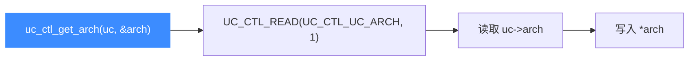

# uc_ctl_get_arch

读取引擎**当前的架构类型**（`UC_ARCH_*`，如 `UC_ARCH_X86`、`UC_ARCH_ARM64`）。读完你会知道如何在运行期确认引擎架构。

## 🧩 便捷宏定义与展开

来自 `include/unicorn/unicorn.h`：

```c
#define uc_ctl_get_arch(uc, arch) \
    uc_ctl(uc, UC_CTL_READ(UC_CTL_UC_ARCH, 1), (arch))
```

> 📄 声明：[`unicorn.h`](https://github.com/android-security-engineer/unicorn-skills/blob/master/include/unicorn/unicorn.h#L660)（便捷宏）· [`unicorn.h`](https://github.com/android-security-engineer/unicorn-skills/blob/master/include/unicorn/unicorn.h#L559)（`UC_CTL_UC_ARCH` 控制码）· 实现：[`uc.c`](https://github.com/android-security-engineer/unicorn-skills/blob/master/uc.c#L2645)（`case UC_CTL_UC_ARCH`）

展开为读方向、1 个参数、控制类型 `UC_CTL_UC_ARCH`。

## 📥 参数与方向

| 项目 | 值 |
| --- | --- |
| 控制类型 | `UC_CTL_UC_ARCH` |
| 方向 | `UC_CTL_IO_READ`（只读） |
| 参数个数 | 1 |
| `arch` 类型 | `int *`（输出，写入 `UC_ARCH_*` 值） |
| 返回 | `uc_err`，成功为 `UC_ERR_OK` |



## 🔧 何时用 / 示例

编写跨架构通用工具时，用它把 `uc_engine*` 与架构解耦。摘自 `samples/sample_ctl.c`：

```c
uc_engine *uc;
int arch;

uc_open(UC_ARCH_X86, UC_MODE_32, &uc);

uc_err err = uc_ctl_get_arch(uc, &arch);
if (err) {
    printf("uc_ctl 失败: %u\n", err);
    return;
}
printf(">>> arch = %d\n", arch); // 期望 UC_ARCH_X86
```

::: tip 📌 与 uc_query 的关系
`uc_query(uc, UC_QUERY_ARCH, ...)` 提供等价信息。对 ARM 而言，架构与模式（Thumb）需分别查询。
:::

::: warning ⚠️ 时机限制
`arch` 只读且在 `uc_open` 时确定，无法通过 `uc_ctl` 修改。要换架构必须新建引擎实例。
:::

## 📂 相关源码

| 文件 | 角色 |
|------|------|
| [`include/unicorn/unicorn.h`](https://github.com/android-security-engineer/unicorn-skills/blob/master/include/unicorn/unicorn.h#L660) | `uc_ctl_get_arch` 便捷宏定义 |
| [`uc.c`](https://github.com/android-security-engineer/unicorn-skills/blob/master/uc.c#L2645) | `case UC_CTL_UC_ARCH` 实现，读取 `uc->arch` |

## 相关页面

- [uc_ctl 总览](/ctl/)
- [uc_ctl_get_mode](/ctl/get-mode)
- [uc_open](/api/open)
- [支持的架构](/features/architectures)
