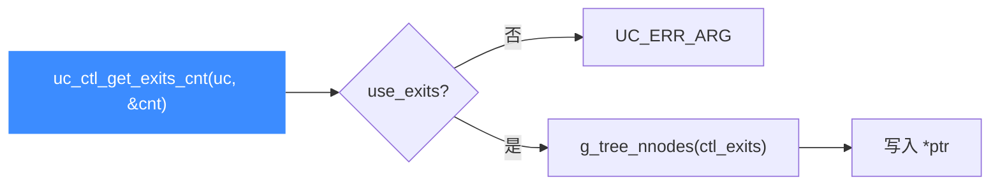

# uc_ctl_get_exits_cnt

读取**当前已设置的退出点数量**。读完你会知道如何在读取退出点集合前先取得其容量，以便分配缓冲区。

## 🧩 便捷宏定义与展开

来自 `include/unicorn/unicorn.h`：

```c
#define uc_ctl_get_exits_cnt(uc, ptr) \
    uc_ctl(uc, UC_CTL_READ(UC_CTL_UC_EXITS_CNT, 1), (ptr))
```

> 📄 声明：[`unicorn.h`](https://github.com/android-security-engineer/unicorn-skills/blob/master/include/unicorn/unicorn.h#L668)（便捷宏）· [`unicorn.h`](https://github.com/android-security-engineer/unicorn-skills/blob/master/include/unicorn/unicorn.h#L570)（`UC_CTL_UC_EXITS_CNT` 控制码）· 实现：[`uc.c`](https://github.com/android-security-engineer/unicorn-skills/blob/master/uc.c#L2717)（`case UC_CTL_UC_EXITS_CNT`）

展开为读方向、1 个参数、控制类型 `UC_CTL_UC_EXITS_CNT`。

## 📥 参数与方向

| 项目 | 值 |
| --- | --- |
| 控制类型 | `UC_CTL_UC_EXITS_CNT` |
| 方向 | `UC_CTL_IO_READ`（只读） |
| 参数个数 | 1 |
| `ptr` 类型 | `size_t *`（输出，退出点个数） |
| 返回 | `uc_err`，成功为 `UC_ERR_OK` |

`uc.c` 实现：`UC_INIT` 后，若 `use_exits` 未启用返回 `UC_ERR_ARG`；否则用 `g_tree_nnodes(uc->ctl_exits)` 取节点数写入 `*ptr`。



## 🔧 何时用 / 示例

读取退出点列表前，先查数量以分配足够缓冲区：

```c
size_t cnt;
uc_err err = uc_ctl_get_exits_cnt(uc, &cnt);
if (err) {
    printf("获取退出点数量失败: %u\n", err);
    return;
}

uint64_t *buf = malloc(cnt * sizeof(uint64_t));
uc_ctl_get_exits(uc, buf, cnt);
```

::: warning ⚠️ 时机限制
必须先 [uc_ctl_exits_enable](/ctl/exits-enable)；未启用时本调用返回 `UC_ERR_ARG`。该数量正是 [uc_ctl_get_exits](/ctl/get-exits) 所需的 `len`。
:::

## 📂 相关源码

| 文件 | 角色 |
|------|------|
| [`include/unicorn/unicorn.h`](https://github.com/android-security-engineer/unicorn-skills/blob/master/include/unicorn/unicorn.h#L668) | `uc_ctl_get_exits_cnt` 便捷宏定义 |
| [`uc.c`](https://github.com/android-security-engineer/unicorn-skills/blob/master/uc.c#L2717) | `case UC_CTL_UC_EXITS_CNT` 实现，取 `g_tree_nnodes(ctl_exits)` |

## 相关页面

- [uc_ctl 总览](/ctl/)
- [uc_ctl_get_exits](/ctl/get-exits)
- [uc_ctl_set_exits](/ctl/set-exits)
- [多退出点机制](/features/exits)
