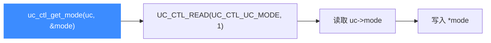

# uc_ctl_get_mode

读取引擎**当前的硬件模式**（`UC_MODE_*` 的组合，如 `UC_MODE_32`、`UC_MODE_THUMB`）。读完你会知道如何在运行期查询模式，以及它和 `uc_query(UC_QUERY_MODE)` 的关系。

## 🧩 便捷宏定义与展开

来自 `include/unicorn/unicorn.h`：

```c
#define uc_ctl_get_mode(uc, mode) \
    uc_ctl(uc, UC_CTL_READ(UC_CTL_UC_MODE, 1), (mode))
```

> 📄 声明：[`unicorn.h`](https://github.com/android-security-engineer/unicorn-skills/blob/master/include/unicorn/unicorn.h#L654)（便捷宏）· [`unicorn.h`](https://github.com/android-security-engineer/unicorn-skills/blob/master/include/unicorn/unicorn.h#L552)（`UC_CTL_UC_MODE` 控制码）· 实现：[`uc.c`](https://github.com/android-security-engineer/unicorn-skills/blob/master/uc.c#L2635)（`case UC_CTL_UC_MODE`）

`UC_CTL_READ(UC_CTL_UC_MODE, 1)` 表示：读方向、1 个参数、控制类型为 `UC_CTL_UC_MODE`。

## 📥 参数与方向

| 项目 | 值 |
| --- | --- |
| 控制类型 | `UC_CTL_UC_MODE` |
| 方向 | `UC_CTL_IO_READ`（只读） |
| 参数个数 | 1 |
| `mode` 类型 | `int *`（输出，写入当前模式位组合） |
| 返回 | `uc_err`，成功为 `UC_ERR_OK` |



## 🔧 何时用 / 示例

当你封装了一段通用逻辑，需要在不知道 `uc_open` 传入了什么模式时动态判断（例如区分 ARM/Thumb）。摘自 `samples/sample_ctl.c`：

```c
uc_engine *uc;
int mode;

uc_open(UC_ARCH_X86, UC_MODE_32, &uc);

uc_err err = uc_ctl_get_mode(uc, &mode);
if (err) {
    printf("uc_ctl 失败: %u\n", err);
    return;
}
printf(">>> mode = %d\n", mode); // 期望 UC_MODE_32
```

::: tip 📌 与 uc_query 的关系
`uc_query(uc, UC_QUERY_MODE, ...)` 也能查询模式，二者数据同源。`uc_ctl_get_mode` 是纯读操作，可在打开引擎后任意时刻调用。
:::

::: warning ⚠️ 时机限制
`mode` 只读，无法用 `uc_ctl` 修改；模式在 `uc_open` 时确定。若要改变行为，需要重新 `uc_open` 或使用对应控制项（如 `uc_ctl_tlb_mode`、`uc_ctl_context_mode`）。
:::

## 📂 相关源码

| 文件 | 角色 |
|------|------|
| [`include/unicorn/unicorn.h`](https://github.com/android-security-engineer/unicorn-skills/blob/master/include/unicorn/unicorn.h#L654) | `uc_ctl_get_mode` 便捷宏定义 |
| [`uc.c`](https://github.com/android-security-engineer/unicorn-skills/blob/master/uc.c#L2635) | `case UC_CTL_UC_MODE` 实现，读取 `uc->mode` |

## 相关页面

- [uc_ctl 总览](/ctl/)
- [uc_ctl_get_arch](/ctl/get-arch)
- [uc_query](/api/query)
- [uc_open](/api/open)
