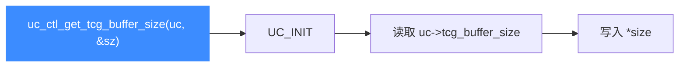

# uc_ctl_get_tcg_buffer_size

读取 **TCG 翻译缓冲区大小**（字节）。读完你会知道如何查询引擎当前用于存放翻译代码的缓冲区容量。

## 🧩 便捷宏定义与展开

来自 `include/unicorn/unicorn.h`：

```c
#define uc_ctl_get_tcg_buffer_size(uc, size) \
    uc_ctl(uc, UC_CTL_READ(UC_CTL_TCG_BUFFER_SIZE, 1), (size))
```

> 📄 声明：[`unicorn.h`](https://github.com/android-security-engineer/unicorn-skills/blob/master/include/unicorn/unicorn.h#L686)（便捷宏）· [`unicorn.h`](https://github.com/android-security-engineer/unicorn-skills/blob/master/include/unicorn/unicorn.h#L604)（`UC_CTL_TCG_BUFFER_SIZE` 控制码）· 实现：[`uc.c`](https://github.com/android-security-engineer/unicorn-skills/blob/master/uc.c#L2949)（`case UC_CTL_TCG_BUFFER_SIZE`）

展开为读方向、1 个参数、控制类型 `UC_CTL_TCG_BUFFER_SIZE`。

## 📥 参数与方向

| 项目 | 值 |
| --- | --- |
| 控制类型 | `UC_CTL_TCG_BUFFER_SIZE` |
| 方向 | `UC_CTL_IO_READ`（只读） |
| 参数个数 | 1 |
| `size` 类型 | `uint32_t *`（输出，字节数） |
| 返回 | `uc_err`，成功为 `UC_ERR_OK` |

`uc.c` 读分支：`UC_INIT` 后返回 `uc->tcg_buffer_size`。注意：Unicorn 可能在内部**调整**你写入的值，因此读回的可能与设置值不同。



## 🔧 何时用 / 示例

在设置了自定义缓冲区大小后确认引擎实际采用的值：

```c
uint32_t size;
uc_err err = uc_ctl_get_tcg_buffer_size(uc, &size);
if (err) {
    printf("读取 TCG 缓冲区大小失败: %u\n", err);
    return;
}
printf(">>> tcg buffer size = %" PRIu32 " 字节\n", size);
```

::: warning ⚠️ 时机限制
读取会触发 `UC_INIT`；由于引擎可能调整过缓冲区大小，读回值应以此为准，不要假设等于 [uc_ctl_set_tcg_buffer_size](/ctl/set-tcg-buffer-size) 的写入值。
:::

## 📂 相关源码

| 文件 | 角色 |
|------|------|
| [`include/unicorn/unicorn.h`](https://github.com/android-security-engineer/unicorn-skills/blob/master/include/unicorn/unicorn.h#L686) | `uc_ctl_get_tcg_buffer_size` 便捷宏定义 |
| [`uc.c`](https://github.com/android-security-engineer/unicorn-skills/blob/master/uc.c#L2949) | `case UC_CTL_TCG_BUFFER_SIZE` 实现，读取 `uc->tcg_buffer_size` |

## 相关页面

- [uc_ctl 总览](/ctl/)
- [uc_ctl_set_tcg_buffer_size](/ctl/set-tcg-buffer-size)
- [JIT 与翻译块](/features/jit)
