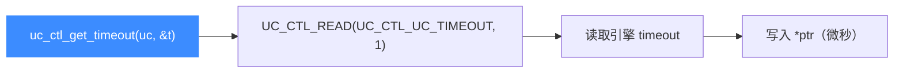

# uc_ctl_get_timeout

读取上一次 `uc_emu_start` 使用的**超时时间**（微秒）。读完你会知道如何查询当前引擎记录的超时值。

## 🧩 便捷宏定义与展开

来自 `include/unicorn/unicorn.h`：

```c
#define uc_ctl_get_timeout(uc, ptr) \
    uc_ctl(uc, UC_CTL_READ(UC_CTL_UC_TIMEOUT, 1), (ptr))
```

> 📄 声明：[`unicorn.h`](https://github.com/android-security-engineer/unicorn-skills/blob/master/include/unicorn/unicorn.h#L662)（便捷宏）· [`unicorn.h`](https://github.com/android-security-engineer/unicorn-skills/blob/master/include/unicorn/unicorn.h#L562)（`UC_CTL_UC_TIMEOUT` 控制码）· 实现：[`uc.c`](https://github.com/android-security-engineer/unicorn-skills/blob/master/uc.c#L2655)（`case UC_CTL_UC_TIMEOUT`）

展开为读方向、1 个参数、控制类型 `UC_CTL_UC_TIMEOUT`。

## 📥 参数与方向

| 项目 | 值 |
| --- | --- |
| 控制类型 | `UC_CTL_UC_TIMEOUT` |
| 方向 | `UC_CTL_IO_READ`（只读） |
| 参数个数 | 1 |
| `ptr` 类型 | `uint64_t *`（输出，单位微秒） |
| 返回 | `uc_err`，成功为 `UC_ERR_OK` |



## 🔧 何时用 / 示例

在设置了 `uc_emu_start(..., timeout, ...)` 后确认引擎记录的超时。摘自 `samples/sample_ctl.c`：

```c
uc_engine *uc;
uint64_t timeout;

uc_open(UC_ARCH_X86, UC_MODE_32, &uc);

uc_err err = uc_ctl_get_timeout(uc, &timeout);
if (err) {
    printf("uc_ctl 失败: %u\n", err);
    return;
}
printf(">>> timeout = %" PRIu64 "\n", timeout);
```

::: tip 📌 与 uc_query 的关系
`uc_query(uc, UC_QUERY_TIMEOUT, ...)` 用于判断上一次运行是否**因超时而停止**，语义与本调用读取的原始超时值不同。
:::

::: warning ⚠️ 时机限制
超时值只读；要设置超时请在 `uc_emu_start` 的 `timeout` 参数中传入，本控制项无法写入。
:::

## 📂 相关源码

| 文件 | 角色 |
|------|------|
| [`include/unicorn/unicorn.h`](https://github.com/android-security-engineer/unicorn-skills/blob/master/include/unicorn/unicorn.h#L662) | `uc_ctl_get_timeout` 便捷宏定义 |
| [`uc.c`](https://github.com/android-security-engineer/unicorn-skills/blob/master/uc.c#L2655) | `case UC_CTL_UC_TIMEOUT` 实现，读取引擎记录的超时值 |

## 相关页面

- [uc_ctl 总览](/ctl/)
- [uc_emu_start](/api/emu-start)
- [uc_query](/api/query)
