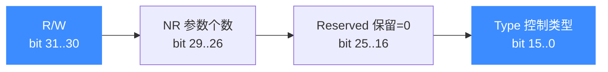

# uc_ctl 控制接口总览

`uc_ctl` 是 Unicorn 的"万能旋钮":用一个类似 Linux `ioctl` 的可变参数接口，读写引擎的各种内部状态（模式、页大小、CPU 型号、TB/TLB 缓存、多退出点等）。读完本页你会理解**控制码是怎么编码的**，并拿到全部 21 个 `uc_ctl_*` 便捷宏的分类索引。

## 🎯 一个接口，两种用法

`uc_ctl` 的原型只有一行（见 [uc_ctl](/api/ctl)）：

```c
uc_err uc_ctl(uc_engine *uc, uc_control_type control, ...);
```

`control` 不是普通枚举值，而是把**读写方向**、**参数个数**、**控制类型**打包进一个 32 位整数。手写它很容易出错，所以头文件提供了 21 个 `uc_ctl_*` 便捷宏，你几乎只需要用它们。想了解裸接口写法见 [手写 uc_ctl](/ctl/set)。

## 🧩 控制码是如何编码的

控制码由宏 `UC_CTL` 合成（`include/unicorn/unicorn.h`）：

```c
#define UC_CTL(type, nr, rw) \
    (uc_control_type)((type) | ((nr) << 26) | ((rw) << 30))
```

也就是把三部分或进同一个 32 位字：



| 字段 | 位区间 | 含义 |
| --- | --- | --- |
| R/W | 31–30 | 读写方向（见下表 `UC_CTL_IO_*`） |
| NR | 29–26 | 变参个数（0/1/2） |
| Reserved | 25–16 | 保留，恒为 0 |
| Type | 15–0 | 取自 `uc_control_type` 枚举 |

方向位由四个 `UC_CTL_IO_*` 常量定义：

| 方向宏 | 值 | 含义 | 对应包装宏 |
| --- | --- | --- | --- |
| `UC_CTL_IO_NONE` | 0 | 无输入输出参数 | `UC_CTL_NONE` |
| `UC_CTL_IO_WRITE` | 1 | 只写（输入参数） | `UC_CTL_WRITE` |
| `UC_CTL_IO_READ` | 2 | 只读（输出参数） | `UC_CTL_READ` |
| `UC_CTL_IO_READ_WRITE` | 3 | 读写（既传入又传出） | `UC_CTL_READ_WRITE` |

例如 `uc_ctl_get_mode` 展开为 `UC_CTL_READ(UC_CTL_UC_MODE, 1)`，即"读方向、1 个参数、类型 = 模式"。

::: tip 📌 为什么这样设计
和 `ioctl` 一样，把方向和参数个数编进控制码，可以让实现在运行时校验调用是否合法（方向不符会返回 `UC_ERR_ARG`），也为未来扩展预留了保留位。
:::

## 📚 21 个便捷宏分类索引

### 📥 可读（Get / READ 方向）

| 便捷宏 | 底层控制类型 | 文档 |
| --- | --- | --- |
| `uc_ctl_get_mode` | `UC_CTL_UC_MODE` | [get-mode](/ctl/get-mode) |
| `uc_ctl_get_arch` | `UC_CTL_UC_ARCH` | [get-arch](/ctl/get-arch) |
| `uc_ctl_get_page_size` | `UC_CTL_UC_PAGE_SIZE` | [get-page-size](/ctl/get-page-size) |
| `uc_ctl_get_timeout` | `UC_CTL_UC_TIMEOUT` | [get-timeout](/ctl/get-timeout) |
| `uc_ctl_get_cpu_model` | `UC_CTL_CPU_MODEL` | [get-cpu-model](/ctl/get-cpu-model) |
| `uc_ctl_get_exits_cnt` | `UC_CTL_UC_EXITS_CNT` | [get-exits-cnt](/ctl/get-exits-cnt) |
| `uc_ctl_get_exits` | `UC_CTL_UC_EXITS` | [get-exits](/ctl/get-exits) |
| `uc_ctl_get_tcg_buffer_size` | `UC_CTL_TCG_BUFFER_SIZE` | [get-tcg-buffer-size](/ctl/get-tcg-buffer-size) |

### 📤 可写（Set / WRITE 方向）

| 便捷宏 | 底层控制类型 | 文档 |
| --- | --- | --- |
| `uc_ctl_set_page_size` | `UC_CTL_UC_PAGE_SIZE` | [set-page-size](/ctl/set-page-size) |
| `uc_ctl_set_cpu_model` | `UC_CTL_CPU_MODEL` | [set-cpu-model](/ctl/set-cpu-model) |
| `uc_ctl_set_exits` | `UC_CTL_UC_EXITS` | [set-exits](/ctl/set-exits) |
| `uc_ctl_set_tcg_buffer_size` | `UC_CTL_TCG_BUFFER_SIZE` | [set-tcg-buffer-size](/ctl/set-tcg-buffer-size) |
| `uc_ctl_tlb_mode` | `UC_CTL_TLB_TYPE` | [tlb-mode](/ctl/tlb-mode) |
| `uc_ctl_context_mode` | `UC_CTL_CONTEXT_MODE` | [context-mode](/ctl/context-mode) |
| `uc_ctl_exits_enable` | `UC_CTL_UC_USE_EXITS` | [exits-enable](/ctl/exits-enable) |
| `uc_ctl_exits_disable` | `UC_CTL_UC_USE_EXITS` | [exits-disable](/ctl/exits-disable) |
| `uc_ctl_remove_cache` | `UC_CTL_TB_REMOVE_CACHE` | [remove-cache](/ctl/remove-cache) |

### 🔧 动作 / 读写（触发操作）

| 便捷宏 | 底层控制类型 | 方向 | 文档 |
| --- | --- | --- | --- |
| `uc_ctl_flush_tb` | `UC_CTL_TB_FLUSH` | NONE | [flush-tb](/ctl/flush-tb) |
| `uc_ctl_flush_tlb` | `UC_CTL_TLB_FLUSH` | NONE | [flush-tlb](/ctl/flush-tlb) |
| `uc_ctl_request_cache` | `UC_CTL_TB_REQUEST_CACHE` | READ_WRITE | [request-cache](/ctl/request-cache) |

::: warning ⚠️ 时机很重要
部分控制项对调用时机有硬性要求：`set_page_size` 与 `set_cpu_model` 只能在 `uc_open` 之后、任何会触发初始化的 API（如 `uc_mem_map`、`uc_emu_start`）之前设置；`set_exits`/`get_exits` 必须先 `exits_enable`。各页的"时机限制"小节有详细说明。
:::

## 相关页面

- [uc_ctl 函数原型](/api/ctl)
- [多退出点机制](/features/exits)
- [Context 快照](/features/context)
- [手写 uc_ctl 与 UC_CTL_IO_* 宏](/ctl/set)
