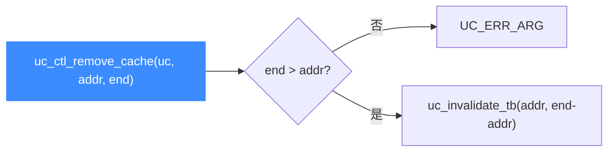

# uc_ctl_remove_cache

**作废一段地址区间内的翻译块缓存**（`[address, end)`）。读完你会知道如何在不做全局刷新的情况下精确清除某段代码的缓存。

## 🧩 便捷宏定义与展开

来自 `include/unicorn/unicorn.h`：

```c
#define uc_ctl_remove_cache(uc, address, end) \
    uc_ctl(uc, UC_CTL_WRITE(UC_CTL_TB_REMOVE_CACHE, 2), (address), (end))
```

> 📄 声明：[`unicorn.h`](https://github.com/android-security-engineer/unicorn-skills/blob/master/include/unicorn/unicorn.h#L678)（便捷宏）· [`unicorn.h`](https://github.com/android-security-engineer/unicorn-skills/blob/master/include/unicorn/unicorn.h#L589)（`UC_CTL_TB_REMOVE_CACHE` 控制码）· 实现：[`uc.c`](https://github.com/android-security-engineer/unicorn-skills/blob/master/uc.c#L2888)（`case UC_CTL_TB_REMOVE_CACHE`）

展开为写方向、2 个参数、控制类型 `UC_CTL_TB_REMOVE_CACHE`。

## 📤 参数与方向

| 项目 | 值 |
| --- | --- |
| 控制类型 | `UC_CTL_TB_REMOVE_CACHE` |
| 方向 | `UC_CTL_IO_WRITE`（只写） |
| 参数个数 | 2 |
| `address` 类型 | `uint64_t`（输入，区间起始，含） |
| `end` 类型 | `uint64_t`（输入，区间结束，不含） |
| 返回 | `uc_err`，成功为 `UC_ERR_OK` |

`uc.c` 写分支：先校验 `end > address`（否则 `UC_ERR_ARG`），再调用 `uc->uc_invalidate_tb(uc, addr, end - addr)` 作废该长度内的 TB。



## 🔧 何时用 / 示例

只改写了某一小段代码时，用它精确作废对应区间，避免整体 `flush_tb`。摘自 `samples/sample_ctl.c`：

```c
for (int i = 0; i < TB_COUNT; i++) {
    uc_err err = uc_ctl_remove_cache(
        uc,
        (uint64_t)(ADDRESS + i * TCG_MAX_INSNS),
        (uint64_t)(ADDRESS + i * TCG_MAX_INSNS + 1)); // [addr, addr+1)
    if (err) {
        printf("uc_ctl 失败: %u\n", err);
        return;
    }
}
```

::: warning ⚠️ 时机限制
- `end` 必须严格大于 `address`，否则返回 `UC_ERR_ARG`。
- 区间为**左闭右开** `[address, end)`；覆写代码后配合它可只重建受影响的块。
:::

## 📂 相关源码

| 文件 | 角色 |
|------|------|
| [`include/unicorn/unicorn.h`](https://github.com/android-security-engineer/unicorn-skills/blob/master/include/unicorn/unicorn.h#L678) | `uc_ctl_remove_cache` 便捷宏定义 |
| [`uc.c`](https://github.com/android-security-engineer/unicorn-skills/blob/master/uc.c#L2888) | `case UC_CTL_TB_REMOVE_CACHE` 实现，调用 `uc->uc_invalidate_tb` |

## 相关页面

- [uc_ctl 总览](/ctl/)
- [uc_ctl_request_cache](/ctl/request-cache)
- [uc_ctl_flush_tb](/ctl/flush-tb)
- [JIT 与翻译块](/features/jit)
