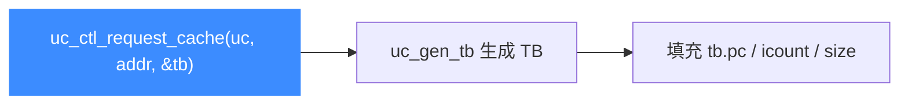

# uc_ctl_request_cache

**主动为某地址生成/取得翻译块（TB）缓存**，同时返回该 TB 的信息（`uc_tb`）。读完你会知道如何预热缓存并读取块的 PC、指令数与字节数。

## 🧩 便捷宏定义与展开

来自 `include/unicorn/unicorn.h`：

```c
#define uc_ctl_request_cache(uc, address, tb) \
    uc_ctl(uc, UC_CTL_READ_WRITE(UC_CTL_TB_REQUEST_CACHE, 2), (address), (tb))
```

> 📄 声明：[`unicorn.h`](https://github.com/android-security-engineer/unicorn-skills/blob/master/include/unicorn/unicorn.h#L680)（便捷宏）· [`unicorn.h`](https://github.com/android-security-engineer/unicorn-skills/blob/master/include/unicorn/unicorn.h#L586)（`UC_CTL_TB_REQUEST_CACHE` 控制码）· 实现：[`uc.c`](https://github.com/android-security-engineer/unicorn-skills/blob/master/uc.c#L2872)（`case UC_CTL_TB_REQUEST_CACHE`）

注意方向是 **READ_WRITE**：`address` 是输入，`tb` 是输出。

## 🔁 参数与方向

| 项目 | 值 |
| --- | --- |
| 控制类型 | `UC_CTL_TB_REQUEST_CACHE` |
| 方向 | `UC_CTL_IO_READ_WRITE`（读写） |
| 参数个数 | 2 |
| `address` 类型 | `uint64_t`（输入，目标地址） |
| `tb` 类型 | `uc_tb *`（输出，翻译块信息） |
| 返回 | `uc_err`，成功为 `UC_ERR_OK` |

`uc.c` 实现：`UC_INIT` 后调用 `uc->uc_gen_tb(uc, addr, tb)` 生成并填充 TB。`uc_tb` 结构（`include/unicorn/unicorn.h`）：

```c
typedef struct uc_tb {
    uint64_t pc;      // 块起始 PC
    uint16_t icount;  // 指令条数
    uint16_t size;    // 字节大小
} uc_tb;
```



## 🔧 何时用 / 示例

在正式运行前预热热点地址的翻译块，或读取块的度量信息。摘自 `samples/sample_ctl.c`：

```c
uc_tb tb;
for (int i = 0; i < TB_COUNT; i++) {
    uc_err err = uc_ctl_request_cache(
        uc, (uint64_t)(ADDRESS + i * TCG_MAX_INSNS), &tb);
    printf(">>> TB cached at 0x%" PRIx64 ", %" PRIu16 " 条指令, %" PRIu16 " 字节\n",
           tb.pc, tb.icount, tb.size);
    if (err) {
        printf("uc_ctl 失败: %u\n", err);
        return;
    }
}
```

::: warning ⚠️ 时机限制
调用会触发 `UC_INIT`（引擎须已可翻译代码，目标内存应已映射并写入）。方向必须为读写并同时传入 `address` 与 `uc_tb*` 两个参数，缺一会 `UC_ERR_ARG`。
:::

## 📂 相关源码

| 文件 | 角色 |
|------|------|
| [`include/unicorn/unicorn.h`](https://github.com/android-security-engineer/unicorn-skills/blob/master/include/unicorn/unicorn.h#L680) | `uc_ctl_request_cache` 便捷宏定义 |
| [`uc.c`](https://github.com/android-security-engineer/unicorn-skills/blob/master/uc.c#L2872) | `case UC_CTL_TB_REQUEST_CACHE` 实现，调用 `uc->uc_gen_tb` |

## 相关页面

- [uc_ctl 总览](/ctl/)
- [uc_ctl_remove_cache](/ctl/remove-cache)
- [uc_ctl_flush_tb](/ctl/flush-tb)
- [JIT 与翻译块](/features/jit)
