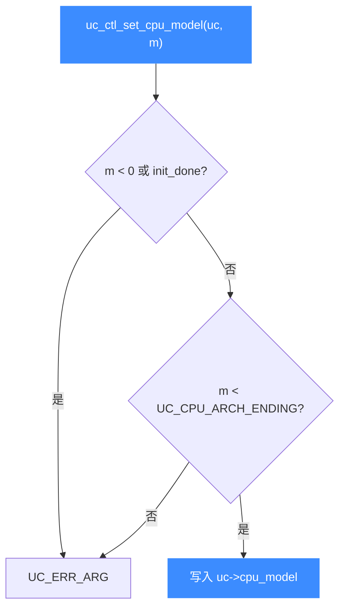

# uc_ctl_set_cpu_model

设置引擎的 **CPU 型号**（决定可用的指令扩展与特性）。读完你会知道如何选定微架构型号，以及为什么必须在 `uc_open` 之后、运行之前设置。

## 🧩 便捷宏定义与展开

来自 `include/unicorn/unicorn.h`：

```c
#define uc_ctl_set_cpu_model(uc, model) \
    uc_ctl(uc, UC_CTL_WRITE(UC_CTL_CPU_MODEL, 1), (model))
```

> 📄 声明：[`unicorn.h`](https://github.com/android-security-engineer/unicorn-skills/blob/master/include/unicorn/unicorn.h#L676)（便捷宏）· [`unicorn.h`](https://github.com/android-security-engineer/unicorn-skills/blob/master/include/unicorn/unicorn.h#L583)（`UC_CTL_CPU_MODEL` 控制码）· 实现：[`uc.c`](https://github.com/android-security-engineer/unicorn-skills/blob/master/uc.c#L2769)（`case UC_CTL_CPU_MODEL`）

展开为写方向、1 个参数、控制类型 `UC_CTL_CPU_MODEL`。

## 📤 参数与方向

| 项目 | 值 |
| --- | --- |
| 控制类型 | `UC_CTL_CPU_MODEL` |
| 方向 | `UC_CTL_IO_WRITE`（只写） |
| 参数个数 | 1 |
| `model` 类型 | `int`（输入，`UC_CPU_<ARCH>_*`） |
| 返回 | `uc_err`，成功为 `UC_ERR_OK` |

`uc.c` 的写分支校验：若 `model < 0` 或 `uc->init_done` 已初始化则报 `UC_ERR_ARG`；随后按架构检查型号未越过对应的 `UC_CPU_<ARCH>_ENDING` 上界（ARM 大端模式还额外禁用部分 Cortex 型号）。通过后写入 `uc->cpu_model`。



## 🔧 何时用 / 示例

需要精确模拟某款 CPU（例如带特定扩展的 ARM64 型号）时：

```c
uc_engine *uc;
uc_open(UC_ARCH_ARM64, UC_MODE_ARM, &uc);

// uc_open 之后、任何运行/映射触发初始化之前
uc_err err = uc_ctl_set_cpu_model(uc, UC_CPU_ARM64_MAX);
if (err) {
    printf("设置 CPU 型号失败: %u\n", err);
    return;
}
```

::: warning ⚠️ 时机限制
如头文件所述：**本选项只能在 `uc_open` 之后、任何其他 Unicorn API 之前设置**。任何触发 `UC_INIT` 的调用会把 `init_done` 置真，之后本调用返回 `UC_ERR_ARG`。型号还必须与 `uc_open` 传入的架构/模式匹配。
:::

## 📂 相关源码

| 文件 | 角色 |
|------|------|
| [`include/unicorn/unicorn.h`](https://github.com/android-security-engineer/unicorn-skills/blob/master/include/unicorn/unicorn.h#L676) | `uc_ctl_set_cpu_model` 便捷宏定义 |
| [`uc.c`](https://github.com/android-security-engineer/unicorn-skills/blob/master/uc.c#L2769) | `case UC_CTL_CPU_MODEL` 实现，校验并写入 `uc->cpu_model` |

## 相关页面

- [uc_ctl 总览](/ctl/)
- [uc_ctl_get_cpu_model](/ctl/get-cpu-model)
- [CPU 型号](/features/cpu-models)
- [uc_open](/api/open)
