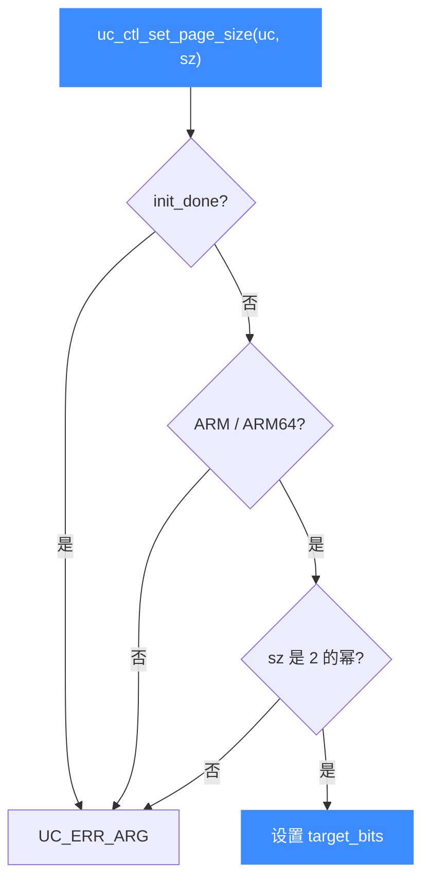

# uc_ctl_set_page_size

设置引擎的**目标页大小**（仅 ARM/ARM64，且必须在映射任何内存之前）。读完你会知道自定义页大小的约束条件与正确时机。

## 🧩 便捷宏定义与展开

来自 `include/unicorn/unicorn.h`：

```c
#define uc_ctl_set_page_size(uc, page_size) \
    uc_ctl(uc, UC_CTL_WRITE(UC_CTL_UC_PAGE_SIZE, 1), (page_size))
```

> 📄 声明：[`unicorn.h`](https://github.com/android-security-engineer/unicorn-skills/blob/master/include/unicorn/unicorn.h#L658)（便捷宏）· [`unicorn.h`](https://github.com/android-security-engineer/unicorn-skills/blob/master/include/unicorn/unicorn.h#L566)（`UC_CTL_UC_PAGE_SIZE` 控制码）· 实现：[`uc.c`](https://github.com/android-security-engineer/unicorn-skills/blob/master/uc.c#L2665)（`case UC_CTL_UC_PAGE_SIZE`）

展开为写方向、1 个参数、控制类型 `UC_CTL_UC_PAGE_SIZE`。

## 📤 参数与方向

| 项目 | 值 |
| --- | --- |
| 控制类型 | `UC_CTL_UC_PAGE_SIZE` |
| 方向 | `UC_CTL_IO_WRITE`（只写） |
| 参数个数 | 1 |
| `page_size` 类型 | `uint32_t`（输入，必须是 2 的幂） |
| 返回 | `uc_err`，成功为 `UC_ERR_OK` |

`uc.c` 中的写分支有三重校验：若 `uc->init_done` 已完成初始化则报 `UC_ERR_ARG`；若架构不是 `UC_ARCH_ARM`/`UC_ARCH_ARM64` 则报错；若 `page_size` 不是 2 的幂（`page_size & (page_size - 1)` 非零）也报错。通过后按位数换算出 `target_bits`。



## 🔧 何时用 / 示例

模拟使用非默认页大小（如 16KB）的 ARM64 环境时：

```c
uc_engine *uc;
uc_open(UC_ARCH_ARM64, UC_MODE_ARM, &uc);

// 必须在任何 uc_mem_map / uc_emu_start 之前！
uc_err err = uc_ctl_set_page_size(uc, 16384); // 16KB
if (err) {
    printf("设置页大小失败: %u\n", err);
    return;
}

uc_mem_map(uc, 0x10000, 0x10000, UC_PROT_ALL);
```

::: warning ⚠️ 时机限制
- 只能在 **映射任何内存之前** 设置。任何触发 `UC_INIT` 的调用（如 `uc_mem_map`、`uc_emu_start`，甚至 [uc_ctl_get_page_size](/ctl/get-page-size)）会把 `init_done` 置真，之后本调用返回 `UC_ERR_ARG`。
- 仅支持 **ARM / ARM64** 架构。
- `page_size` 必须是 2 的幂。
:::

## 📂 相关源码

| 文件 | 角色 |
|------|------|
| [`include/unicorn/unicorn.h`](https://github.com/android-security-engineer/unicorn-skills/blob/master/include/unicorn/unicorn.h#L658) | `uc_ctl_set_page_size` 便捷宏定义 |
| [`uc.c`](https://github.com/android-security-engineer/unicorn-skills/blob/master/uc.c#L2665) | `case UC_CTL_UC_PAGE_SIZE` 实现，校验并换算 `target_bits` |

## 相关页面

- [uc_ctl 总览](/ctl/)
- [uc_ctl_get_page_size](/ctl/get-page-size)
- [uc_mem_map](/api/mem-map)
- [内存管理](/features/memory)
