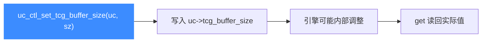

# uc_ctl_set_tcg_buffer_size

设置 **TCG 翻译缓冲区大小**（字节）。读完你会知道如何调整翻译代码缓冲区，以及为什么写入值可能被引擎修正。

## 🧩 便捷宏定义与展开

来自 `include/unicorn/unicorn.h`：

```c
#define uc_ctl_set_tcg_buffer_size(uc, size) \
    uc_ctl(uc, UC_CTL_WRITE(UC_CTL_TCG_BUFFER_SIZE, 1), (size))
```

> 📄 声明：[`unicorn.h`](https://github.com/android-security-engineer/unicorn-skills/blob/master/include/unicorn/unicorn.h#L688)（便捷宏）· [`unicorn.h`](https://github.com/android-security-engineer/unicorn-skills/blob/master/include/unicorn/unicorn.h#L604)（`UC_CTL_TCG_BUFFER_SIZE` 控制码）· 实现：[`uc.c`](https://github.com/android-security-engineer/unicorn-skills/blob/master/uc.c#L2949)（`case UC_CTL_TCG_BUFFER_SIZE`）

展开为写方向、1 个参数、控制类型 `UC_CTL_TCG_BUFFER_SIZE`。

## 📤 参数与方向

| 项目 | 值 |
| --- | --- |
| 控制类型 | `UC_CTL_TCG_BUFFER_SIZE` |
| 方向 | `UC_CTL_IO_WRITE`（只写） |
| 参数个数 | 1 |
| `size` 类型 | `uint32_t`（输入，期望字节数） |
| 返回 | `uc_err`，成功为 `UC_ERR_OK` |

`uc.c` 写分支直接把 `uc->tcg_buffer_size = size`。头文件明确提示：**Unicorn 可能对该值再作调整**，所以读回的可能不同。



## 🔧 何时用 / 示例

翻译大量代码、默认缓冲区易触发频繁 TB 刷新时，可加大缓冲：

```c
uc_engine *uc;
uc_open(UC_ARCH_X86, UC_MODE_64, &uc);

uc_err err = uc_ctl_set_tcg_buffer_size(uc, 32 * 1024 * 1024); // 32MB
if (err) {
    printf("设置 TCG 缓冲区失败: %u\n", err);
    return;
}

uint32_t actual;
uc_ctl_get_tcg_buffer_size(uc, &actual); // 可能被调整
```

::: warning ⚠️ 时机限制
写入值仅作期望值，引擎可能上下调整；务必用 [uc_ctl_get_tcg_buffer_size](/ctl/get-tcg-buffer-size) 读回实际生效值。建议在正式运行前设置。
:::

## 📂 相关源码

| 文件 | 角色 |
|------|------|
| [`include/unicorn/unicorn.h`](https://github.com/android-security-engineer/unicorn-skills/blob/master/include/unicorn/unicorn.h#L688) | `uc_ctl_set_tcg_buffer_size` 便捷宏定义 |
| [`uc.c`](https://github.com/android-security-engineer/unicorn-skills/blob/master/uc.c#L2949) | `case UC_CTL_TCG_BUFFER_SIZE` 实现，写入 `uc->tcg_buffer_size` |

## 相关页面

- [uc_ctl 总览](/ctl/)
- [uc_ctl_get_tcg_buffer_size](/ctl/get-tcg-buffer-size)
- [JIT 与翻译块](/features/jit)
