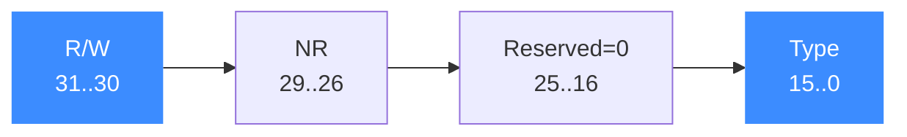

# 手写 uc_ctl 与 UC_CTL_IO_* 读写宏

面向进阶读者：绕过便捷宏，直接用 `uc_ctl` 和 `UC_CTL_*` 合成控制码。读完你会理解控制码的完整编码方式，并能为尚无便捷宏的场景手写调用。

## 🧠 为什么需要手写

21 个 `uc_ctl_*` 便捷宏覆盖了绝大多数需求（见 [总览](/ctl/)）。它们本质都是对同一个函数的薄封装：

```c
uc_err uc_ctl(uc_engine *uc, uc_control_type control, ...);
```

> 📄 声明：[`unicorn.h`](https://github.com/android-security-engineer/unicorn-skills/blob/master/include/unicorn/unicorn.h#L778) · 实现：[`uc.c`](https://github.com/android-security-engineer/unicorn-skills/blob/master/uc.c#L2623)

真正的关键是第二个参数 `control`——一个把方向、参数个数、控制类型打包好的 32 位整数。理解它，你就能读懂任何便捷宏，也能在需要时自行拼装。

## 🧩 控制码合成宏

来自 `include/unicorn/unicorn.h`：

```c
#define UC_CTL(type, nr, rw) \
    (uc_control_type)((type) | ((nr) << 26) | ((rw) << 30))

#define UC_CTL_NONE(type, nr)       UC_CTL(type, nr, UC_CTL_IO_NONE)
#define UC_CTL_READ(type, nr)       UC_CTL(type, nr, UC_CTL_IO_READ)
#define UC_CTL_WRITE(type, nr)      UC_CTL(type, nr, UC_CTL_IO_WRITE)
#define UC_CTL_READ_WRITE(type, nr) UC_CTL(type, nr, UC_CTL_IO_READ_WRITE)
```

> 📄 宏定义：[`unicorn.h`](https://github.com/android-security-engineer/unicorn-skills/blob/master/include/unicorn/unicorn.h#L528)

四个 `UC_CTL_IO_*` 方向常量：

| 宏 | 值 | 含义 |
| --- | --- | --- |
| `UC_CTL_IO_NONE` | 0 | 无参数（纯动作） |
| `UC_CTL_IO_WRITE` | 1 | 只写（输入） |
| `UC_CTL_IO_READ` | 2 | 只读（输出） |
| `UC_CTL_IO_READ_WRITE` | 3 | 读写（`WRITE | READ`） |

## 🗺️ 位布局



`type` 取自 `uc_control_type` 枚举（如 `UC_CTL_UC_MODE`、`UC_CTL_TB_FLUSH`），`nr` 是变参个数，`rw` 是方向。三者或在一起即得 `control`。

## 🔧 手写示例：等价于 uc_ctl_get_mode

下面两行完全等价——便捷宏只是省去了手写 `UC_CTL_READ`：

```c
int mode;

// 便捷宏写法
uc_ctl_get_mode(uc, &mode);

// 手写等价写法
uc_ctl(uc, UC_CTL_READ(UC_CTL_UC_MODE, 1), &mode);
```

再看一个纯动作（无参数，方向 NONE 亦可，头文件里 flush 用 WRITE）：

```c
// 作废全部翻译块，等价于 uc_ctl_flush_tb(uc)
uc_ctl(uc, UC_CTL_WRITE(UC_CTL_TB_FLUSH, 0));
```

读写型（`request_cache`，同时传入地址与输出指针）：

```c
uc_tb tb;
uc_ctl(uc, UC_CTL_READ_WRITE(UC_CTL_TB_REQUEST_CACHE, 2), addr, &tb);
```

::: warning ⚠️ 方向与参数个数必须与实现匹配
`uc.c` 的分发逻辑会按 `rw` 校验方向：例如对只读控制项传了写方向，或参数个数不符，都会返回 `UC_ERR_ARG`。手写时 `nr` 必须等于实际传入的变参个数，方向必须与该控制项在 `uc_control_type` 注释里声明的 Read/Write 一致。优先使用便捷宏，除非确有必要手写。
:::

::: tip 📌 变参类型要精确
`uc_ctl` 用 `va_arg` 取参，类型不匹配（如把 `uint64_t` 当 `uint32_t` 传）会导致未定义行为。参照 `uc_control_type` 各枚举上方注释里的 `@args` 类型说明。
:::

## 📂 相关源码

| 文件 | 角色 |
|------|------|
| [`include/unicorn/unicorn.h`](https://github.com/android-security-engineer/unicorn-skills/blob/master/include/unicorn/unicorn.h#L778) | `uc_ctl` 函数声明 |
| [`include/unicorn/unicorn.h`](https://github.com/android-security-engineer/unicorn-skills/blob/master/include/unicorn/unicorn.h#L528) | `UC_CTL` / `UC_CTL_READ` / `UC_CTL_WRITE` 等合成宏定义 |
| [`uc.c`](https://github.com/android-security-engineer/unicorn-skills/blob/master/uc.c#L2623) | `uc_ctl` 实现，按 `control` 位域分发到各 `case UC_CTL_*` |

## 相关页面

- [uc_ctl 总览](/ctl/)
- [uc_ctl 函数原型](/api/ctl)
- [uc_ctl_flush_tb](/ctl/flush-tb)
- [uc_ctl_request_cache](/ctl/request-cache)
