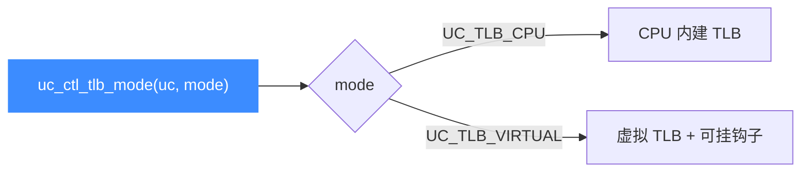

# uc_ctl_tlb_mode

切换引擎的 **TLB 实现方式**：`UC_TLB_CPU`（默认，CPU 自带 TLB）或 `UC_TLB_VIRTUAL`（虚拟 TLB，可用钩子精细控制访存）。读完你会知道两种模式的差异与切换方法。

## 🧩 便捷宏定义与展开

来自 `include/unicorn/unicorn.h`：

```c
#define uc_ctl_tlb_mode(uc, mode) \
    uc_ctl(uc, UC_CTL_WRITE(UC_CTL_TLB_TYPE, 1), (mode))
```

> 📄 声明：[`unicorn.h`](https://github.com/android-security-engineer/unicorn-skills/blob/master/include/unicorn/unicorn.h#L684)（便捷宏）· [`unicorn.h`](https://github.com/android-security-engineer/unicorn-skills/blob/master/include/unicorn/unicorn.h#L599)（`UC_CTL_TLB_TYPE` 控制码）· 实现：[`uc.c`](https://github.com/android-security-engineer/unicorn-skills/blob/master/uc.c#L2934)（`case UC_CTL_TLB_TYPE`）

展开为写方向、1 个参数、控制类型 `UC_CTL_TLB_TYPE`。

## 📤 参数与方向

| 项目 | 值 |
| --- | --- |
| 控制类型 | `UC_CTL_TLB_TYPE` |
| 方向 | `UC_CTL_IO_WRITE`（只写） |
| 参数个数 | 1 |
| `mode` 类型 | `int`（`uc_tlb_type`：`UC_TLB_CPU` / `UC_TLB_VIRTUAL`） |
| 返回 | `uc_err`，成功为 `UC_ERR_OK` |

`uc.c` 写分支调用 `uc->set_tlb(uc, mode)` 切换实现。取值来自 `uc_tlb_type` 枚举：

| 取值 | 语义 |
| --- | --- |
| `UC_TLB_CPU`（0） | CPU 默认 TLB，适合全系统模拟 |
| `UC_TLB_VIRTUAL`（1） | 虚拟 TLB，默认虚拟地址=物理地址，可用钩子（`uc_cb_tlbevent_t`）覆写条目 |



## 🔧 何时用 / 示例

需要对每次访存做细粒度控制（如自定义虚拟→物理映射）时切到虚拟 TLB：

```c
uc_engine *uc;
uc_open(UC_ARCH_ARM64, UC_MODE_ARM, &uc);

uc_err err = uc_ctl_tlb_mode(uc, UC_TLB_VIRTUAL);
if (err) {
    printf("切换 TLB 模式失败: %u\n", err);
    return;
}
```

::: warning ⚠️ 时机限制
切换 TLB 实现会影响地址翻译方式，建议在配置映射前完成切换；切换后如已有缓存，可配合 [uc_ctl_flush_tlb](/ctl/flush-tlb) 清空。
:::

## 📂 相关源码

| 文件 | 角色 |
|------|------|
| [`include/unicorn/unicorn.h`](https://github.com/android-security-engineer/unicorn-skills/blob/master/include/unicorn/unicorn.h#L684) | `uc_ctl_tlb_mode` 便捷宏定义 |
| [`uc.c`](https://github.com/android-security-engineer/unicorn-skills/blob/master/uc.c#L2934) | `case UC_CTL_TLB_TYPE` 实现，调用 `uc->set_tlb` |

## 相关页面

- [uc_ctl 总览](/ctl/)
- [uc_ctl_flush_tlb](/ctl/flush-tlb)
- [TLB 模式](/features/tlb-modes)
- [MMU](/features/mmu)
