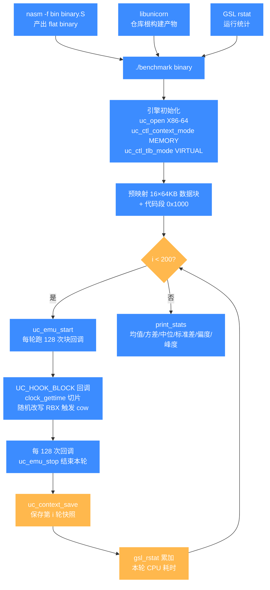
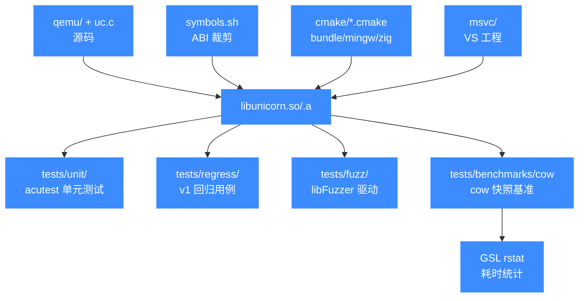

# 性能基准与测试辅助设施

本页聚焦 `tests/benchmarks/`（cow copy-on-write 快照场景的性能基准），并顺带概述 `tests/` 下与它并列的 regress、fuzz，以及仓库根服务于构建/打包的 `cmake/`、`msvc/`、`symbols.sh` 等辅助设施。

## 📌 概述

`tests/benchmarks/` 是 Unicorn 从 v1 继承下来的性能基准套件，目前只含一个 `cow/` 子目录：一个 x86-64 的 copy-on-write 快照场景，用于衡量带内存快照（`uc_context_save`）与虚拟 TLB 模式下的仿真吞吐量。它与同级的 `tests/regress/`（从 v1 继承的回归用例集，C + Python 混合，**文件名即 bug 描述**）、`tests/fuzz/`（OSS-Fuzz 模糊驱动，每个架构一个 `fuzz_emu_*.c`）互为补充：regress 验证"bug 不复活"，fuzz 探索"未知崩溃"，benchmarks 度量"跑得有多快"。

周边还有几个不属于 `tests/` 但服务于整体构建/测试流程的设施：`cmake/` 是 `bundle_static.cmake`、`mingw-w64.cmake`、`zig.cmake` 等 CMake 辅助模块；`msvc/` 是各架构的 Visual Studio 工程目录（如 `x86_64-softmmu/`、`aarch64-softmmu/`）；`symbols.sh` 是导出符号白名单脚本（约 6600 行），用于在链接阶段裁剪 `libunicorn` 对外可见的 ABI。这些目录各自独立，**不依赖** `tests/unit/` 的 acutest 框架，而是通过各自的 Makefile、libFuzzer 或 shell 脚本运行。

## 📁 关键文件与子目录

| 路径 | 类型 | 用途 |
|------|------|------|
| [`tests/benchmarks/cow/benchmark.c`](https://github.com/android-security-engineer/unicorn-skills/blob/master/tests/benchmarks/cow/benchmark.c) | C | cow 快照场景主程序，跑 200 轮仿真并用 GSL 统计每轮耗时 |
| [`tests/benchmarks/cow/binary.S`](https://github.com/android-security-engineer/unicorn-skills/blob/master/tests/benchmarks/cow/binary.S) | 汇编 | 被测 x86-64 代码：一个写内存循环（`mov [rbx+rcx*8], rsi`） |
| [`tests/benchmarks/cow/Makefile`](https://github.com/android-security-engineer/unicorn-skills/blob/master/tests/benchmarks/cow/Makefile) | Makefile | 编译 `benchmark.c`，链接 `-lgsl -lgslcblas -lm -lunicorn` |
| [`tests/regress/`](https://github.com/android-security-engineer/unicorn-skills/blob/master/tests/regress) `*.c` / `*.py` | C/Python | v1 继承的回归用例，文件名即原始崩溃症状 |
| [`tests/regress/Makefile`](https://github.com/android-security-engineer/unicorn-skills/blob/master/tests/regress/Makefile) | Makefile | `wildcard *.c` 批量编译所有 C 用例，链接 `-lunicorn` |
| [`tests/fuzz/`](https://github.com/android-security-engineer/unicorn-skills/blob/master/tests/fuzz) `fuzz_emu_*.c` | C | 每架构一个 libFuzzer 驱动（如 `fuzz_emu_x86_64.c`、`fuzz_emu_arm_arm.c`） |
| [`tests/fuzz/onefile.c`](https://github.com/android-security-engineer/unicorn-skills/blob/master/tests/fuzz/onefile.c) / [`onedir.c`](https://github.com/android-security-engineer/unicorn-skills/blob/master/tests/fuzz/onedir.c) | C | 单文件 / 单目录语料回放驱动，便于复现崩溃样本 |
| [`tests/fuzz/fuzz_emu.options`](https://github.com/android-security-engineer/unicorn-skills/blob/master/tests/fuzz/fuzz_emu.options) | 配置 | libFuzzer 选项，`max_len = 4096` |
| [`cmake/bundle_static.cmake`](https://github.com/android-security-engineer/unicorn-skills/blob/master/cmake/bundle_static.cmake) | CMake | 把多个静态库合并为单一 `.a` 的辅助模块 |
| [`cmake/mingw-w64.cmake`](https://github.com/android-security-engineer/unicorn-skills/blob/master/cmake/mingw-w64.cmake) | CMake | MinGW-w64 交叉编译工具链文件 |
| [`cmake/zig.cmake`](https://github.com/android-security-engineer/unicorn-skills/blob/master/cmake/zig.cmake) | CMake | Zig 作为 C 编译器/链接器时的工具链文件 |
| [`msvc/`](https://github.com/android-security-engineer/unicorn-skills/blob/master/msvc) `<arch>-softmmu/` | VS 工程 | 每架构一个 Visual Studio 工程目录 |
| [`msvc/unicorn/`](https://github.com/android-security-engineer/unicorn-skills/blob/master/msvc/unicorn) | VS 工程 | 顶层 Unicorn 解决方案工程 |
| [`msvc/config-host.h`](https://github.com/android-security-engineer/unicorn-skills/blob/master/msvc/config-host.h) | 头文件 | MSVC 构建的宿主配置宏 |
| [`symbols.sh`](https://github.com/android-security-engineer/unicorn-skills/blob/master/symbols.sh) | Shell | 导出符号白名单脚本（约 6600 行），裁剪动态库对外 ABI |

::: details binary.S 被测代码
被基准程序加载执行的 x86-64 代码片段，是一个不断写入 `rbx` 指向内存的循环：

```asm
USE64
DEFAULT REL

SECTION .text
loop:
	xor rcx, rcx
write:
	mov [rbx+rcx*8], rsi
	inc rcx
	mov rdi, rax
	sub rdi, rcx
	jnz write
	jmp loop
```

每次进入 `write` 块时，hook 会随机改写 `RBX` 指向 16 个 64KB 内存块之一，从而触发快照与写时复制路径。
:::

## 💻 用法

### 运行 benchmarks

cow 基准需要 [GSL](https://www.gnu.org/software/gsl/)（GNU Scientific Library）提供运行统计，并需要先用汇编器把 `binary.S` 编成裸二进制：

```bash
# 先构建 libunicorn（仓库根）
mkdir build && cd build
cmake .. -DCMAKE_BUILD_TYPE=Release
make -j

# 进入基准目录编译
cd tests/benchmarks/cow
make                        # 编译 benchmark.c，链接 ../../build 的 libunicorn
./benchmark binary          # binary.S 需先用 nasm 编为 flat binary
```

::: warning 注意
`benchmark.c` 用 `open()` + `mmap()` 直接把参数指定的文件映射为可执行内存，因此 `argv[1]` 必须是已编好的**flat binary**（不是 ELF）。`binary.S` 需用 `nasm -f bin binary.S -o binary` 产出。运行时还需系统安装 `libgsl`、`libgslcblas`，否则链接报 `undefined reference to gsl_rstat_*`。
:::

### 运行 regress 与 fuzz（同属 tests/）

```bash
# regress：批量编译并跑 C 用例
cd tests/regress
make
LD_LIBRARY_PATH=../.. ./map_crash
sh regress.sh                 # 按固定顺序执行一批关键用例

# fuzz：需 CMake 开启 UNICORN_FUZZ，且通常需带 libFuzzer 的 clang
mkdir build-fuzz && cd build-fuzz
cmake .. -DUNICORN_FUZZ=ON
make -j
./tests/fuzz/fuzz_emu_x86_64 corpus_x86_64/
```

## 🔧 实现

### cow 基准的测量模型

`benchmark.c` 的核心思路是：固定跑 200 轮仿真，每轮在 `UC_HOOK_BLOCK` 回调里用 `clock_gettime(CLOCK_PROCESS_CPUTIME_ID)` 记录两个时间点之间的 CPU 耗时，再喂给 GSL 的 rstat 累加器，最终输出均值、方差、中位数、标准差、偏度、峰度等完整统计：

```c
#define NRUNS 200

static void callback_block(uc_engine *uc, uint64_t addr, uint32_t size, void *data)
{
    struct data *d = data;
    struct timespec now;
    clock_gettime(CLOCK_PROCESS_CPUTIME_ID, &now);
    if (d->rstat_p) {
        update_stats(d->rstat_p, &d->start, &now);   // 累加上一段耗时
    } else {
        d->rstat_p = gsl_rstat_alloc();
    }
    /* 每跑 128 次块回调就主动 uc_emu_stop，结束本轮 */
    run = gsl_rstat_n(d->rstat_p);
    if (run && !(run % 128)) {
        uc_emu_stop(uc);
        return;
    }
    /* 随机选定一个 64KB 内存块写入，触发 cow */
    rsi = random();
    memblock = random() & 15;
    offset = random() & (BLOCKSIZE - 1) & (~0xf);
    rbx += (memblock * BLOCKSIZE) + offset;
    uc_reg_write(uc, UC_X86_REG_RBX, &rbx);
    /* ... */
    clock_gettime(CLOCK_PROCESS_CPUTIME_ID, &d->start);  // 下一段起点
}
```

### 快照与虚拟 TLB

为了让 cow 路径真正被走到，基准在启动时做了两件关键配置：

```c
uc_open(UC_ARCH_X86, UC_MODE_64, &uc);
uc_ctl_context_mode(uc, UC_CTL_CONTEXT_MEMORY);  // 快照包含内存状态
uc_ctl_tlb_mode(uc, UC_TLB_VIRTUAL);             // 启用虚拟 TLB
```

- `UC_CTL_CONTEXT_MEMORY` 让 `uc_context_save` 不仅保存寄存器，还保存内部内存指针，从而实现真正的 copy-on-write 快照——后续对内存的写入只在新快照里生效，旧快照保持不变。
- `UC_TLB_VIRTUAL` 切换到更细粒度的 TLB 模式，配合 cow 让内存访问走软 TLB 路径，这是该基准要度量的核心开销。

每轮仿真结束后，程序会分配并保存一个 `uc_context`，模拟"连续打 200 个快照"的工作负载：

```c
for (int i = 0; i < NRUNS; i++) {
    err = uc_emu_start(uc, CODEADDR, -1, 0, 0);
    uc_context_alloc(uc, &d.c[d.nc]);
    uc_context_save(uc, d.c[d.nc]);   // 保存第 i 轮的快照
    d.nc++;
}
print_stats(d.rstat_p);               // 汇总每轮耗时统计
```

### 内存布局

基准预映射 16 个 64KB 内存块作为写入目标，代码段固定映射在 `0x1000`，数据区基址为 `0x40000000`：

```c
static uint64_t CODEADDR  = 0x1000;
static uint64_t DATABASE  = 0x40000000;
static uint64_t BLOCKSIZE = 0x10000;

static void prepare_mapping(uc_engine *uc)
{
    for (size_t i = 0; i < 16; i++)
        uc_mem_map(uc, DATABASE+i*BLOCKSIZE, BLOCKSIZE,
                   UC_PROT_READ|UC_PROT_WRITE);
}
```

### symbols.sh 与 ABI 控制

`symbols.sh` 维护一份导出符号白名单（含 `uc_open`、`uc_emu_start` 等公共 API，以及 `unicorn_fill_tlb`、`reg_read`、`uc_init` 等需跨编译单元可见的内部符号），在打包动态库时据此裁剪符号表，确保只有白名单内的符号对外可见，从而稳定 ABI。脚本本身逐行列出保留符号，约 6600 行。

::: details 为什么需要 symbols.sh
Unicorn 把多个架构的 QEMU 后端链接进同一个 `libunicorn`，若不加裁剪，链接器会暴露大量 QEMU 内部符号，既膨胀动态库，也会让"未公开符号被外部依赖"成为事实 ABI，增加后续重构难度。`symbols.sh` 通过版本脚本把可见面收敛到刻意公开的集合。
:::

## 📊 cow 基准测量流水线

下图把一次 `./benchmark binary` 的执行拆成五段：编译期准备、引擎初始化、200 轮仿真循环、GSL 统计累加、最终输出。重点在于 hook 回调里用 `clock_gettime` 切片计时、每 128 次块回调 `uc_emu_stop` 结束本轮、以及每轮末尾 `uc_context_save` 模拟连续快照负载这三处耦合点。



整条流水线里 Unicorn 不是被测对象，而是**承载快照负载的执行引擎**：度量的真正对象是 `UC_CTL_CONTEXT_MEMORY` + `UC_TLB_VIRTUAL` 这条 cow 路径在连续 200 个快照下的吞吐开销。GSL 的 rstat 累加器把每轮 CPU 耗时聚合成一份完整统计分布，避免单轮抖动主导结论。

## 📖 模块与构建/测试流程关系



整体上：`qemu/` 与 `uc.c` 等源码经 CMake（或 `msvc/`、`cmake/*.cmake` 工具链）构建为 `libunicorn`，`symbols.sh` 在此环节裁剪 ABI；随后 `tests/unit`、`tests/regress`、`tests/fuzz`、`tests/benchmarks` 四条线分别从单元、回归、模糊、性能四个角度验证同一个库，其中 benchmarks 额外依赖 GSL 做运行统计。

## ⚠️ 注意

- benchmarks **不**走 CTest：CTest 只注册 `tests/unit/` 下的可执行文件，跑基准需显式 `cd tests/benchmarks/cow && make && ./benchmark binary`。
- cow 基准强依赖 GSL（`gsl_rstat_*`）与 POSIX `clock_gettime`、`mmap`，在 Windows/MinGW 下需自行提供等价依赖，`Makefile` 已加 `-D__USE_MINGW_ANSI_STDIO=1` 但不解决 GSL 缺失。
- 被测输入必须是 flat binary 而非 ELF——`benchmark.c` 直接 `mmap` 文件到 `0x1000` 作为可执行内存。
- fuzz 默认不开启，必须显式 `-DUNICORN_FUZZ=ON`，且通常需要带 libFuzzer 的 clang 工具链。
- `symbols.sh` 实际行数约 6600（而非"13 万行"），请以源码为准。

## 📂 相关源码

| 文件 | 角色 |
|------|------|
| [`tests/benchmarks/cow/benchmark.c`](https://github.com/android-security-engineer/unicorn-skills/blob/master/tests/benchmarks/cow/benchmark.c) | cow 快照基准主程序 |
| [`tests/benchmarks/cow/binary.S`](https://github.com/android-security-engineer/unicorn-skills/blob/master/tests/benchmarks/cow/binary.S) | 被测 x86-64 写内存循环 |
| [`tests/benchmarks/cow/Makefile`](https://github.com/android-security-engineer/unicorn-skills/blob/master/tests/benchmarks/cow/Makefile) | 基准编译规则（链接 GSL） |
| [`tests/benchmarks/cow/`](https://github.com/android-security-engineer/unicorn-skills/blob/master/tests/benchmarks/cow) | 全部 cow 基准文件目录 |

## 相关页面

- [测试体系总览](/guide/testing)
- [单元测试 tests/unit](/tests/)
- [回归测试与辅助测试设施](/dev/regress)
- [构建系统与 CMake 选项](/internals/build-system)
- [快照实现 uc_context](/internals/snapshot-impl)
- [TLB 与软内存管理](/internals/tlb)
