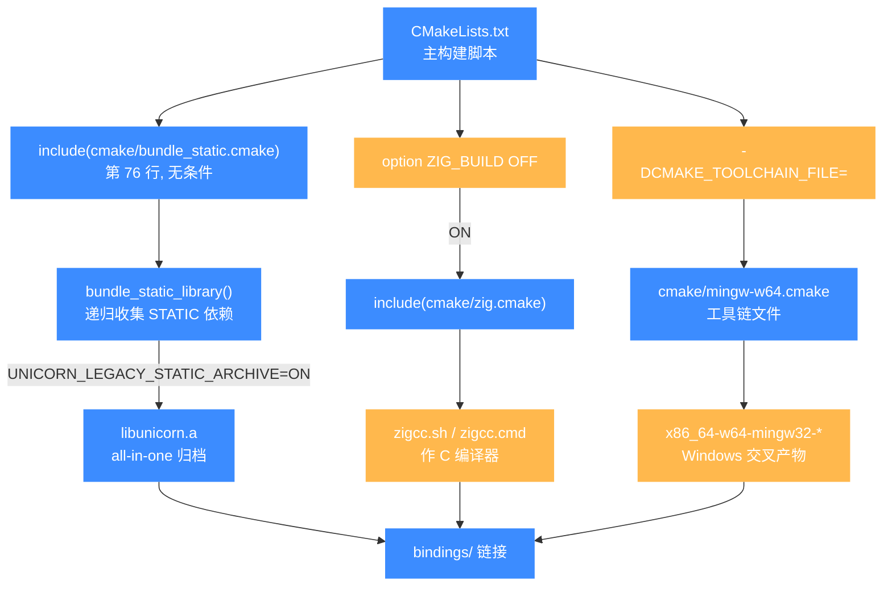
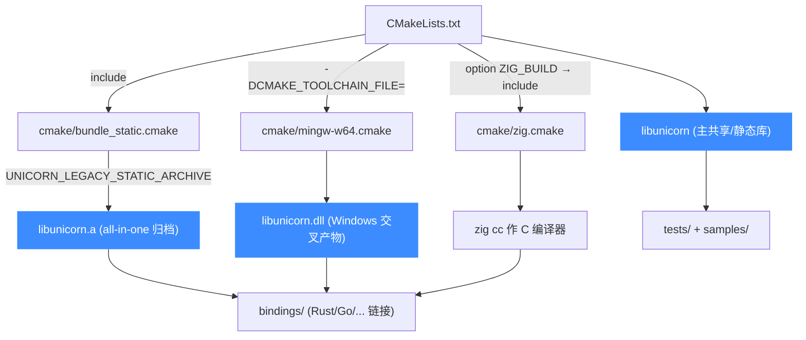

# CMake 辅助模块（cmake/）

> 🔧 本页讲仓库根 `cmake/` 目录下的三个 CMake 辅助模块：`bundle_static.cmake`、`mingw-w64.cmake`、`zig.cmake`，以及它们如何被 `CMakeLists.txt` 引入来支撑静态库打包、交叉编译与 Zig 构建。

## 📌 概述

`cmake/` 是 Unicorn 顶层 CMake 构建系统的「工具箱」目录，里面只放了三个 `.cmake` 模块文件，各自解决一个具体问题：把多个分架构静态库合并成一个 all-in-one 归档、为 Windows 交叉编译指定 MinGW-w64 工具链、以及在用 Zig 作 C 编译器时挂上 `zigcc` 脚本。它们都由 `CMakeLists.txt` 在合适时机 `include()` 进来，本身不编任何源码。

::: tip 目录很小但作用关键
`cmake/` 一共只有 3 个文件，但 `bundle_static.cmake` 是 v1 风格 `libunicorn.a` 归档得以产出的核心，`zig.cmake` / `mingw-w64.cmake` 则是跨平台交叉编译的入口。
:::

## 📖 关键文件一览

| 文件 | 行数 | 作用 |
| --- | --- | --- |
| [`cmake/bundle_static.cmake`](https://github.com/android-security-engineer/unicorn-skills/blob/master/cmake/bundle_static.cmake) | 57 | 定义 `bundle_static_library()` 函数：递归收集一个静态目标的所有 `STATIC_LIBRARY` 依赖，把它们的目标文件合并成一个新的 all-in-one 静态库，并创建一个 `.o` 符号链接 |
| [`cmake/mingw-w64.cmake`](https://github.com/android-security-engineer/unicorn-skills/blob/master/cmake/mingw-w64.cmake) | 17 | MinGW-w64 交叉编译工具链文件：设定 `CMAKE_SYSTEM_NAME=Windows`、指定 `x86_64-w64-mingw32-*` 编译器与 `windres`、限制 `FIND_` 只在目标环境找库 |
| [`cmake/zig.cmake`](https://github.com/android-security-engineer/unicorn-skills/blob/master/cmake/zig.cmake) | 9 | Zig 构建辅助：置 `CMAKE_CROSSCOMPILING=TRUE`，把 `CMAKE_C_COMPILER` 指向 `bindings/zig/tools/zigcc.cmd`（Windows）或 `zigcc.sh`（其他平台） |

## 🔧 bundle_static.cmake：合并静态库

Unicorn 把每个架构编成独立的 `*-softmmu` 静态库（见 [构建系统](/internals/build-system)）。当开启 `UNICORN_LEGACY_STATIC_ARCHIVE` 时，需要一个 v1 风格的 all-in-one `libunicorn.a`——但 CMake 原生不会把传递依赖的静态库「摊平」进一个归档里，这就是 `bundle_static_library()` 的职责。

```cmake
# cmake/bundle_static.cmake（节选）
function(bundle_static_library tgt_name bundled_tgt_name library_name)
  # 递归收集 tgt_name 的所有 STATIC_LIBRARY 依赖
  function(_recursively_collect_dependencies input_target)
    get_target_property(public_dependencies ${input_target} ${_input_link_libraries})
    foreach(dependency IN LISTS public_dependencies)
      if(TARGET ${dependency})
        get_target_property(_type ${dependency} TYPE)
        if (${_type} STREQUAL "STATIC_LIBRARY")
          list(APPEND static_libs ${dependency})
        endif()
        # ...递归下去，并用 GLOBAL PROPERTY 去重
      endif()
    endforeach()
  endfunction()

  _recursively_collect_dependencies(${tgt_name})
  # 用 $<TARGET_OBJECTS:> 把每个静态库的目标文件收集起来
  foreach(tgt IN LISTS static_libs)
    list(APPEND static_libs_objects $<TARGET_OBJECTS:${tgt}>)
  endforeach()
  add_library(${bundled_tgt_name} STATIC ${static_libs_objects})
  set_target_properties(${bundled_tgt_name} PROPERTIES
    OUTPUT_NAME "${library_name}"
    SYMLINK_NAME "${library_name}.o")
  # POST_BUILD 再建一个 libunicorn.a.o -> libunicorn.a 的符号链接
endfunction()
```

### 在 CMakeLists.txt 里的调用点

`CMakeLists.txt` 第 76 行无条件 `include(cmake/bundle_static.cmake)`，随后在静态归档分支里按共享/静态两种情况分别调用一次：

```cmake
# CMakeLists.txt:76
include(cmake/bundle_static.cmake)

# CMakeLists.txt:1458
if (UNICORN_LEGACY_STATIC_ARCHIVE)
    if (BUILD_SHARED_LIBS)
        if (MSVC)
            # 避开 MSVC 导入库与归档同名冲突
            set_target_properties(unicorn PROPERTIES ARCHIVE_OUTPUT_NAME "unicorn-import")
        endif()
        bundle_static_library(unicorn_static unicorn_archive unicorn)
    else()
        # 重命名 static lib 防止文件名冲突
        set_target_properties(unicorn PROPERTIES OUTPUT_NAME "unicorn-static")
        bundle_static_library(unicorn unicorn_archive unicorn)
    endif()
endif()
```

::: warning MSVC 下的特殊处理
当同时编共享库又开 `UNICORN_LEGACY_STATIC_ARCHIVE` 时，MSVC 会用同一名字生成导入库，与我们要的归档撞名，所以先把 `unicorn` 的 `ARCHIVE_OUTPUT_NAME` 改成 `unicorn-import`，再让 `bundle_static_library` 用 `unicorn` 这个 `OUTPUT_NAME` 产出 `libunicorn.a`。
:::

## 🔧 mingw-w64.cmake：Windows 交叉编译

这是一份标准的 CMake **工具链文件**（toolchain file），用于在 Linux/macOS 上交叉编译 Windows 版 `libunicorn`。核心是固定编译器三元组与查找根路径：

```cmake
# cmake/mingw-w64.cmake
SET(CMAKE_SYSTEM_NAME Windows)
SET(CMAKE_C_COMPILER  x86_64-w64-mingw32-gcc)
SET(CMAKE_CXX_COMPILER x86_64-w64-mingw32-g++)
SET(CMAKE_RC_COMPILER x86_64-w64-mingw32-windres)
SET(CMAKE_FIND_ROOT_PATH  /usr/x86_64-w64-mingw32)
set(CMAKE_FIND_ROOT_PATH_MODE_PROGRAM NEVER)
set(CMAKE_FIND_ROOT_PATH_MODE_LIBRARY ONLY)
set(CMAKE_FIND_ROOT_PATH_MODE_INCLUDE ONLY)
```

### 用法

```bash
# 从 Linux 交叉编译 Windows 共享库
mkdir build-mingw && cd build-mingw
cmake .. -DCMAKE_TOOLCHAIN_FILE=../cmake/mingw-w64.cmake \
         -DBUILD_SHARED_LIBS=ON
make -j$(nproc)
```

`CMAKE_FIND_ROOT_PATH_MODE_*` 三行确保只在目标环境（`/usr/x86_64-w64-mingw32`）里找库和头文件，但仍在主机找程序（`NEVER` 表示不去目标环境找 `find_program` 的结果）。

## 🔧 zig.cmake：Zig 作 C 编译器

当用 Zig 的 `zig cc` 作 C 编译器构建 Unicorn 时（对应 `ZIG_BUILD` 选项），CMake 需要把编译器指向仓库自带的 `zigcc` 包装脚本。该脚本位于 [Zig 绑定](/bindings/overview) 目录下：

```cmake
# cmake/zig.cmake
set(CMAKE_CROSSCOMPILING TRUE)
if(WIN32)
    SET(ZIG_CC ${CMAKE_SOURCE_DIR}/bindings/zig/tools/zigcc.cmd)
else()
    SET(ZIG_CC ${CMAKE_SOURCE_DIR}/bindings/zig/tools/zigcc.sh)
endif()
SET(CMAKE_C_COMPILER_ID ${ZIG_CC})
SET(CMAKE_C_COMPILER ${ZIG_CC})
```

### 在 CMakeLists.txt 里的调用点

```cmake
# CMakeLists.txt:23
option(ZIG_BUILD "Enable zig build" OFF)
if(ZIG_BUILD)
    include(cmake/zig.cmake)
endif()
```

::: tip 何时用 zig.cmake
仅当显式 `-DZIG_BUILD=ON` 才会 include。常用于让 Zig 消费者复用同一份 C 库，或借助 `zig cc` 的开箱即用交叉能力跨平台编 Unicorn。
:::

## 💻 用法：三种入口

三个模块对应三种不同的使用路径：

```bash
# 1) 默认构建（含 bundle_static.cmake 自动合并静态归档）
mkdir build && cd build
cmake .. -DCMAKE_BUILD_TYPE=Release
make

# 2) 显式开启 v1 风格 all-in-one 归档
cmake .. -DUNICORN_LEGACY_STATIC_ARCHIVE=ON
make

# 3) MinGW-w64 交叉编译 Windows 版
cmake .. -DCMAKE_TOOLCHAIN_FILE=../cmake/mingw-w64.cmake

# 4) 用 zig cc 构建
cmake .. -DZIG_BUILD=ON
```

## ⚠️ 注意

- `bundle_static.cmake` 依赖 CMake 的生成器表达式 `$<TARGET_OBJECTS:>`，**不能用 `ar` 手工模拟**；如果静态归档少了某个架构的目标文件，先检查 `UNICORN_ARCH` 裁剪与各 `*-softmmu` 目标的链接关系。
- `mingw-w64.cmake` 写死的是 `x86_64-w64-mingw32-*`（64 位 Windows）。要编 32 位需把三元组改成 `i686-w64-mingw32-*`，并相应改 `CMAKE_FIND_ROOT_PATH`。
- `zig.cmake` 把 `CMAKE_C_COMPILER_ID` 也设成了 `zigcc` 脚本路径——这偏离 CMake 的常规语义（`_ID` 通常是 `GNU`/`Clang`/`MSVC` 这类标识符），但在 Unicorn 的场景里只为让后续逻辑识别到「这是 zig 构建」。
- 这三个文件**不在 `format.sh` 的格式化范围内**（`format.sh` 只处理 `*.c`/`*.h`），所以它们的缩进风格保留 CMake 惯例（`SET` 大写等）。

## 🗺️ CMake 辅助模块组织

下图把 `cmake/` 三个模块与 `CMakeLists.txt` 的引入关系、各自的触发条件、最终产物画在一起。`bundle_static.cmake` 无条件引入、走主构建路径产出归档；`zig.cmake` 与 `mingw-w64.cmake` 是按需引入的工具链，分别由 `ZIG_BUILD` 选项和 `-DCMAKE_TOOLCHAIN_FILE=` 触发。



三个模块定位互补：`bundle_static` 解决"如何把多架构静态库摊平进一个归档"，`mingw-w64` 与 `zig` 解决"如何换一套编译器跨平台编 Unicorn"。它们都不编源码，只改 CMake 的构建配置与工具链指向。

## 🗺️ 与主构建/测试流程的关系



## 📖 参考

- 上游 `bundle_static_library` 思路来自 [Bundling static libraries with CMake (cristianadam.eu)](https://cristianadam.eu/20190501/bundling-together-static-libraries-with-cmake/)，文件首行注释即注明了出处。
- CMake 官方文档：[toolchain file](https://cmake.org/cmake/help/latest/manual/cmake-toolchains.7.html)、[`$<TARGET_OBJECTS:>`](https://cmake.org/cmake/help/latest/manual/cmake-generator-expressions.7.html)。
- `cmake/` 之外，构建辅助还散落在：`msvc/`（各架构 Visual Studio 工程）、`tests/regress/`（v1 继承的回归用例，C+Python 混合，文件名即 bug 描述）、`tests/fuzz/`（OSS-Fuzz 模糊驱动，13 个 `fuzz_emu_*.c` 每架构一个）、`tests/benchmarks/`（基于 cow 快照的性能基准）、根目录 `symbols.sh`（约 13 万行的导出符号表脚本，用于控制 ABI）。

## 📂 相关源码

| 文件 | 角色 |
|------|------|
| [`cmake/bundle_static.cmake`](https://github.com/android-security-engineer/unicorn-skills/blob/master/cmake/bundle_static.cmake) | `bundle_static_library()` 合并静态库 |
| [`cmake/mingw-w64.cmake`](https://github.com/android-security-engineer/unicorn-skills/blob/master/cmake/mingw-w64.cmake) | MinGW-w64 交叉编译工具链 |
| [`cmake/zig.cmake`](https://github.com/android-security-engineer/unicorn-skills/blob/master/cmake/zig.cmake) | Zig 工具链辅助 |
| [`bindings/zig/tools/zigcc.sh`](https://github.com/android-security-engineer/unicorn-skills/blob/master/bindings/zig/tools/zigcc.sh) | Zig 作 C 编译器的包装脚本 |
| [`CMakeLists.txt`](https://github.com/android-security-engineer/unicorn-skills/blob/master/CMakeLists.txt) | 主构建文件，`include()` 各 `*.cmake` 模块 |

## 相关页面

- [CMake 构建系统](/internals/build-system)
- [编译安装](/guide/compile)
- [测试体系](/tests/)
- [Zig 绑定](/bindings/overview)
