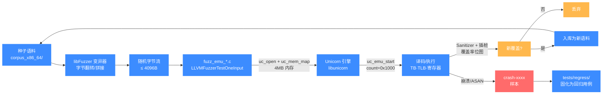
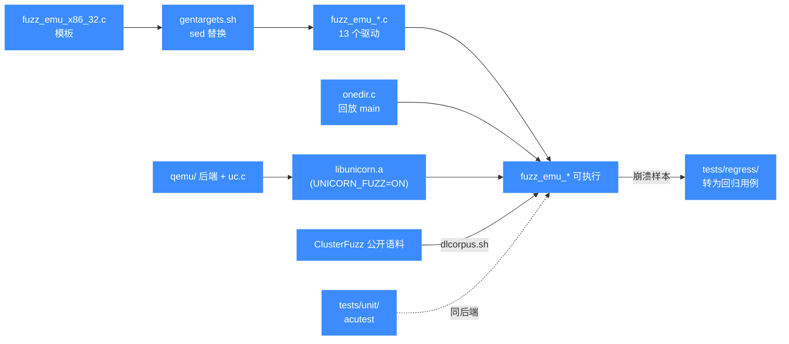

# 模糊测试 tests/fuzz

> 💡 本页讲 `tests/fuzz/` 目录：面向 OSS-Fuzz 的 libFuzzer 模糊驱动集，每个架构一个 `fuzz_emu_*.c`，以及配套的语料回放、语料下载、目标生成脚本。

## 📌 概述

`tests/fuzz/` 是 Unicorn 接入 OSS-Fuzz 持续模糊测试的入口。目录里一共 19 个文件，其中 13 个是 `fuzz_emu_*.c` 形态的 libFuzzer 驱动——**每种架构 + 模式组合一个**，各自实现标准的 `LLVMFuzzerTestOneInput(data, size)` 入口：把传入的随机字节当作机器码，`uc_open` 对应架构、映射 4MB 内存、写入字节后 `uc_emu_start` 跑最多 4096 条指令。所有驱动结构完全一致，只是 `UC_ARCH_*` / `UC_MODE_*` 不同，因此可以用一个模板（`fuzz_emu_x86_32.c`）通过 `gentargets.sh` 的 `sed` 替换批量生成其余目标。

::: tip 为什么按架构拆分
Unicorn 在构建期通过 `UNICORN_ARCH` 决定编入哪些后端，OSS-Fuzz 也按目标粒度分配语料与算力。把每个架构拆成独立驱动，既能让 fuzzer 针对单架构喂入定向语料，也方便在崩溃时一眼定位到是哪个后端的翻译/执行出了问题。
:::

驱动可以两种方式运行：一是接入 libFuzzer 持续变异生成新输入，二是脱离 libFuzzer、用 `onefile.c` / `onedir.c` 回放单个样本或整个语料目录来复现崩溃。CMake 通过 `UNICORN_FUZZ` 选项把驱动接入构建；`tests/fuzz/Makefile` 则提供了一条不依赖 CMake 的手工编译路径。

## 📁 关键文件一览

| 文件 | 类型 | 用途 |
|------|------|------|
| [`tests/fuzz/fuzz_emu_x86_32.c`](https://github.com/android-security-engineer/unicorn-skills/blob/master/tests/fuzz/fuzz_emu_x86_32.c) | C | 模糊驱动**模板**，x86 32 位；`gentargets.sh` 以它为蓝本生成其余目标 |
| [`tests/fuzz/fuzz_emu_x86_64.c`](https://github.com/android-security-engineer/unicorn-skills/blob/master/tests/fuzz/fuzz_emu_x86_64.c) | C | x86 64 位模糊驱动 |
| [`tests/fuzz/fuzz_emu_x86_16.c`](https://github.com/android-security-engineer/unicorn-skills/blob/master/tests/fuzz/fuzz_emu_x86_16.c) | C | x86 16 位（实模式）模糊驱动 |
| [`tests/fuzz/fuzz_emu_arm_arm.c`](https://github.com/android-security-engineer/unicorn-skills/blob/master/tests/fuzz/fuzz_emu_arm_arm.c) | C | ARM ARM 模式模糊驱动 |
| [`tests/fuzz/fuzz_emu_arm_armbe.c`](https://github.com/android-security-engineer/unicorn-skills/blob/master/tests/fuzz/fuzz_emu_arm_armbe.c) | C | ARM ARM 大端模式模糊驱动 |
| [`tests/fuzz/fuzz_emu_arm_thumb.c`](https://github.com/android-security-engineer/unicorn-skills/blob/master/tests/fuzz/fuzz_emu_arm_thumb.c) | C | ARM Thumb 模式模糊驱动 |
| [`tests/fuzz/fuzz_emu_arm64_arm.c`](https://github.com/android-security-engineer/unicorn-skills/blob/master/tests/fuzz/fuzz_emu_arm64_arm.c) | C | AArch64 ARM 模式模糊驱动 |
| [`tests/fuzz/fuzz_emu_arm64_armbe.c`](https://github.com/android-security-engineer/unicorn-skills/blob/master/tests/fuzz/fuzz_emu_arm64_armbe.c) | C | AArch64 ARM 大端模式模糊驱动 |
| [`tests/fuzz/fuzz_emu_m68k_be.c`](https://github.com/android-security-engineer/unicorn-skills/blob/master/tests/fuzz/fuzz_emu_m68k_be.c) | C | M68K 大端模糊驱动 |
| [`tests/fuzz/fuzz_emu_mips_32le.c`](https://github.com/android-security-engineer/unicorn-skills/blob/master/tests/fuzz/fuzz_emu_mips_32le.c) | C | MIPS32 小端模糊驱动 |
| [`tests/fuzz/fuzz_emu_mips_32be.c`](https://github.com/android-security-engineer/unicorn-skills/blob/master/tests/fuzz/fuzz_emu_mips_32be.c) | C | MIPS32 大端模糊驱动 |
| [`tests/fuzz/fuzz_emu_sparc_32be.c`](https://github.com/android-security-engineer/unicorn-skills/blob/master/tests/fuzz/fuzz_emu_sparc_32be.c) | C | SPARC32 大端模糊驱动 |
| [`tests/fuzz/fuzz_emu_s390x_be.c`](https://github.com/android-security-engineer/unicorn-skills/blob/master/tests/fuzz/fuzz_emu_s390x_be.c) | C | s390x 大端模糊驱动 |
| [`tests/fuzz/fuzz_emu.options`](https://github.com/android-security-engineer/unicorn-skills/blob/master/tests/fuzz/fuzz_emu.options) | 配置 | libFuzzer 选项，`max_len = 4096` 限制单条输入上限 |
| [`tests/fuzz/onefile.c`](https://github.com/android-security-engineer/unicorn-skills/blob/master/tests/fuzz/onefile.c) | C | 单文件回放主函数：读入一个样本文件调用 `LLVMFuzzerTestOneInput`，不依赖 libFuzzer |
| [`tests/fuzz/onedir.c`](https://github.com/android-security-engineer/unicorn-skills/blob/master/tests/fuzz/onedir.c) | C | 单目录回放主函数：遍历目录下所有常规文件逐个回放，CMake 构建时与每个驱动链接 |
| [`tests/fuzz/gentargets.sh`](https://github.com/android-security-engineer/unicorn-skills/blob/master/tests/fuzz/gentargets.sh) | Shell | 用 `sed` 把模板 `fuzz_emu_x86_32.c` 里的架构/模式替换，生成其余 12 个驱动源文件 |
| [`tests/fuzz/dlcorpus.sh`](https://github.com/android-security-engineer/unicorn-skills/blob/master/tests/fuzz/dlcorpus.sh) | Shell | 从 ClusterFuzz 公开语料库下载各目标的 `public.zip`，解压后回放 |
| [`tests/fuzz/Makefile`](https://github.com/android-security-engineer/unicorn-skills/blob/master/tests/fuzz/Makefile) | Makefile | 脱离 CMake 的手工编译入口，`wildcard fuzz*.c` 批量链接 `onedir.c` |

## 📊 模糊目标与架构映射

下表列出 13 个驱动各自喂给 `uc_open()` 的架构与模式常量：

| 驱动文件 | `UC_ARCH_*` | `UC_MODE_*` | 端序 |
|----------|-------------|-------------|------|
| `fuzz_emu_x86_16` | `UC_ARCH_X86` | `UC_MODE_16` | 小端 |
| `fuzz_emu_x86_32` | `UC_ARCH_X86` | `UC_MODE_32` | 小端 |
| `fuzz_emu_x86_64` | `UC_ARCH_X86` | `UC_MODE_64` | 小端 |
| `fuzz_emu_arm_arm` | `UC_ARCH_ARM` | `UC_MODE_ARM` | 小端 |
| `fuzz_emu_arm_armbe` | `UC_ARCH_ARM` | `UC_MODE_ARM \| UC_MODE_BIG_ENDIAN` | 大端 |
| `fuzz_emu_arm_thumb` | `UC_ARCH_ARM` | `UC_MODE_THUMB` | 小端 |
| `fuzz_emu_arm64_arm` | `UC_ARCH_ARM64` | `UC_MODE_ARM` | 小端 |
| `fuzz_emu_arm64_armbe` | `UC_ARCH_ARM64` | `UC_MODE_ARM \| UC_MODE_BIG_ENDIAN` | 大端 |
| `fuzz_emu_m68k_be` | `UC_ARCH_M68K` | `UC_MODE_BIG_ENDIAN` | 大端 |
| `fuzz_emu_mips_32le` | `UC_ARCH_MIPS` | `UC_MODE_MIPS32 + UC_MODE_LITTLE_ENDIAN` | 小端 |
| `fuzz_emu_mips_32be` | `UC_ARCH_MIPS` | `UC_MODE_MIPS32 + UC_MODE_BIG_ENDIAN` | 大端 |
| `fuzz_emu_sparc_32be` | `UC_ARCH_SPARC` | `UC_MODE_SPARC32 \| UC_MODE_BIG_ENDIAN` | 大端 |
| `fuzz_emu_s390x_be` | `UC_ARCH_S390X` | `UC_MODE_BIG_ENDIAN` | 大端 |

::: details 没有覆盖到的架构
`gentargets.sh` 里注释掉了 `fuzz_emu_sparc_64be` 与 `fuzz_emu_arm_thumbbe` 两行，因此 sparc64、ARM Thumb 大端当前没有驱动；ppc、riscv、tricore 也没有 fuzz 目标。新增架构的模糊驱动时，照搬 `gentargets.sh` 里的 `sed` 模式补一条即可。
:::

## 💻 用法

### 通过 CMake 编译并运行（推荐）

模糊测试默认关闭，需用 `UNICORN_FUZZ=ON` 显式开启，并通常搭配带 libFuzzer 的 clang 工具链：

```bash
# 用带 libFuzzer 的 clang 构建
mkdir build-fuzz && cd build-fuzz
cmake .. -DCMAKE_BUILD_TYPE=Release -DUNICORN_FUZZ=ON \
         -DCMAKE_C_COMPILER=clang -DCMAKE_C_FLAGS="-fsanitize=fuzzer-no-link"
make -j$(nproc)

# 用 libFuzzer 驱动 x86_64 目标，语料放进 corpus_x86_64/
./tests/fuzz/fuzz_emu_x86_64 corpus_x86_64/ -max_total_time=600
```

开启 `UNICORN_FUZZ` 后，`CMakeLists.txt` 会按固定的 13 个后缀循环 `add_executable`，每个驱动与 `onedir.c` 一起链接：

```cmake
# CMakeLists.txt:1472
if(UNICORN_FUZZ)
    set(UNICORN_FUZZ_SUFFIX
        "arm_arm;arm_armbe;arm_thumb;arm64_arm;arm64_armbe;m68k_be;\
mips_32be;mips_32le;sparc_32be;x86_16;x86_32;x86_64;s390x_be")
    foreach(SUFFIX ${UNICORN_FUZZ_SUFFIX})
        add_executable(fuzz_emu_${SUFFIX}
            ${CMAKE_CURRENT_SOURCE_DIR}/tests/fuzz/fuzz_emu_${SUFFIX}.c
            ${CMAKE_CURRENT_SOURCE_DIR}/tests/fuzz/onedir.c)
        target_link_libraries(fuzz_emu_${SUFFIX} PRIVATE ${SAMPLES_LIB})
    endforeach()
endif()
```

### 复现崩溃样本

OSS-Fuzz 报出的崩溃样本通常是一个二进制文件。直接把它作为参数传给驱动即可回放——此时走的是 `onedir.c` 的 `main`，会把参数当目录或文件路径处理并调用 `LLVMFuzzerTestOneInput`，**不需要** libFuzzer 运行时：

```bash
# 复现单个崩溃样本
./tests/fuzz/fuzz_emu_x86_64 crash-xxxx

# 回放整个语料目录
./tests/fuzz/fuzz_emu_x86_64 corpus_x86_64/
```

### 不依赖 CMake 的手工编译

`tests/fuzz/Makefile` 提供了一条脱离 CMake 的路径：用 `wildcard fuzz*.c` 自动发现所有驱动，逐个与 `onedir.c` 链接到仓库根的 `libunicorn.a`：

```bash
# 先在仓库根编出 libunicorn.a
cd tests/fuzz
make            # 生成所有 fuzz_emu_* 可执行文件
./fuzz_emu_x86_64 /path/to/corpus/
```

```makefile
# tests/fuzz/Makefile
CFLAGS += -L ../../ -I ../../include
LDFLAGS += -pthread
ifeq ($(UNAME_S), Linux)
LDFLAGS += -lrt
endif
LDFLAGS += ../../libunicorn.a

ALL_TESTS_SOURCES = $(wildcard fuzz*.c)
ALL_TESTS = $(ALL_TESTS_SOURCES:%.c=%)

fuzz%: fuzz%.c
	$(CC) $(CFLAGS) $^ onedir.c $(LDFLAGS) -o $@
```

### 下载公开语料

`dlcorpus.sh` 会从 ClusterFuzz 的公开语料库为每个目标下载 `public.zip` 并回放：

```bash
cd tests/fuzz
sh dlcorpus.sh
```

```bash
# tests/fuzz/dlcorpus.sh（节选）
ls fuzz_emu*.c | sed 's/.c//' | while read target
do
    wget "https://storage.googleapis.com/unicorn-backup.clusterfuzz-external.appspot.com/corpus/libFuzzer/unicorn_$target/public.zip"
    unzip -q public.zip -d corpus_$target
    ./$target corpus_$target
done
```

## 🔧 实现

### 驱动结构

13 个 `fuzz_emu_*.c` 互为副本，区别只在 `uc_open()` 的两个常量。以 `fuzz_emu_x86_64.c` 为例，其核心逻辑是：把 fuzzer 给的字节流当作机器码写入映射好的 4MB 内存，然后启动模拟，最多执行 `0x1000`（4096）条指令以规避死循环导致的超时。

```c
// tests/fuzz/fuzz_emu_x86_64.c（节选）
#define ADDRESS 0x1000000

int LLVMFuzzerTestOneInput(const uint8_t *Data, size_t Size) {
    uc_err err;

    // Initialize emulator in supplied mode
    err = uc_open(UC_ARCH_X86, UC_MODE_64, &uc);
    if (err != UC_ERR_OK) {
        printf("Failed on uc_open() with error returned: %u\n", err);
        abort();
    }

    // map 4MB memory for this emulation
    uc_mem_map(uc, ADDRESS, 4 * 1024 * 1024, UC_PROT_ALL);

    // write machine code to be emulated to memory
    if (uc_mem_write(uc, ADDRESS, Data, Size)) {
        printf("Failed to write emulation code to memory, quit!\n");
        abort();
    }

    // emulate code in infinite time & 4096 instructions
    // avoid timeouts with infinite loops
    err = uc_emu_start(uc, ADDRESS, ADDRESS + Size, 0, 0x1000);
    if (err) {
        fprintf(outfile, "Failed on uc_emu_start() with error returned %u: %s\n",
                err, uc_strerror(err));
    }

    uc_close(uc);
    return 0;
}
```

几个值得注意的细节：

- `uc_emu_start` 的 `count` 参数固定为 `0x1000`，`timeout` 为 `0`（不限时）。指令数上限是防止 fuzzer 生成出死循环代码把单次执行挂死。
- `outfile` 指向 `/dev/null`，错误信息默认丢弃，只在初始化阶段 `fopen` 一次（由 `initialized` 标志守护）。
- 每次输入都新建并销毁一个 `uc_engine`，保证用例间状态隔离。

### 目标生成

`gentargets.sh` 用一连串 `sed` 替换从 `fuzz_emu_x86_32.c` 派生其余 12 个驱动。例如 x86 64 位就是把模板里的 `UC_MODE_32` 改成 `UC_MODE_64`，s390x 则是同时替换架构与端序：

```bash
# tests/fuzz/gentargets.sh（节选）
sed 's/UC_MODE_32/UC_MODE_64/'  fuzz_emu_x86_32.c > fuzz_emu_x86_64.c
sed 's/UC_MODE_32/UC_MODE_16/'  fuzz_emu_x86_32.c > fuzz_emu_x86_16.c
sed 's/UC_ARCH_X86/UC_ARCH_S390X/' fuzz_emu_x86_32.c \
  | sed 's/UC_MODE_32/UC_MODE_BIG_ENDIAN/' > fuzz_emu_s390x_be.c
```

::: warning 改驱动要同步改生成脚本
如果修改了 `fuzz_emu_x86_32.c` 的结构（比如换内存布局、加 hook），记得这是所有驱动的模板；同时若新增架构驱动，应往 `gentargets.sh` 与 CMake 的 `UNICORN_FUZZ_SUFFIX` 列表里各加一条，两边缺一不可。
:::

### 回放驱动：onefile vs onedir

两个 `main` 函数都不依赖 libFuzzer，差别在输入是单个文件还是整个目录：

- `onefile.c`：`fopen(argv[1])` → 读入整段字节 → `malloc` 缓冲 → 调用 `LLVMFuzzerTestOneInput(Data, Size)`。适合一次性复现一个 crash sample。
- `onedir.c`：`opendir(argv[1])` → 遍历每个 `DT_REG` 常规文件 → 跳过大于 `0x1000` 字节的 → 逐个回放。CMake 构建时驱动默认链接的是 `onedir.c`，所以把语料目录作为参数即可整批跑。

```c
// tests/fuzz/onedir.c（节选）
while((dir = readdir(d)) != NULL) {
    if (dir->d_type != DT_REG) continue;
    fp = fopen(dir->d_name, "rb");
    // ... fseek/ftell/fread 读入 Data[0x1000]
    LLVMFuzzerTestOneInput(Data, Size);
    fclose(fp);
}
```

## 📊 模糊测试流水线

libFuzzer 主导的变异循环里，Unicorn 是"被驱动的执行引擎"：fuzzer 把字节流当机器码喂进 `uc_emu_start`，靠 Unicorn 内部的执行路径触发不同的 TB/TLB 走向，再通过插桩把覆盖信号回喂给变异器，形成闭环。



图中 Unicorn 的角色被刻意框出来：它**不参与变异决策**，只是把 fuzzer 给的"任意字节"翻译成可观察的执行轨迹，让覆盖率信号和崩溃样本得以产生。这也是为什么 13 个驱动结构完全一致——差异只在 `uc_open` 的两个常量上，fuzzer 关心的是"哪个后端被这条字节流打出了新覆盖"，而不是驱动本身。

## 📖 模糊测试与构建/测试流程关系



模糊驱动与 `tests/unit/`、`tests/regress/` 共享同一个 `libunicorn`，但定位不同：单元测试断言已知行为，回归测试固化历史 bug，模糊测试则是在随机输入下探索未知的崩溃路径。OSS-Fuzz 跑出的崩溃样本往往会沉淀进 `tests/regress/`，由"名字即症状"的用例长期守护。

## ⚠️ 注意

- **fuzz 不走 CTest**：CTest 只注册 `tests/unit/` 下的可执行文件，模糊驱动需用 `UNICORN_FUZZ=ON` 单独构建后手动运行，CI 里也是独立作业。
- **需要带 libFuzzer 的工具链**：默认 GCC 无法编出可用的 fuzzer；推荐 clang + `-fsanitize=fuzzer-no-link`（库在链接驱动时由 `-fsanitize=fuzzer` 提供）。`onefile.c`/`onedir.c` 回放路径则不挑编译器。
- **指令数上限是硬约束**：所有驱动把 `uc_emu_start` 的 `count` 固定为 `0x1000`，fuzzer 若生成长循环代码会被静默截断，不会触发超时；这也意味着驱动不擅长发现需要长执行序列才暴露的 bug。
- **`fuzz_emu.options` 的 `max_len = 4096`** 与 `onedir.c` 里跳过 `> 0x1000` 文件的逻辑共同把单条输入限制在 4KB 内，超出部分的样本不会被回放。
- **新增架构要改两处**：`gentargets.sh`（生成源文件）与 `CMakeLists.txt` 的 `UNICORN_FUZZ_SUFFIX`（注册构建目标），缺一处都会导致目标不齐。

## 📂 相关源码

| 文件 | 角色 |
|------|------|
| [`tests/fuzz/fuzz_emu_x86_32.c`](https://github.com/android-security-engineer/unicorn-skills/blob/master/tests/fuzz/fuzz_emu_x86_32.c) | libFuzzer 驱动模板 |
| [`tests/fuzz/onefile.c`](https://github.com/android-security-engineer/unicorn-skills/blob/master/tests/fuzz/onefile.c) | 单样本回放主函数 |
| [`tests/fuzz/onedir.c`](https://github.com/android-security-engineer/unicorn-skills/blob/master/tests/fuzz/onedir.c) | 目录语料回放主函数 |
| [`tests/fuzz/gentargets.sh`](https://github.com/android-security-engineer/unicorn-skills/blob/master/tests/fuzz/gentargets.sh) | 批量生成各架构驱动源文件 |
| [`tests/fuzz/`](https://github.com/android-security-engineer/unicorn-skills/blob/master/tests/fuzz) | 全部模糊测试驱动所在目录 |

## 相关页面

- [测试体系总览](/guide/testing)
- [回归测试 tests/regress](/dev/regress)
- [CMake 辅助模块 cmake/](/dev/cmake-helpers)
- [构建系统与 CMake 选项](/internals/build-system)
- [单元测试 tests/unit](/tests/)
