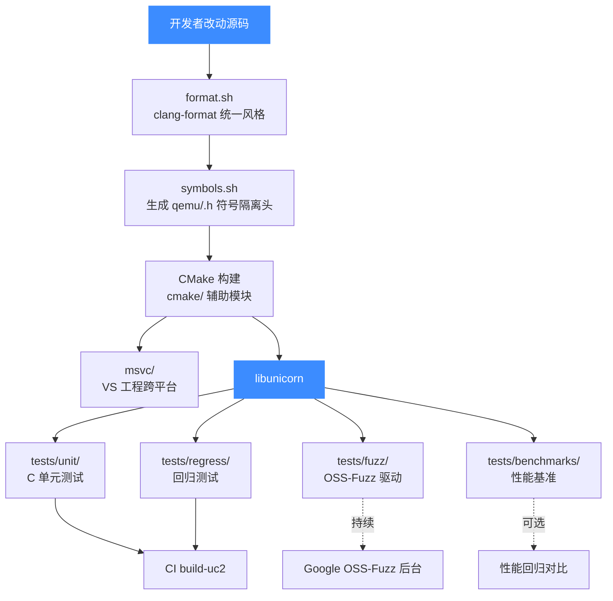
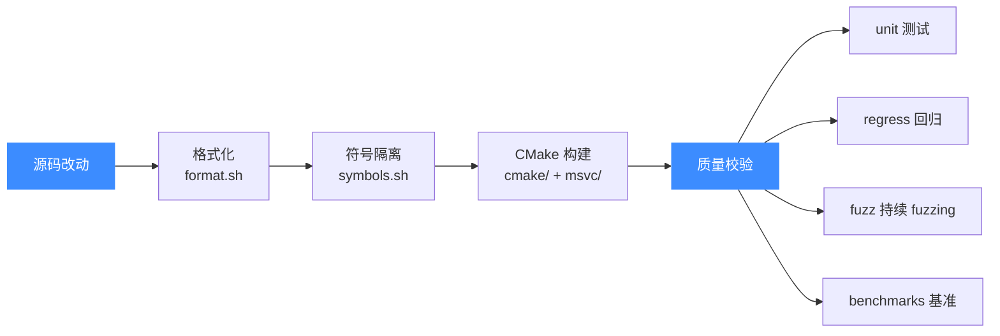
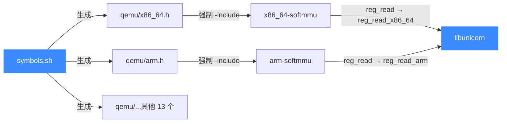

# 开发基础设施总览

本页总览 Unicorn 仓库里围绕"开发与质量"的辅助设施——回归测试、模糊测试、性能基准、CMake 辅助、MSVC 工程目录，以及符号导出脚本，并说明它们在开发流程里各自的位置。

## 📌 概述

除了核心 C 库与语言绑定，仓库根目录还散落着一组服务于"构建、测试、跨平台编译、符号隔离"的辅助工程。它们不是 Unicorn 运行时的一部分，但维护者每次改代码、提 PR 都会间接用到：

- `tests/regress/` —— 从 v1 继承的回归测试，每条对应一个曾出现的 bug。
- `tests/fuzz/` —— OSS-Fuzz 模糊测试驱动，被 Google 基础设施持续投喂随机机器码。
- `tests/benchmarks/` —— 从 v1 继承的性能基准套件，衡量仿真吞吐量。
- `cmake/` —— 复用的 CMake 工具模块（静态库打包、MinGW、Zig）。
- `msvc/` —— 给 Visual Studio 用的各架构工程目录与配置头。
- `symbols.sh` —— 生成各架构符号重命名头 `qemu/<arch>.h`，实现单二进制多架构隔离。
- `format.sh` —— 调 `clang-format` 统一代码风格（详见 `.clang-format`）。

::: tip 这些是"开发态"设施，不是"运行态"
它们只参与编译/测试/打包流程，不会被链进最终 `libunicorn` 对外暴露。但其中 `symbols.sh` 生成的 `qemu/<arch>.h` 是**编译期**必需的——没有它，多架构无法共存于同一静态库。
:::

## 🔧 在开发流程中的位置

下面这张图把六类设施放进一条典型的"改代码→提交 PR"流水线里，标出各自作用环节：





## 💻 各设施速览

### tests/regress/ — 回归测试

从 Unicorn 1 继承而来，混合 C 与 Python（C 约 50 个、Python 约 50 个）。每条测试通常对应一个曾经报过的 issue：segfault、非法指令译码、Hook 死锁、内存映射崩溃、分支延迟槽、EFLAGS 不同步……修 bug 时配套加一条回归是仓库惯例。

C 回归用 `tests/regress/Makefile` 编译，链接 `libunicorn` 与 `pthread/rt`：

```makefile
# tests/regress/Makefile
CFLAGS += -Wall -Werror -I../../include
LDLIBS += -L../../ -lm -lunicorn
LDLIBS += -pthread
ifeq ($(UNAME_S), Linux)
LDLIBS += -lrt
endif
TESTS_SOURCE = $(wildcard *.c)
TESTS = $(TESTS_SOURCE:%.c=%)
test: $(TESTS)
```

C 用例通过 `regress.sh` 顺序串跑；Python 用例由 `regress.py` 驱动（依赖 `unicorn` Python 绑定）：

```bash
cd tests/regress
make            # 编译所有 *.c 回归为同名可执行
./regress.sh    # 串跑 C 用例
python3 regress.py   # 跑 Python 用例
```

### tests/fuzz/ — 模糊测试

供 [OSS-Fuzz](https://github.com/google/oss-fuzz) 持续运行的 libFuzzer 驱动集合。每个驱动实现标准的 `LLVMFuzzerTestOneInput(Data, Size)` 入口，把随机字节当作机器码喂给 Unicorn 模拟，靠上限指令数（`0x1000`）防死循环：

```c
// tests/fuzz/fuzz_emu_x86_32.c（节选）
int LLVMFuzzerTestOneInput(const uint8_t *Data, size_t Size) {
    uc_err err;
    err = uc_open(UC_ARCH_X86, UC_MODE_32, &uc);
    if (err != UC_ERR_OK) { abort(); }
    uc_mem_map(uc, ADDRESS, 4 * 1024 * 1024, UC_PROT_ALL);
    uc_mem_write(uc, ADDRESS, Data, Size);
    // 无限时间、上限 4096 条指令，避免死循环
    err = uc_emu_start(uc, ADDRESS, ADDRESS + Size, 0, 0x1000);
    uc_close(uc);
    return 0;
}
```

13 个目标覆盖 x86(16/32/64)、arm(arm/thumb/be)、arm64、m68k、mips(32be/32le)、sparc、s390x。CMake 顶层开关 `UNICORN_FUZZ=ON` 时把它们注册成可执行目标：

```cmake
# CMakeLists.txt（约 1472 行）
if(UNICORN_FUZZ)
    set(UNICORN_FUZZ_SUFFIX
        "arm_arm;arm_armbe;arm_thumb;arm64_arm;arm64_armbe;\
m68k_be;mips_32be;mips_32le;sparc_32be;x86_16;x86_32;x86_64;s390x_be")
    foreach(SUFFIX ${UNICORN_FUZZ_SUFFIX})
        add_executable(fuzz_emu_${SUFFIX}
            ${CMAKE_CURRENT_SOURCE_DIR}/tests/fuzz/fuzz_emu_${SUFFIX}.c
            ${CMAKE_CURRENT_SOURCE_DIR}/tests/fuzz/onedir.c)
    endforeach()
endif()
```

新架构的 fuzz 目标不必手写——`gentargets.sh` 用 `sed` 从 `fuzz_emu_x86_32.c` 模板派生其余目标；`dlcorpus.sh` 则从 Google 公开语料库拉取种子输入复现历史崩溃。

::: warning 单目录模式与单文件模式
`onedir.c` 提供 libFuzzer 真实入口（多目录、内存隔离），`onefile.c` 是脱离 libFuzzer 的命令行 wrapper——读单个文件喂给 `LLVMFuzzerTestOneInput`，便于在没装 fuzzer 运行时的机器上复现某个崩溃样本。
:::

### tests/benchmarks/ — 性能基准

从 v1 继承，目前含 `cow/` 一个套件。它把一段汇编（`binary.S`）反复加载进 Unicorn 执行 `NRUNS` 次（默认 200），用 [GSL](https://www.gnu.org/software/gsl/) 的 `gsl_rstat` 在线统计运行时分位数（均值/中位数/p95），衡量仿真吞吐与上下文切换开销：

```c
// tests/benchmarks/cow/benchmark.c（节选）
static uint64_t CODEADDR = 0x1000;
static size_t NRUNS = 200;

static int callback_mem_prot(uc_engine *uc, uc_mem_type type,
                             uint64_t addr, uint32_t size,
                             int64_t value, void *data) { ... }
```

```bash
cd tests/benchmarks/cow
make            # 依赖 libgsl / libgslcblas / libunicorn
./benchmark
```

::: warning 额外系统依赖
基准套件链接 `-lgsl -lgslcblas`，需先装 GSL 开发包（`apt install libgsl-dev`）。它是唯一需要第三方运行库的测试目录，CI 默认不跑。
:::

### cmake/ — CMake 辅助模块

三个可复用的 CMake 工具文件，被顶层 `CMakeLists.txt` 在特定场景下 `include`：

| 文件 | 作用 |
|------|------|
| `bundle_static.cmake` | `bundle_static_library()` 函数：递归收集一个静态目标的全部静态依赖，把它们的 object 文件合并成单个 bundled 静态库（含 `.o` 符号链接）。用于 `UNICORN_LEGACY_STATIC_ARCHIVE` 合并出 v1 风格 all-in-one `libunicorn.a` |
| `mingw-w64.cmake` | MinGW-w64 交叉编译工具链文件（Linux→Windows） |
| `zig.cmake` | Zig 编译器工具链文件，供 `bindings/zig` 与 `build.zig` 复用 |

```cmake
# cmake/bundle_static.cmake：递归收集静态依赖的核心循环
function(_recursively_collect_dependencies input_target)
    get_target_property(public_dependencies ${input_target} LINK_LIBRARIES)
    foreach(dependency IN LISTS public_dependencies)
        if(TARGET ${dependency})
            get_target_property(_type ${dependency} TYPE)
            if (${_type} STREQUAL "STATIC_LIBRARY")
                list(APPEND static_libs ${dependency})
            endif()
            # 防环：全局属性标记已访问目标
            ...
            _recursively_collect_dependencies(${dependency})
        endif()
    endforeach()
endfunction()
```

### msvc/ — MSVC 工程目录

为 Visual Studio 提供的工程骨架，每个 `<arch>-softmmu` 子目录对应一个架构后端，外加顶层 `unicorn/`（含 `dllmain.cpp`）和 `config-host.h` 平台配置头。配合 MSVC 生成器把各架构编成独立静态库再合成 `libunicorn.dll`/`libunicorn.lib`：

```
msvc/
├── x86_64-softmmu/      # x86 后端工程
├── arm-softmmu/         # ARM（含 armeb）
├── aarch64-softmmu/
├── mips-softmmu/ ... mips64el-softmmu/   # 四个端序/位宽变体
├── ppc-softmmu/ ppc64-softmmu/
├── riscv32-softmmu/ riscv64-softmmu/
├── sparc-softmmu/ sparc64-softmmu/
├── m68k-softmmu/ s390x-softmmu/ tricore-softmmu/
├── unicorn/dllmain.cpp  # DLL 入口
└── config-host.h        # 平台/特性宏
```

::: details 为何 MSVC 路径独立成一套
QEMU/TCG 内部代码在某些点用了 GCC 扩展与内联汇编，MSVC 不能直接消化整棵 vendored 树。`msvc/` 子目录的存在让 MSVC 用户能用一套精简过的工程文件、配合 `symbols.sh` 生成的隔离头，把每个后端编成独立 `.lib` 再拼装，而不必和 GCC 的内联汇编死磕。
:::

### symbols.sh — 符号导出/重命名脚本

仓库里**唯一**让"九个架构后端静态库链进同一个 `libunicorn` 而符号不冲突"的机制。它维护两份清单——`COMMON_SYMBOLS`（所有架构共享的 TCG/helper 符号）和每个架构的 `<arch>_SYMBOLS`（如 `tricore_SYMBOLS` 含 `helper_fadd` 等）——然后为每个架构生成 `qemu/<arch>.h`，把每个符号 `#define` 成带 `_<arch>` 后缀的别名：

```bash
# symbols.sh（生成逻辑节选）
ARCHS="x86_64 arm aarch64 riscv32 riscv64 mips mipsel mips64 mips64el \
       sparc sparc64 m68k ppc ppc64 s390x tricore"

for arch in $ARCHS; do
    echo "/* Autogen header for Unicorn Engine - DONOT MODIFY */" > qemu/$arch.h
    for loop in $COMMON_SYMBOLS; do
        echo "#define $loop ${loop}_${arch}" >> qemu/$arch.h
    done
    ARCH_SYMBOLS=$(eval echo '$'"${arch}_SYMBOLS")
    for loop in $ARCH_SYMBOLS; do
        echo "#define $loop ${loop}_${arch}" >> qemu/$arch.h
    done
done
```

CMake 在编译各 `*-softmmu` 目标时 `-include <arch>.h`（见 [构建系统](/internals/build-system)），于是 `reg_read` 在 x86 编译单元里被改写成 `reg_read_x86_64`、在 arm 单元里是 `reg_read_arm`——同名符号得以在同一静态库里共存。



::: warning 改后端符号要同步改 symbols.sh
如果你在某个 `qemu/target/<arch>/` 里新加一个会暴露到链接层的非 static 函数，必须在 `symbols.sh` 对应的 `<arch>_SYMBOLS` 列表里登记它，否则重新生成头文件后会漏掉、导致与别的架构符号重名链接冲突。生成的 `qemu/<arch>.h` 头文件首行带 `DONOT MODIFY`，不要手改。
:::

## ⚠️ 注意

- **测试目录与构建耦合**：`regress/` 与 `fuzz/` 的 Makefile 都用相对路径 `../../` 找 `libunicorn`，必须在仓库根先完成 CMake 构建再进子目录 `make`。
- **fuzz 与 regress 不进 CTest**：CTest 只注册 `tests/unit/` 下的 12 个套件（见 [测试套件总览](/tests/)）。`regress` 与 `fuzz` 各有独立 Makefile，需手动跑或靠 CI 脚本调度。
- **基准需 GSL**：`benchmarks/cow` 是唯一依赖第三方库（`libgsl`）的目录，CI 默认不构建。
- **symbols.sh 是编译期依赖**：首次构建前若 `qemu/<arch>.h` 缺失，CMake 会触发它；手改 `symbols.sh` 后需删掉旧的头文件再重新 configure。

## 📖 参考

- [Unicorn 源码根目录](https://github.com/android-security-engineer/unicorn-skills)
- [OSS-Fuzz 项目](https://github.com/google/oss-fuzz)
- [acutest 框架](https://github.com/mity/acutest)（单元测试用）
- [GSL 运行时统计](https://www.gnu.org/software/gsl/doc/html/rstat.html)（基准用）
- [clang-format 风格](https://clang.llvm.org/docs/ClangFormatStyleOptions.html)

## 📚 全部子页索引

| 子页 | 路径 | 涉及目录 / 文件 | 一句话 |
|------|------|-----------------|--------|
| 开发基础设施总览 | `/dev/` | 全部 | 本页，总览六类设施 |
| 回归测试 | `/dev/regress` | `tests/regress/` | v1 继承的 bug 防复发用例集 |
| 模糊测试 | `/dev/fuzz` | `tests/fuzz/` | OSS-Fuzz libFuzzer 驱动与语料 |
| 性能基准 | `/dev/benchmarks` | `tests/benchmarks/cow/` | GSL 统计的吞吐基准 |
| CMake 辅助 | `/dev/cmake-helpers` | `cmake/*.cmake` | 静态库打包与交叉工具链 |
| MSVC 工程 | `/dev/msvc` | `msvc/<arch>-softmmu/` | Visual Studio 各架构工程 |
| 符号导出脚本 | `/dev/symbols` | `symbols.sh` | 多架构符号隔离头生成器 |

## 相关页面

- [测试套件总览（unit）](/tests/)
- [测试与基准（指南）](/guide/testing)
- [CMake 构建系统](/internals/build-system)
- [编译与安装](/guide/compile)
- [内部实现原理总览](/internals/overview)
