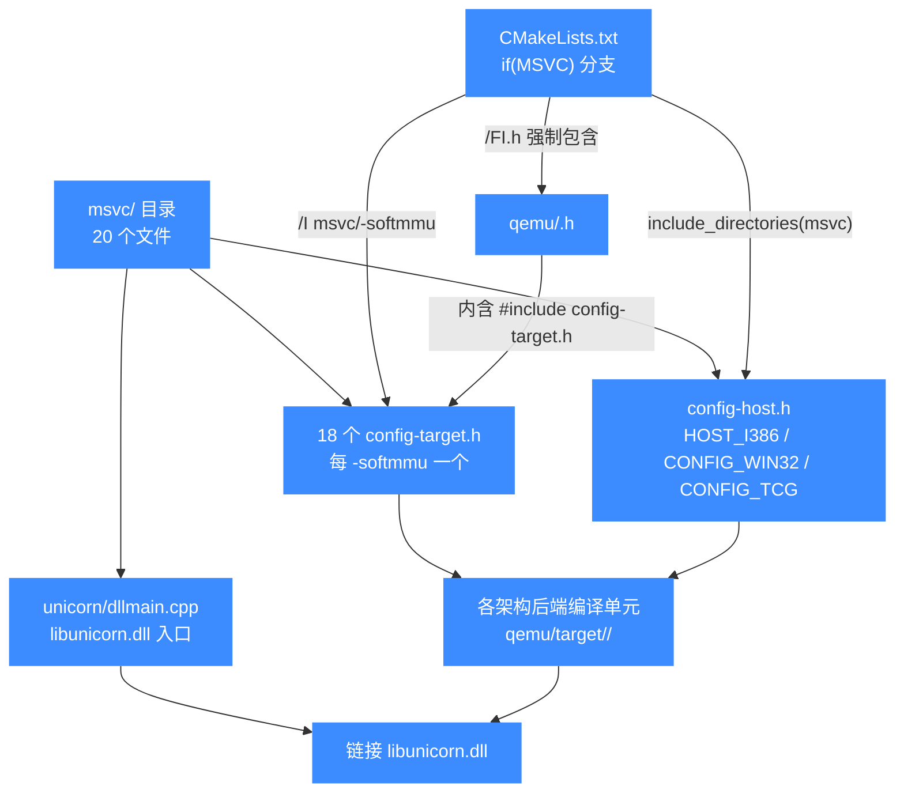

# MSVC 工程目录 msvc/

本页讲仓库根 `msvc/` 目录如何为 Visual Studio / MSVC 工具链提供"固定版"的配置头与 DLL 入口，让 CMake 在 MSVC 分支上不必再 `configure` 生成 `config-host.h` / 各架构 `config-target.h`，而是直接 `include_directories(msvc/)` 即可。

## 📌 概述

`msvc/` 不是一组 Visual Studio 解决方案（`.sln` / `.vcxproj`），而是一组**预先生成好的配置头**加一个 DLL 入口源文件，专门供 MSVC 构建路径消费。它存在的原因是：Unicorn 的 CMake 在非 MSVC 平台会在 `${CMAKE_BINARY_DIR}` 下用 `configure_file` 从 `.mak` 模板生成 `config-host.h` 与每个架构的 `<arch>-softmmu/config-target.h`；而 MSVC 路径把这一步省掉，直接引用仓库里写死好的 `msvc/` 版本，避免在 Windows 上重新跑 `create_config`。

目录结构非常扁平：

- 顶层 `config-host.h` —— 宿主侧配置（`HOST_I386`、`CONFIG_WIN32`、`CONFIG_TCG` 等）。
- 每个 `<arch>-softmmu/config-target.h` —— 目标侧配置（`TARGET_<ARCH>`、`TARGET_NAME`、`TARGET_WORDS_BIGENDIAN`、`CONFIG_SOFTMMU` 等）。
- `unicorn/dllmain.cpp` —— `libunicorn.dll` 的 `DllMain` 入口，空实现，仅用于把 DLL 装载/卸载回调接到 Windows 运行时。

::: tip 为什么 MSVC 走"固定头"而不是生成
`CMakeLists.txt` 在 `if(MSVC)` 分支里 `include_directories(${CMAKE_CURRENT_SOURCE_DIR}/msvc)`，并把每个架构目标的 `/I` 指向 `msvc/<arch>-softmmu`，同时用 `/FI<arch>.h` 强制包含架构头——等价于非 MSVC 分支的 `-include <arch>.h -I ${CMAKE_BINARY_DIR}/<arch>-softmmu`。这样 MSVC 用户开箱即用，不需要先跑生成步骤。
:::

## 📁 关键文件与子目录

| 路径 | 类型 | 用途 |
|------|------|------|
| [`msvc/config-host.h`](https://github.com/android-security-engineer/unicorn-skills/blob/master/msvc/config-host.h) | 头文件 | 宿主配置宏：`HOST_I386`、`CONFIG_WIN32`、`CONFIG_TCG`、`CONFIG_CPUID_H`、`CONFIG_CMPXCHG128`、`CONFIG_PLUGIN` |
| [`msvc/x86_64-softmmu/config-target.h`](https://github.com/android-security-engineer/unicorn-skills/blob/master/msvc/x86_64-softmmu/config-target.h) | 头文件 | x86_64 目标：`TARGET_X86_64`、`TARGET_I386`、`TARGET_NAME "x86_64"`、`CONFIG_SOFTMMU` |
| [`msvc/arm-softmmu/config-target.h`](https://github.com/android-security-engineer/unicorn-skills/blob/master/msvc/arm-softmmu/config-target.h) | 头文件 | ARM 目标：`TARGET_ARM`、`TARGET_NAME "arm"` |
| [`msvc/armeb-softmmu/config-target.h`](https://github.com/android-security-engineer/unicorn-skills/blob/master/msvc/armeb-softmmu/config-target.h) | 头文件 | ARM 大端：`TARGET_ARM` + `TARGET_WORDS_BIGENDIAN` |
| [`msvc/aarch64-softmmu/config-target.h`](https://github.com/android-security-engineer/unicorn-skills/blob/master/msvc/aarch64-softmmu/config-target.h) | 头文件 | AArch64 小端 |
| [`msvc/aarch64eb-softmmu/config-target.h`](https://github.com/android-security-engineer/unicorn-skills/blob/master/msvc/aarch64eb-softmmu/config-target.h) | 头文件 | AArch64 大端（`TARGET_WORDS_BIGENDIAN`） |
| [`msvc/m68k-softmmu/config-target.h`](https://github.com/android-security-engineer/unicorn-skills/blob/master/msvc/m68k-softmmu/config-target.h) | 头文件 | M68K 大端 |
| `msvc/mips-softmmu/` 等 4 个 | 头文件 | MIPS 的四个端序/位宽变体（`mips` / `mipsel` / `mips64` / `mips64el`），大端者带 `TARGET_WORDS_BIGENDIAN` |
| `msvc/ppc-softmmu/`、`ppc64-softmmu/` | 头文件 | PowerPC 32/64，均大端 |
| `msvc/riscv32-softmmu/`、`riscv64-softmmu/` | 头文件 | RISC-V 32/64，含 `TARGET_SUPPORTS_MTTCG` |
| [`msvc/s390x-softmmu/config-target.h`](https://github.com/android-security-engineer/unicorn-skills/blob/master/msvc/s390x-softmmu/config-target.h) | 头文件 | s390x 大端，含 `TARGET_SYSTBL_ABI common,64` 与 `TARGET_SUPPORTS_MTTCG` |
| `msvc/sparc-softmmu/`、`sparc64-softmmu/` | 头文件 | SPARC 32/64，均大端 |
| [`msvc/tricore-softmmu/config-target.h`](https://github.com/android-security-engineer/unicorn-skills/blob/master/msvc/tricore-softmmu/config-target.h) | 头文件 | TriCore |
| [`msvc/unicorn/dllmain.cpp`](https://github.com/android-security-engineer/unicorn-skills/blob/master/msvc/unicorn/dllmain.cpp) | C++ 源 | `libunicorn.dll` 的 `DllMain`，空实现 |

整个目录共 **20 个文件**（`find msvc -type f | wc -l`）：1 个 `config-host.h`、1 个 `dllmain.cpp`、18 个 `config-target.h`（对应 18 个 `<arch>-softmmu` 子目录，含 MIPS 的四变体与 ARM/AArch64 的大小端变体）。

## 💻 用法

### 在 MSVC 下构建

`msvc/` 由 CMake 的 MSVC 分支自动引用，用户无需手动指定。在 Visual Studio 命令提示符里：

```bash
mkdir build && cd build
cmake .. -G "NMake Makefiles" -DCMAKE_BUILD_TYPE=Release
nmake
```

或用 Visual Studio 生成器配合 `msbuild`：

```bash
cmake .. -G "Visual Studio 16 2019" -A x64
msbuild unicorn.sln /p:Configuration=Release
```

::: warning 只在 `if(MSVC)` 分支生效
`msvc/` 的头只在 CMake 检测到 MSVC 时被纳入 `include_directories`，并经 `/FI<arch>.h` 强制包含。MinGW / MSYS2 路径走的是 `else()` 分支，仍用 `${CMAKE_BINARY_DIR}` 下生成的 `config-target.h`，与 `msvc/` 无关。
:::

### DLL 入口

`unicorn/dllmain.cpp` 编译进 `libunicorn.dll`，提供标准的 `DllMain`：

```cpp
#include <windows.h>

BOOL APIENTRY DllMain(HMODULE hModule,
                      DWORD  ul_reason_for_call,
                      LPVOID lpReserved)
{
    switch (ul_reason_for_call)
    {
    case DLL_PROCESS_ATTACH:
    case DLL_THREAD_ATTACH:
    case DLL_THREAD_DETACH:
    case DLL_PROCESS_DETACH:
        break;
    }
    return TRUE;
}
```

四个回调点都留空——Unicorn 的全局状态初始化由 `uc_struct` 与各 `uc_init_<arch>` 在 `uc_open()` 时按需完成，不需要在 DLL 装载时跑全局构造，因此 `DllMain` 只是个符合 Windows DLL 模型的占位入口。

## 🔧 实现

### CMake 如何引用 msvc/

`CMakeLists.txt` 在顶层与每个架构目标里都做了 MSVC / 非 MSVC 二分。顶层负责把 `msvc/` 加进全局 include：

```cmake
if(MSVC)
    include_directories(${CMAKE_CURRENT_SOURCE_DIR}/msvc)
else()
    include_directories(${CMAKE_BINARY_DIR})   # 用生成的 config-host.h
endif()
```

每个 `*-softmmu` 静态库目标里，MSVC 分支用 `/FI` 强制包含架构头、`/I` 指向 `msvc/<arch>-softmmu`：

```cmake
# x86_64-softmmu 目标（节选）
if(MSVC)
    target_compile_options(x86_64-softmmu PRIVATE
        -DNEED_CPU_H
        /FIx86_64.h                                     # 强制包含，等价 -include
        /I${CMAKE_CURRENT_SOURCE_DIR}/msvc/x86_64-softmmu
        /I${CMAKE_CURRENT_SOURCE_DIR}/qemu/target/i386)
else()
    target_compile_options(x86_64-softmmu PRIVATE
        -DNEED_CPU_H
        -include x86_64.h
        -I${CMAKE_BINARY_DIR}/x86_64-softmmu            # 用生成的 config-target.h
        -I${CMAKE_CURRENT_SOURCE_DIR}/qemu/target/i386)
endif()
```

`/FI`（force include）等价于 GCC 的 `-include`，会在每个翻译单元开头自动 `#include x86_64.h`，而 `x86_64.h` 又会 `#include "config-target.h"`——后者正是从 `msvc/x86_64-softmmu/` 里取到的固定版。

### MSVC 全局编译开关

除了 include 路径，`CMakeLists.txt` 的 `if(MSVC)` 块还统一加了一批兼容性宏与警告抑制：

```cmake
if(MSVC)
    if(CMAKE_SIZEOF_VOID_P EQUAL 8)
        set(MSVC_FLAG -D__x86_64__)        # 让 QEMU 代码认出 64 位宿主
    elseif(CMAKE_SIZEOF_VOID_P EQUAL 4)
        set(MSVC_FLAG -D__i386__)
    endif()

    add_compile_options(
        -Dinline=__inline          # MSVC 的 inline 关键字
        -D__func__=__FUNCTION__    # MSVC 无 __func__，用 __FUNCTION__
        -D_CRT_SECURE_NO_WARNINGS
        -DWIN32_LEAN_AND_MEAN
        ${MSVC_FLAG}
        /I${CMAKE_CURRENT_SOURCE_DIR}/qemu/tcg/i386)

    # 抑制 QEMU 代码里大量 int/size_t 转换的 C4244/C4267 等
    add_compile_options($<$<COMPILE_LANGUAGE:C>:/wd4018>)
    add_compile_options($<$<COMPILE_LANGUAGE:C>:/wd4098>)
    add_compile_options($<$<COMPILE_LANGUAGE:C>:/wd4244>)
    add_compile_options($<$<COMPILE_LANGUAGE:C>:/wd4267>)
endif()
```

`CMAKE_MSVC_RUNTIME_LIBRARY` 还把 `/MT`、`/MTd`、`/MD`、`/MDd` 这些传进 `CMAKE_C_FLAGS` 的运行时库选择归一化，避免重复指定。

## 📖 config-host.h 与 config-target.h 内容

固定头的宏直接复刻非 MSVC 路径 `configure_file` 的产物。宿主侧 `msvc/config-host.h`：

```c
/* Automatically generated by create_config - do not modify */
#define HOST_I386 1
#define CONFIG_WIN32 1
#define CONFIG_TCG 1
#define CONFIG_CPUID_H 1
// #define CONFIG_INT128 1
#define CONFIG_CMPXCHG128 1
// #define CONFIG_ATOMIC64 1
#define CONFIG_PLUGIN 1
```

目标侧以 `arm-softmmu/config-target.h` 为例：

```c
/* Automatically generated by create_config - do not modify */
#define TARGET_ARM 1
#define TARGET_NAME "arm"
#define TARGET_ARM 1
#define CONFIG_SOFTMMU 1
```

大端目标（如 `m68k-softmmu`）多一行 `TARGET_WORDS_BIGENDIAN 1`，s390x 还带 `TARGET_SUPPORTS_MTTCG 1` 与 `TARGET_SYSTBL_ABI common,64`。这些宏最终驱动 QEMU 后端里 `#ifdef TARGET_WORDS_BIGENDIAN` 等条件编译分支，决定字节序与多线程 TCG 行为。

::: details 为什么注释掉的宏也要保留
`config-host.h` 里被注释掉的 `CONFIG_INT128` 与 `CONFIG_ATOMIC64` 是 MSVC 当前不具备的能力——QEMU 在这些宏未定义时会走 fallback 实现而非 `__int128` / 原子内建。注释行原样保留是为了和非 MSVC 路径的生成产物保持视觉一致，方便对照。
:::

## 🗺️ MSVC 工程目录与构建流程

下图把 `msvc/` 的扁平结构与 CMake 的 MSVC 分支引用关系画在一起：顶层 `config-host.h` 与各 `<arch>-softmmu/config-target.h` 被 `if(MSVC)` 分支 `include_directories` 进来，再用 `/FI<arch>.h` 强制包含架构头，从而跳过非 MSVC 路径里 `configure_file` 生成配置头的步骤。



大端目标（如 `m68k-softmmu`、`s390x-softmmu`）的 `config-target.h` 比小端多一行 `TARGET_WORDS_BIGENDIAN 1`，s390x 还带 `TARGET_SUPPORTS_MTTCG` 与 `TARGET_SYSTBL_ABI`。这些宏驱动 QEMU 后端里 `#ifdef` 条件编译分支，决定字节序与多线程 TCG 行为。MinGW / MSYS2 路径不走 `msvc/`，而是用 `CMAKE_BINARY_DIR` 下生成的配置头，因此两套配置头互不干扰。

## ⚠️ 注意

- `msvc/` **不是** Visual Studio 工程文件集合，里面没有 `.sln` / `.vcxproj`；构建入口仍是 CMake（`-G "NMake Makefiles"` 或 `-G "Visual Studio ..."`）。
- 固定头里写死的架构集合必须与 `UNICORN_ARCH` 实际编译的架构对得上：如果新增了一个 `msvc/` 里没有的架构子目录，MSVC 路径会找不到对应 `config-target.h`，需要同时补一份固定头。
- `dllmain.cpp` 编译为 C++（扩展名 `.cpp`），CMake 在 MSVC 下用 `/TP` 或文件后缀自动按 C++ 处理；它不依赖 Unicorn 的任何 C 头文件，仅包含 `<windows.h>`。
- MinGW / MSYS2 构建不走 `msvc/`，而是用 `CMAKE_BINARY_DIR` 下生成的配置头，因此不要把 MinGW 的构建问题归咎于 `msvc/`。

## 📂 相关源码

| 文件 | 角色 |
|------|------|
| [`msvc/config-host.h`](https://github.com/android-security-engineer/unicorn-skills/blob/master/msvc/config-host.h) | MSVC 宿主侧固定配置头 |
| [`msvc/x86_64-softmmu/config-target.h`](https://github.com/android-security-engineer/unicorn-skills/blob/master/msvc/x86_64-softmmu/config-target.h) | x86_64 目标侧固定配置头 |
| [`msvc/unicorn/dllmain.cpp`](https://github.com/android-security-engineer/unicorn-skills/blob/master/msvc/unicorn/dllmain.cpp) | `libunicorn.dll` 的 `DllMain` 入口 |
| [`msvc/`](https://github.com/android-security-engineer/unicorn-skills/blob/master/msvc) | 全部 MSVC 固定配置头目录 |
| [`CMakeLists.txt`](https://github.com/android-security-engineer/unicorn-skills/blob/master/CMakeLists.txt) | `if(MSVC)` 分支 `include_directories(msvc)` |

## 相关页面

- [构建系统与 CMake 选项](/internals/build-system)
- [编译与安装（含 MSVC / MinGW 步骤）](/guide/compile)
- [内置 QEMU Fork](/internals/qemu-fork)
- [开发设施总览](/dev/)
