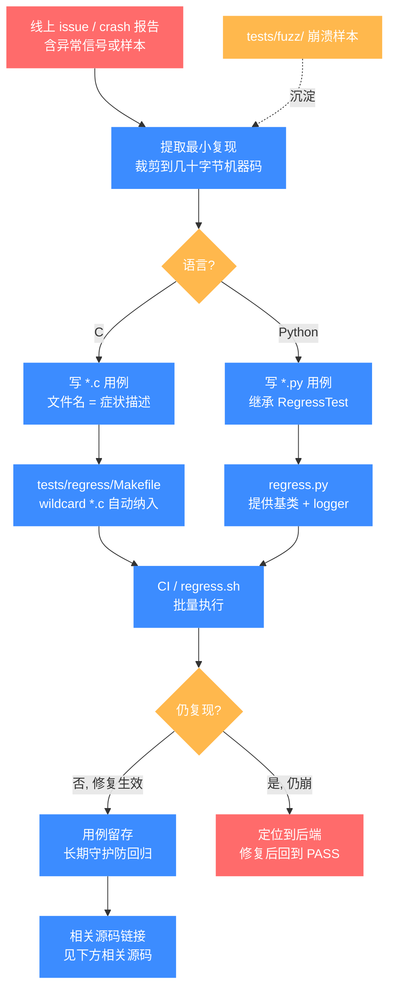
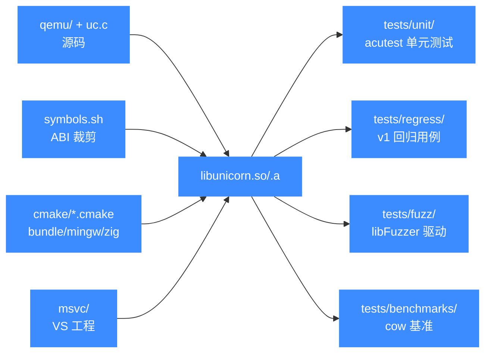

# 回归测试与辅助测试设施

本页介绍 `tests/` 下除 `unit/` 之外的回归用例、模糊测试、性能基准，以及仓库根目录下服务于构建/打包的 `cmake/`、`msvc/`、`symbols.sh` 等辅助设施。

## 📌 概述

Unicorn 的测试体系由几类互补的目录构成：`tests/regress/` 是从 v1 继承下来的回归用例集，每个文件对应一个曾经复现的 bug，**文件名本身就是 bug 描述**；`tests/fuzz/` 是面向 OSS-Fuzz 的 libFuzzer 模糊驱动，每个架构一个 `fuzz_emu_*.c`；`tests/benchmarks/` 是性能基准，目前含一个 cow（copy-on-write 快照）场景；仓库根的 `cmake/` 提供 `bundle_static.cmake`、`mingw-w64.cmake`、`zig.cmake` 等 CMake 辅助模块；`msvc/` 是各架构的 Visual Studio 工程目录；`symbols.sh` 是导出符号表脚本，用于在链接阶段裁剪并控制动态库的对外 ABI。

这些目录彼此独立、各有自己的入口，不依赖 `tests/unit/` 的 acutest 框架，而是各自通过 Makefile、Python `unittest` 或 libFuzzer 驱动运行。

## 📁 关键文件与子目录

| 路径 | 类型 | 用途 |
|------|------|------|
| [`tests/regress/`](https://github.com/android-security-engineer/unicorn-skills/blob/master/tests/regress) `*.c` | C | v1 继承的回归用例，编译为独立可执行程序，验证特定 bug 不再复现 |
| [`tests/regress/`](https://github.com/android-security-engineer/unicorn-skills/blob/master/tests/regress) `*.py` | Python | 同上的 Python 版本用例，基于 `regress.py` 提供的 `unittest` 基类与统一 logger |
| [`tests/regress/Makefile`](https://github.com/android-security-engineer/unicorn-skills/blob/master/tests/regress/Makefile) | Makefile | 用 `wildcard *.c` 批量编译所有 `.c` 用例，链接 `-lunicorn` |
| [`tests/regress/regress.sh`](https://github.com/android-security-engineer/unicorn-skills/blob/master/tests/regress/regress.sh) | Shell | 按固定顺序执行一组关键 C 用例的简易脚本 |
| [`tests/regress/regress.py`](https://github.com/android-security-engineer/unicorn-skills/blob/master/tests/regress/regress.py) | Python | 提供 `RegressTest` 基类、`logger`，统一日志级别由 `REGRESS_LOG_LEVEL` 环境变量控制 |
| [`tests/fuzz/`](https://github.com/android-security-engineer/unicorn-skills/blob/master/tests/fuzz) `fuzz_emu_*.c` | C | 每架构一个 libFuzzer 驱动（如 `fuzz_emu_x86_64.c`、`fuzz_emu_arm_arm.c`） |
| [`tests/fuzz/onefile.c`](https://github.com/android-security-engineer/unicorn-skills/blob/master/tests/fuzz/onefile.c) / [`onedir.c`](https://github.com/android-security-engineer/unicorn-skills/blob/master/tests/fuzz/onedir.c) | C | 单文件 / 单目录语料回放驱动，便于复现崩溃样本 |
| [`tests/fuzz/fuzz_emu.options`](https://github.com/android-security-engineer/unicorn-skills/blob/master/tests/fuzz/fuzz_emu.options) | 配置 | libFuzzer 选项，`max_len = 4096` |
| [`tests/fuzz/dlcorpus.sh`](https://github.com/android-security-engineer/unicorn-skills/blob/master/tests/fuzz/dlcorpus.sh) / [`gentargets.sh`](https://github.com/android-security-engineer/unicorn-skills/blob/master/tests/fuzz/gentargets.sh) | Shell | 下载语料、生成各架构目标列表 |
| [`tests/benchmarks/cow/`](https://github.com/android-security-engineer/unicorn-skills/blob/master/tests/benchmarks/cow) | C/asm | cow 快照场景性能基准，含 `benchmark.c`、`binary.S`、`Makefile` |
| [`cmake/bundle_static.cmake`](https://github.com/android-security-engineer/unicorn-skills/blob/master/cmake/bundle_static.cmake) | CMake | 把多个静态库合并为单一 `.a` 的辅助模块 |
| [`cmake/mingw-w64.cmake`](https://github.com/android-security-engineer/unicorn-skills/blob/master/cmake/mingw-w64.cmake) | CMake | MinGW-w64 交叉编译工具链文件 |
| [`cmake/zig.cmake`](https://github.com/android-security-engineer/unicorn-skills/blob/master/cmake/zig.cmake) | CMake | Zig 作为 C 编译器/链接器时的工具链文件 |
| [`msvc/`](https://github.com/android-security-engineer/unicorn-skills/blob/master/msvc) `<arch>-softmmu/` | VS 工程 | 每架构一个 Visual Studio 工程目录（如 `x86_64-softmmu`、`aarch64-softmmu`） |
| [`msvc/unicorn/`](https://github.com/android-security-engineer/unicorn-skills/blob/master/msvc/unicorn) | VS 工程 | 顶层 Unicorn 解决方案工程 |
| [`msvc/config-host.h`](https://github.com/android-security-engineer/unicorn-skills/blob/master/msvc/config-host.h) | 头文件 | MSVC 构建的宿主配置宏 |
| [`symbols.sh`](https://github.com/android-security-engineer/unicorn-skills/blob/master/symbols.sh) | Shell | 导出符号白名单脚本（约 6600 行），用于裁剪 `libunicorn` 对外可见符号 |

::: details regress 文件命名约定
回归用例的文件名往往直接描述了原始崩溃信号，例如：

- `004-segmentation_fault_1.c`
- `005-qemu__fatal__illegal_instruction__0000___00000404.c`
- `invalid_read_in_cpu_tb_exec.c`
- `timeout_segfault.c`
- `emu_stop_segfault.py`

这种"名字即症状"的命名让回归集本身就是一份历史 bug 清单。
:::

## 💻 用法

### 运行 regress

regress 的 C 用例通过 Makefile 批量编译为独立可执行文件，然后既可整体跑，也可单独跑某个：

```bash
# 编译所有 .c 用例（链接仓库根的 libunicorn）
cd tests/regress
make          # 等价于 make all，输出每个 *.c 对应的可执行文件

# 跑某一个
LD_LIBRARY_PATH=../.. ./map_crash

# 跑 Python 用例（需要先安装 python 绑定）
python3 arm_bx_unmapped.py
REGRESS_LOG_LEVEL=DEBUG python3 emu_clear_errors.py
```

`regress.sh` 是一个更轻量的入口，按固定顺序执行一批关键 C 用例：

```bash
cd tests/regress
sh regress.sh
```

::: warning 注意
regress.sh 里列出的若干目标（如 `mem_unmap`、`mem_protect`、`mem_exec`、`mem_map_large`、`mem_double_unmap`）在当前 `tests/regress/` 下并没有对应源文件——它们与 `tests/unit/test_mem.c` 中的同名用例对应。若脚本因找不到可执行文件而退出，请以 `tests/unit/` 下的单元测试为准。
:::

### 运行 fuzz

模糊测试需要先用 CMake 开启 `UNICORN_FUZZ` 编译出带 libFuzzer 链接的静态库：

```bash
mkdir build-fuzz && cd build-fuzz
cmake .. -DCMAKE_BUILD_TYPE=Release -DUNICORN_FUZZ=ON
make -j

# 直接用 libFuzzer 驱动单个架构（以 x86_64 为例）
./tests/fuzz/fuzz_emu_x86_64 corpus_x86_64/

# 复现某个崩溃样本（不走 libFuzzer，走 onefile.c 回放驱动）
./tests/fuzz/fuzz_emu_x86_64 crash-sample
```

`tests/fuzz/Makefile` 也能脱离 CMake 单独编译驱动，它把 `fuzz*.c` 与 `onedir.c` 一起链接到仓库根的 `libunicorn.a`：

```bash
cd tests/fuzz
make            # 生成所有 fuzz_emu_* 可执行文件
```

::: tip
`onefile.c` 是一个不依赖 libFuzzer 的回放主函数：读入单个样本文件后调用 `LLVMFuzzerTestOneInput`，便于在没有 libFuzzer 的环境里复现崩溃。`onedir.c` 则遍历整个语料目录。
:::

### 运行 benchmarks

```bash
cd tests/benchmarks/cow
make            # 编译 benchmark.c 与 binary.S
./benchmark     # 运行 cow 快照场景基准
```

## 🔧 实现

### regress 的编译模型

`tests/regress/Makefile` 用 `wildcard *.c` 自动发现所有 C 用例，逐个编译为同名可执行文件，统一链接 `-lunicorn -lm -pthread`（Linux 还加 `-lrt`）：

```makefile
TESTS_SOURCE = $(wildcard *.c)
TESTS = $(TESTS_SOURCE:%.c=%)

test: $(TESTS)
fuzz%: fuzz%.c
	$(CC) $(CFLAGS) $^ onedir.c $(LDFLAGS) -o $@
```

Python 用例则通过 `regress.py` 提供的公共基类与 logger 组织，日志级别由 `REGRESS_LOG_LEVEL` 环境变量控制：

```python
class RegressTest(unittest.TestCase):
    """ Regress test case dummy class. """

logger = __setup_logger('UnicornRegress')
logger.setLevel((os.getenv('REGRESS_LOG_LEVEL') or 'INFO').upper())
```

### fuzz 驱动结构

每个 `fuzz_emu_*.c` 实现 libFuzzer 标准入口 `LLVMFuzzerTestOneInput(data, size)`，在内部 `uc_open` 对应架构、映射内存、写入语料后 `uc_emu_start`。`fuzz_emu.options` 限制单次输入上限为 4096 字节。

### symbols.sh 与 ABI 控制

`symbols.sh` 维护一份导出符号白名单（含 `uc_open`、`uc_emu_start` 等公共 API 以及内部需要跨编译单元可见的符号如 `unicorn_fill_tlb`、`reg_read`、`uc_init` 等），在打包动态库时据此裁剪符号表，确保只有白名单内的符号对外可见，从而稳定 ABI。脚本本身约 6600 行，逐行列出保留符号。

::: details 为什么需要 symbols.sh
Unicorn 把多个架构的 QEMU 后端链接进同一个 `libunicorn`，如果不加裁剪，编译器/链接器会暴露大量 QEMU 内部符号，既膨胀动态库，也会让"未公开符号被外部依赖"成为事实 ABI，增加后续重构难度。`symbols.sh` 通过版本脚本（version script）把可见面收敛到刻意公开的集合。
:::

## 📊 从 issue 到回归用例的工作流

`tests/regress/` 的每个文件背后都对应一个曾被打出的 bug。下图把"线上报障 → 最小复现 → 固化为用例 → CI 守护"的链路串起来，强调 regress 与 unit、fuzz 三者在防线上的分工：unit 钉死已知行为，fuzz 探索未知崩溃，regress 沉淀历史症状。



regress 的核心约定是"文件名即症状"——如 `004-segmentation_fault_1.c`、`invalid_read_in_cpu_tb_exec.c`，让回归集本身就是一份历史 bug 清单。新增用例时按这一传统命名，比逐行读代码更快定位当初修的是什么。

## 📖 模块与构建/测试流程关系



整体上：`qemu/` 与 `uc.c` 等源码经 CMake（或 `msvc/`、`cmake/*.cmake` 工具链）构建为 `libunicorn`，`symbols.sh` 在此环节裁剪 ABI；随后 `tests/unit`、`tests/regress`、`tests/fuzz`、`tests/benchmarks` 四条线分别从不同角度验证同一个库。

## ⚠️ 注意

- regress 与 fuzz **不**走 CTest：CTest 只注册 `tests/unit/` 下的可执行文件，CI 里跑回归需显式 `cd tests/regress && make && sh regress.sh`。
- 部分 regress 的 C 用例依赖宿主平台特性（如 `-lrt`、`-pthread`），在 Windows/MinGW 下需按 `Makefile` 里的 `__USE_MINGW_ANSI_STDIO` 宏调整。
- fuzz 默认不开启，必须显式 `-DUNICORN_FUZZ=ON`，且通常需要带 libFuzzer 的 clang 工具链。
- `symbols.sh` 行数约 6600（而非传言中的"13 万行"），请以源码为准。

## 📂 相关源码

| 文件 | 角色 |
|------|------|
| [`tests/regress/`](https://github.com/android-security-engineer/unicorn-skills/blob/master/tests/regress) | v1 继承的回归用例目录（C + Python） |
| [`tests/regress/Makefile`](https://github.com/android-security-engineer/unicorn-skills/blob/master/tests/regress/Makefile) | 批量编译回归 C 用例 |
| [`tests/regress/regress.sh`](https://github.com/android-security-engineer/unicorn-skills/blob/master/tests/regress/regress.sh) | 关键用例串跑脚本 |
| [`tests/fuzz/`](https://github.com/android-security-engineer/unicorn-skills/blob/master/tests/fuzz) | OSS-Fuzz 模糊驱动目录 |
| [`tests/benchmarks/cow/`](https://github.com/android-security-engineer/unicorn-skills/blob/master/tests/benchmarks/cow) | cow 快照性能基准 |
| [`symbols.sh`](https://github.com/android-security-engineer/unicorn-skills/blob/master/symbols.sh) | 符号后缀生成脚本 |

## 相关页面

- [测试体系总览](/guide/testing)
- [单元测试 tests/unit](/tests/)
- [构建系统与 CMake 选项](/internals/build-system)
- [核心分发模型 uc.c](/internals/uc-dispatch)
