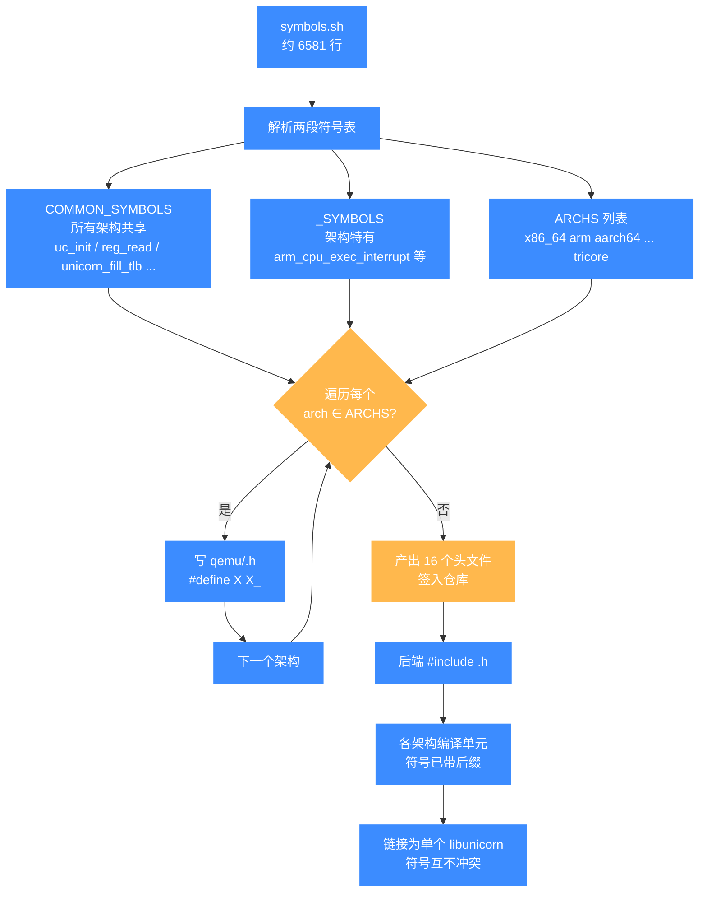
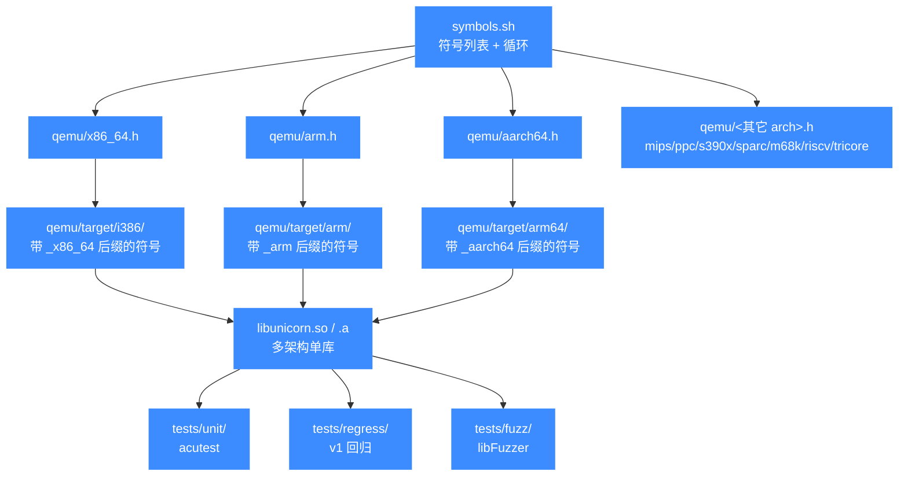

# 符号后缀脚本 symbols.sh

本页介绍仓库根目录下的 `symbols.sh`——一个为每个架构生成 `qemu/<arch>.h` 头文件的脚本，通过把符号重定义为带架构后缀的形式，使多个 QEMU 后端能链接进同一个 `libunicorn` 而不冲突。

## 📌 概述

`symbols.sh` 位于仓库根目录，共 6581 行。它本身**不是**链接阶段的 version script（版本脚本），而是一个**符号后缀重定义生成器**：脚本内逐行列出约 6500 个 QEMU/Unicorn 内部符号，最后遍历 `x86_64`、`arm`、`aarch64`、…、`tricore` 等所有架构，为每个架构输出 `qemu/<arch>.h`，文件内容形如：

```c
/* Autogen header for Unicorn Engine - DONOT MODIFY */
#ifndef UNICORN_AUTOGEN_x86_64_H
#define UNICORN_AUTOGEN_x86_64_H
#ifndef UNICORN_ARCH_POSTFIX
#define UNICORN_ARCH_POSTFIX _x86_64
#endif
#define gen_helper_check_exit_request gen_helper_check_exit_request_x86_64
#define unicorn_fill_tlb unicorn_fill_tlb_x86_64
#define reg_read reg_read_x86_64
#define uc_init uc_init_x86_64
...
#endif
```

这样，在每个架构后端的编译单元里 `#include "qemu/x86_64.h"` 之后，所有 `reg_read`、`uc_init`、`unicorn_fill_tlb` 等符号都会被宏改写成带 `_<arch>` 后缀的版本。Unicorn 因此能把多个架构各自编译为独立的目标集，再链接成**同一个** `libunicorn`，符号彼此隔离、互不冲突。这正是 `uc_struct` 里那批函数指针能跨架构共存的底层前提。

## 📁 关键文件与产物

| 路径 | 类型 | 用途 |
|------|------|------|
| [`symbols.sh`](https://github.com/android-security-engineer/unicorn-skills/blob/master/symbols.sh) | Shell | 仓库根的符号后缀生成脚本，约 6581 行；逐行列出需要加架构后缀的符号，末尾循环生成各架构头文件 |
| `COMMON_SYMBOLS`（脚本内变量） | 符号列表 | 所有架构共享的符号，如 `uc_init`、`reg_read`、`reg_write`、`unicorn_fill_tlb`、`tb_invalidate_phys_range`、`memory_map`、`cpu_physical_memory_rw` 等 |
| `<arch>_SYMBOLS`（脚本内变量） | 符号列表 | 每个架构特有的符号，如 `arm_SYMBOLS`（`arm_cpu_exec_interrupt`、`a15_l2ctlr_read`…）、`aarch64_SYMBOLS`、`m68k_SYMBOLS`、`tricore_SYMBOLS` 等 |
| `ARCHS`（脚本内变量） | 字符串 | 待生成的架构列表：`x86_64 arm aarch64 riscv32 riscv64 mips mipsel mips64 mips64el sparc sparc64 m68k ppc ppc64 s390x tricore` |
| [`qemu/<arch>.h`](https://github.com/android-security-engineer/unicorn-skills/blob/master/qemu/x86_64.h) | 头文件（生成） | 脚本产物，每个架构一个，如 `qemu/x86_64.h`、`qemu/aarch64.h`、`qemu/tricore.h`；文件头标注 `DONOT MODIFY` |
| [`qemu/unicorn_common.h`](https://github.com/android-security-engineer/unicorn-skills/blob/master/qemu/unicorn_common.h) | 头文件（手写） | 各架构共用的公共头，与生成的 `<arch>.h` 配合 |

::: details 为什么不是 version script
常见误解是把 `symbols.sh` 当作 `ld --version-script` 用的导出白名单。实际上它生成的头文件里没有任何 `global:` / `local:` 段，全是 `#define X X_<arch>`。它的职责是**编译期符号隔离**（让多架构共存于一个库），而非链接期 ABI 裁剪。动态库的可见性控制由 CMakeLists 里的链接选项单独处理。
:::

## 💻 用法

`symbols.sh` 是手动触发的脚本，CMake 主构建流程**不会**自动调用它。当符号列表需要更新（例如新增了一个 helper、或引入了新架构）时，开发者手动执行：

```bash
# 在仓库根目录执行
sh symbols.sh
```

脚本会读取自身的 `COMMON_SYMBOLS` 与各 `<arch>_SYMBOLS` 段，遍历 `$ARCHS`，为每个架构在 `qemu/` 下（重新）生成 `<arch>.h`：

```bash
Generating header for x86_64
Generating header for arm
Generating header for aarch64
...
Generating header for tricore
```

::: warning 注意
生成的 `qemu/<arch>.h` 文件头明确写着 `DONOT MODIFY`。任何要新增/调整符号的改动都应回到 `symbols.sh` 里编辑对应的 `*_SYMBOLS` 段，再重跑脚本，而不是直接改头文件。
:::

::: tip
新增架构支持时的典型顺序：先在 `symbols.sh` 的 `ARCHS` 列表里加入新架构名，按需补一个 `<arch>_SYMBOLS` 段，跑一次 `sh symbols.sh` 生成 `qemu/<arch>.h`，再让 `qemu/target/<arch>/` 里的源文件 include 它。详见 [添加新架构](/internals/build-system)。
:::

## 🔧 实现

### 脚本结构

`symbols.sh` 的逻辑分两段：

1. **符号列表段**（约第 6 行到第 6540 行）：用反斜杠续行的字符串形式，依次定义 `COMMON_SYMBOLS` 与各架构的 `<arch>_SYMBOLS`。每行一个符号名，形如 `arm_cpu_exec_interrupt \`。这是脚本体量的主体——6500 余行几乎全是符号枚举。

```bash
COMMON_SYMBOLS="
gen_helper_check_exit_request \
unicorn_fill_tlb \
reg_read \
reg_write \
uc_init \
...
"

arm_SYMBOLS="
arm_cpu_exec_interrupt \
arm_cpu_update_virq \
arm_cpu_initfn \
...
"
```

2. **生成段**（约第 6555 行起）：定义 `ARCHS` 后，对每个架构循环：写出头文件头注释与 include guard，`#define UNICORN_ARCH_POSTFIX _<arch>`，然后遍历 `COMMON_SYMBOLS` 与该架构的 `<arch>_SYMBOLS`，各产出一行 `#define $loop ${loop}_${arch}`，最后写 `#endif`。

```bash
ARCHS="x86_64 arm aarch64 riscv32 riscv64 mips mipsel mips64 mips64el sparc sparc64 m68k ppc ppc64 s390x tricore"

for arch in $ARCHS; do
    echo "/* Autogen header for Unicorn Engine - DONOT MODIFY */" > $SOURCE_DIR/qemu/$arch.h
    echo "#ifndef UNICORN_AUTOGEN_${arch}_H" >> $SOURCE_DIR/qemu/$arch.h
    ...
    for loop in $COMMON_SYMBOLS; do
        echo "#define $loop ${loop}_${arch}" >> $SOURCE_DIR/qemu/$arch.h
    done

    ARCH_SYMBOLS=$(eval echo '$'"${arch}_SYMBOLS")
    for loop in $ARCH_SYMBOLS; do
        echo "#define $loop ${loop}_${arch}" >> $SOURCE_DIR/qemu/$arch.h
    done
    echo "#endif" >> $SOURCE_DIR/qemu/$arch.h
done
```

### 为什么需要符号后缀

Unicorn 把 `x86`、`arm`、`aarch64`、`mips`、`ppc`、`s390x`、`sparc`、`m68k`、`riscv`、`tricore` 等多个 QEMU target 编译进同一个 `libunicorn`。这些 target 共享大量同名符号——`cpu_exec`、`tb_find_slow`、`reg_read`、`memory_map`——若直接链接会全部冲突。`symbols.sh` 通过宏把每个 target 的符号改写成 `xxx_<arch>`，在编译期完成隔离，链接期便各自独立。`UNICORN_ARCH_POSTFIX` 宏则供需要"知道自己当前架构后缀"的公共代码使用。

::: details 与 uc_struct 函数指针的关系
`uc_open()` 选择的 `uc_init_<arch>`（如 `uc_init_arm`、`uc_init_x86_64`）正是被 `symbols.sh` 加了后缀的符号之一。后端在 `uc_init_<arch>` 里填充 `uc_struct` 的 `reg_read`、`reg_write`、`gen_tb`、`set_tlb` 等函数指针——填的是本架构后缀版本的具体实现，于是上层架构中立的 API 通过一次间接调用完成分发。详见 [核心分发模型](/internals/uc-dispatch) 与 [uc_struct](/internals/uc-struct)。
:::

## 📊 符号后缀生成流水线

下图把 `sh symbols.sh` 一次执行的数据流拆开：脚本先吃进自身的 `COMMON_SYMBOLS` 与各 `<arch>_SYMBOLS` 两段，再遍历 `ARCHS` 列表，为每个架构产出一个 `qemu/<arch>.h`，里面把每个符号宏改写成带 `_<arch>` 后缀的版本。这些头在后端编译期被 include，从而让多架构能在链接期共存于单库。



关键点在于这是**编译期**符号隔离而非链接期 ABI 裁剪：宏在预处理阶段就把 `reg_read` 改写成 `reg_read_x86_64`，于是 x86 后端的目标文件里根本没有裸名 `reg_read`，链接时也就不可能与 arm 后端的同名符号撞车。`uc_struct` 函数指针填入的正是这些带后缀的具体实现，详见 [核心分发模型](/internals/uc-dispatch)。

## 📖 与主构建/测试流程的关系



`symbols.sh` 是构建链路里**最上游**的一环：它产出的 `qemu/<arch>.h` 在每个架构后端编译时被 include，决定符号的最终名称；这些目标文件再被链接为 `libunicorn`，供 `tests/unit`、`tests/regress`、`tests/fuzz` 共同验证。脚本本身不被 CMake 自动调用，只在符号集合变动时手动重跑并提交生成的头文件。

## ⚠️ 注意

- `symbols.sh` 实际行数约 **6581**（符号续行约 6500 处），并非传言中的"13 万行"；请以源码 `wc -l` 为准。
- 生成的 `qemu/<arch>.h` 是**签入仓库**的产物（而非 CI 现场生成），日常构建不需要跑脚本；只有改了符号列表才需重跑并提交。
- `COMMON_SYMBOLS` 里也包含一些看似架构无关的名字（如 `arm_arch`），因为它们会在多个 target 的公共路径里被引用，统一加后缀可避免在单库里撞名。
- 修改 `symbols.sh` 后务必本地 `sh symbols.sh` 重新生成全部 `qemu/<arch>.h` 并一并提交，否则其它架构在编译时会出现符号未定义或重复定义。

## 📂 相关源码

| 文件 | 角色 |
|------|------|
| [`symbols.sh`](https://github.com/android-security-engineer/unicorn-skills/blob/master/symbols.sh) | 符号后缀生成脚本（约 6581 行） |
| [`qemu/x86_64.h`](https://github.com/android-security-engineer/unicorn-skills/blob/master/qemu/x86_64.h) | 生成产物示例：x86_64 架构符号重定义头 |
| [`qemu/unicorn_common.h`](https://github.com/android-security-engineer/unicorn-skills/blob/master/qemu/unicorn_common.h) | 各架构共用的手写公共头 |
| [`qemu/target/`](https://github.com/android-security-engineer/unicorn-skills/blob/master/qemu/target) | 各架构后端源码，include 生成的 `<arch>.h` |
| [`CMakeLists.txt`](https://github.com/android-security-engineer/unicorn-skills/blob/master/CMakeLists.txt) | 主构建规则，决定多架构如何链接为单库 |

## 相关页面

- [构建系统与 CMake 选项](/internals/build-system)
- [核心分发模型 uc.c](/internals/uc-dispatch)
- [uc_struct 与函数指针](/internals/uc-struct)
- [测试体系总览](/guide/testing)
- [回归与辅助测试设施](/dev/regress)
