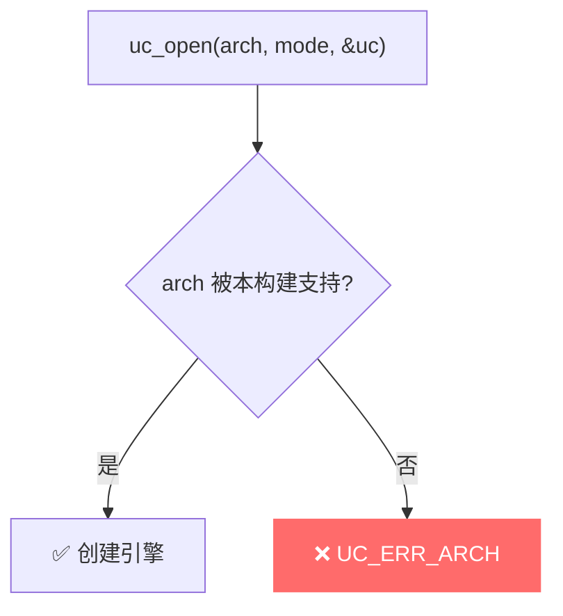
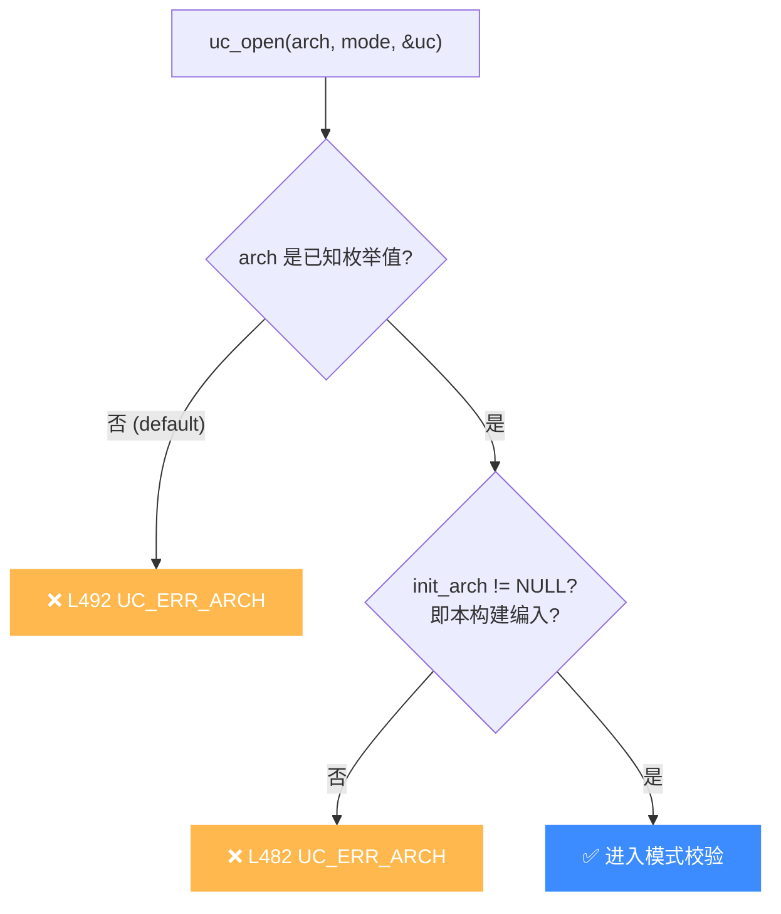

# UC_ERR_ARCH — 不支持的架构

本页讲清 `UC_ERR_ARCH` 的触发原因：`uc_open` 时传入的架构未被当前 Unicorn 构建支持。

## 🧠 含义

头文件注释：`Unsupported architecture: uc_open()`。 枚举定义见 [`unicorn.h#L167`](https://github.com/android-security-engineer/unicorn-skills/blob/master/include/unicorn/unicorn.h#L167)。表示你传给 `uc_open` 的 `uc_arch` 值，在当前编译出的 Unicorn 库中**没有编入支持**。

## 🎯 触发场景

- 传入了当前构建未启用的架构（Unicorn 可按需裁剪只编译部分架构）。
- 传入了非法的 `uc_arch` 枚举值（越界的整数）。
- 用错了枚举，比如把 `uc_mode` 的值误当作 `uc_arch` 传入。



## 🧪 复现/处理示例

```c
uc_engine *uc;
uc_err err = uc_open(UC_ARCH_ARM64, UC_MODE_ARM, &uc);
if (err == UC_ERR_ARCH) {
    printf("本构建不支持该架构: %s\n", uc_strerror(err));
    return 1;
}
// 运行时可先用 uc_arch_supported 探测
if (!uc_arch_supported(UC_ARCH_RISCV)) {
    printf("RISCV 未编入\n");
}
```

## ⚠️ 触发时机

`uc_open` 在两处返回 `UC_ERR_ARCH`（见 `uc.c`）：

- [`uc.c` L482](https://github.com/android-security-engineer/unicorn-skills/blob/master/uc.c#L482)：所选架构对应的 `uc->init_arch` 函数指针为 `NULL`——即该架构未编入当前构建（`UNICORN_ARCH` 裁剪掉了）。
- [`uc.c` L492](https://github.com/android-security-engineer/unicorn-skills/blob/master/uc.c#L492)：`uc_open` 顶层 switch 的 `default` 分支——传入的 `uc_arch` 值根本不在已知枚举范围内。



## 💻 典型场景

::: warning 常见错误
用 `-DUNICORN_ARCH="x86"` 裁剪构建，却尝试打开 ARM：
```c
// ❌ 该构建未编入 ARM，init_arch 为 NULL
uc_open(UC_ARCH_ARM, UC_MODE_ARM, &uc); // → UC_ERR_ARCH
```
:::

```c
// ✅ 正确：先探测再打开
if (uc_arch_supported(UC_ARCH_ARM)) {
    uc_open(UC_ARCH_ARM, UC_MODE_ARM, &uc);
}
```

## 🔧 排查思路

1. 调用前用 [uc_arch_supported](/api/arch-supported) 探测目标架构是否编入。
2. 确认构建配置：`UNICORN_ARCH` 是否包含目标架构（见 `CMakeLists.txt`）。
3. 核对 `uc_open` 第一参数确为 `UC_ARCH_*`，别误传 `UC_MODE_*` 或裸整数。
4. 发行包默认含全部主流架构；自编/裁剪构建最易踩此坑。

## 📂 相关源码

| 文件 | 角色 |
|------|------|
| [`uc.c`](https://github.com/android-security-engineer/unicorn-skills/blob/master/uc.c#L482) | [L482](https://github.com/android-security-engineer/unicorn-skills/blob/master/uc.c#L482) `uc_open` 校验架构、[L492](https://github.com/android-security-engineer/unicorn-skills/blob/master/uc.c#L492) 架构 switch 默认分支 |

## 相关页面

- [错误码总览](/errors/)
- [uc_open — 创建引擎](/api/open)
- [uc_arch_supported — 探测架构支持](/api/arch-supported)
- [UC_ERR_MODE — 无效模式](/errors/mode)
