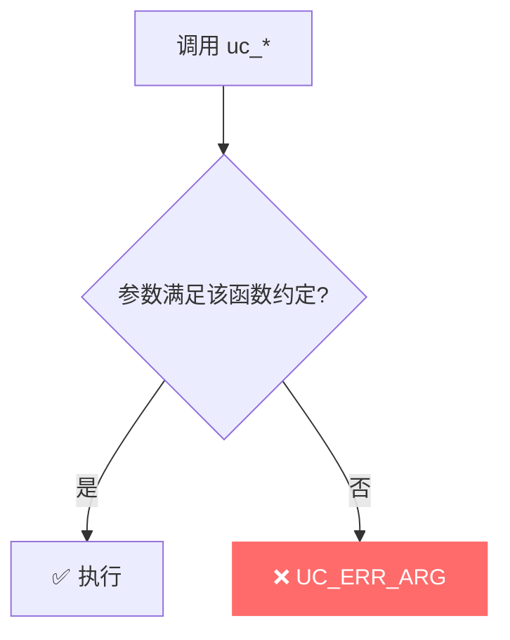

# UC_ERR_ARG — 参数非法

本页讲清 `UC_ERR_ARG` 的成因：传给某个 `uc_*` 函数的参数不合法，需查该函数各自的 API 约定。

## 🧠 含义

头文件注释：`Invalid argument provided to uc_xxx function (See specific function API)`。 枚举定义见 [`unicorn.h#L187`](https://github.com/android-security-engineer/unicorn-skills/blob/master/include/unicorn/unicorn.h#L187)。这是一个**通用参数错误**，具体哪个参数错，取决于被调函数的文档。

## 🎯 触发场景

`UC_ERR_ARG` 覆盖面广，常见来源：

| API | 典型非法参数 |
|-----|--------------|
| `uc_reg_read` / `uc_reg_write` | 寄存器编号非法 |
| `uc_mem_map` / `uc_mem_protect` | 权限位不是 `UC_PROT_READ/WRITE/EXEC` 组合 |
| `uc_mem_map` | 地址未 4KB 对齐、大小非 4KB 倍数（见头文件注释） |
| `uc_emu_start` | 参数组合非法 |
| `uc_ctl` | 控制类型/变参不匹配 |



## 🧪 复现/处理示例

```c
// 头文件明确：uc_mem_map 地址须 4KB 对齐、大小须 4KB 倍数、
// 权限须为 UC_PROT_READ/WRITE/EXEC 组合，否则返回 UC_ERR_ARG
uc_err err = uc_mem_map(uc, 0x1000, 0x1000, 0x99);  // 非法权限位
if (err == UC_ERR_ARG)
    printf("参数非法: %s\n", uc_strerror(err));

// 正确
err = uc_mem_map(uc, 0x1000, 0x1000, UC_PROT_READ | UC_PROT_WRITE);
```

::: tip 排查建议
- 逐一对照**被调函数**的 API 文档核对每个参数（这是通用错误，需按上下文定位）。
- 权限位只能是 `UC_PROT_READ` / `UC_PROT_WRITE` / `UC_PROT_EXEC` 的按位或（或 `UC_PROT_ALL`/`UC_PROT_NONE`）。
- 寄存器编号用对应架构头文件里的 `UC_<ARCH>_REG_*` 常量。
- 映射对齐问题也可能表现为 [UC_ERR_MAP](/errors/map)，注意区分。
:::

## 📂 相关源码

| 文件 | 角色 |
|------|------|
| [`uc.c`](https://github.com/android-security-engineer/unicorn-skills/blob/master/uc.c#L788) | [L788](https://github.com/android-security-engineer/unicorn-skills/blob/master/uc.c#L788) 通用参数校验、[L794](https://github.com/android-security-engineer/unicorn-skills/blob/master/uc.c#L794) 参数非法 |

## 相关页面

- [错误码总览](/errors/)
- [uc_mem_map — 映射内存](/api/mem-map)
- [uc_reg_write — 写寄存器](/api/reg-write)
- [UC_ERR_MAP — 映射参数非法](/errors/map)
