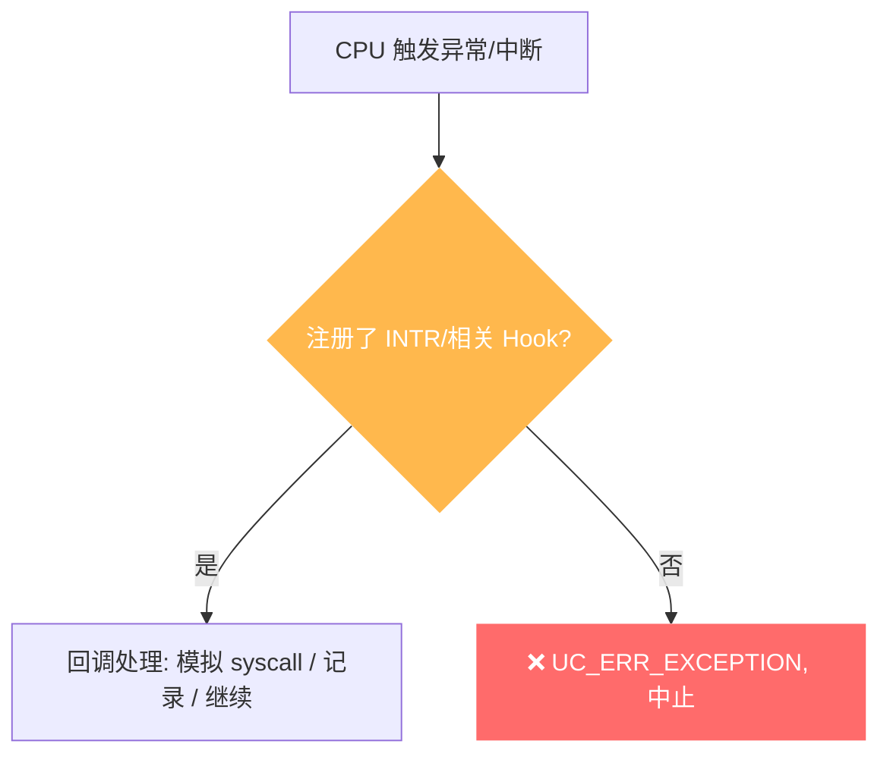

# UC_ERR_EXCEPTION — 未处理的 CPU 异常

本页讲清 `UC_ERR_EXCEPTION` 的成因：仿真中发生了一次 CPU 异常/中断，但没有 Hook 去处理它。

## 🧠 含义

头文件注释：`Unhandled CPU exception`。 枚举定义见 [`unicorn.h#L194`](https://github.com/android-security-engineer/unicorn-skills/blob/master/include/unicorn/unicorn.h#L194)。被仿真 CPU 触发了异常（系统调用、软/硬中断、除零、非法访问等），而你没有注册 [UC_HOOK_INTR](/hooks/intr) 之类的 Hook 接管，引擎便以此错误中止。

## 🎯 触发场景

| 来源 | 说明 |
|------|------|
| 系统调用 | x86 `syscall`/`int 0x80`、ARM `svc` 等，未 Hook 就成为未处理异常 |
| 软中断 | `int N`、断点 `int3` 等 |
| CPU 故障 | 除零、非法操作等硬件异常 |

::: tip syscall 要靠 Hook 接管
仿真里没有真实内核，`syscall`/`svc` 会作为异常抛出。必须用 [UC_HOOK_INTR](/hooks/intr)（或 x86 的 `UC_HOOK_INSN` + `UC_X86_INS_SYSCALL`）自己实现系统调用语义，否则得到 `UC_ERR_EXCEPTION`。
:::



## 🧪 复现/处理示例

```c
// 用中断 Hook 接管 syscall，避免 UC_ERR_EXCEPTION
static void on_intr(uc_engine *uc, uint32_t intno, void *ud) {
    printf("intr #%u\n", intno);
    // 在此读寄存器、模拟系统调用效果、写回返回值
}
uc_hook h;
uc_hook_add(uc, &h, UC_HOOK_INTR, on_intr, NULL, 1, 0);

uc_err err = uc_emu_start(uc, code, code_end, 0, 0);
if (err == UC_ERR_EXCEPTION)
    printf("未处理 CPU 异常: %s\n", uc_strerror(err));
```

::: tip 排查建议
- 若代码含系统调用/中断，务必注册 [UC_HOOK_INTR](/hooks/intr) 接管。
- x86 的 `syscall` 指令可用 `UC_HOOK_INSN` + `UC_X86_INS_SYSCALL` 精确捕获。
- 除零/非法操作等真实故障，说明被仿真逻辑本身有 bug，结合寄存器与 PC 定位。
:::

## 📂 相关源码

| 文件 | 角色 |
|------|------|
| [`qemu/accel/tcg/cpu-exec.c`](https://github.com/android-security-engineer/unicorn-skills/blob/master/qemu/accel/tcg/cpu-exec.c#L419) | [L419](https://github.com/android-security-engineer/unicorn-skills/blob/master/qemu/accel/tcg/cpu-exec.c#L419) 未处理异常设置 `invalid_error` |
| [`qemu/target/i386/seg_helper.c`](https://github.com/android-security-engineer/unicorn-skills/blob/master/qemu/target/i386/seg_helper.c#L1429) | [L1429](https://github.com/android-security-engineer/unicorn-skills/blob/master/qemu/target/i386/seg_helper.c#L1429) x86 异常未处理返回 |

## 相关页面

- [错误码总览](/errors/)
- [UC_HOOK_INTR — 中断/异常 Hook](/hooks/intr)
- [UC_HOOK_INSN — 指令级 Hook](/hooks/insn)
- [uc_emu_start — 启动仿真](/api/emu-start)
