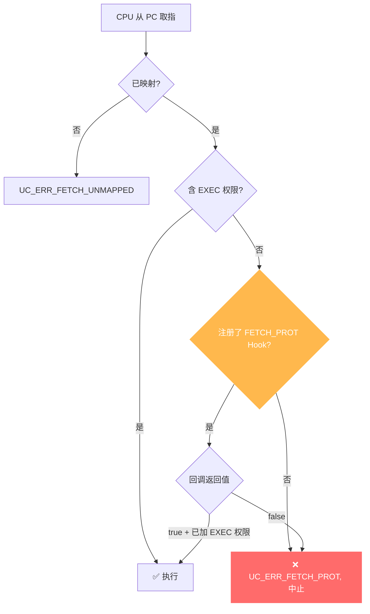

# UC_ERR_FETCH_PROT — 取指保护违规

本页讲清 `UC_ERR_FETCH_PROT` 的成因：CPU 试图从一处**已映射但不含执行权限**的内存取指执行。

## 🧠 含义

头文件注释：`Quit emulation due to UC_MEM_FETCH_PROT violation: uc_emu_start()`。 枚举定义见 [`unicorn.h#L185`](https://github.com/android-security-engineer/unicorn-skills/blob/master/include/unicorn/unicorn.h#L185)。目标页有映射，但权限里没有 `UC_PROT_EXEC`，取指被拒绝，引擎中止。这正是 NX/DEP（不可执行数据）在仿真中的体现。

## 🎯 触发场景

- PC 跳到只读数据段（无 `UC_PROT_EXEC`）执行。
- 代码段映射时漏了 `UC_PROT_EXEC`。
- 控制流被劫持到栈/堆等不可执行区（模拟真实 NX 保护）。

::: warning 与「取指未映射」的区别
`UC_ERR_FETCH_PROT` 是**已映射但无执行权限**；[UC_ERR_FETCH_UNMAPPED](/errors/fetch-unmapped) 是**没有映射**。
:::



## 🧪 复现/处理示例

```c
uc_mem_map(uc, 0x1000, 0x1000, UC_PROT_READ | UC_PROT_WRITE);  // 无 EXEC
uc_mem_write(uc, 0x1000, code, sizeof(code));
// 从 0x1000 执行 -> UC_ERR_FETCH_PROT

static bool on_fp(uc_engine *uc, uc_mem_type t, uint64_t addr,
                  int size, int64_t val, void *ud) {
    uint64_t page = addr & ~0xfffULL;
    if (uc_mem_protect(uc, page, 0x1000, UC_PROT_ALL) != UC_ERR_OK)
        return false;
    return true;
}
uc_hook h;
uc_hook_add(uc, &h, UC_HOOK_MEM_FETCH_PROT, on_fp, NULL, 1, 0);
```

::: tip 排查建议
- 代码段映射务必带 `UC_PROT_EXEC`（或用 `UC_PROT_ALL`）。
- 若在研究 NX 绕过/ROP，`UC_ERR_FETCH_PROT` 恰是预期信号。
- 用 [UC_HOOK_MEM_FETCH_PROT](/hooks/mem-fetch-prot) 拦截并按需加执行权限后继续。
:::

## 📂 相关源码

| 文件 | 角色 |
|------|------|
| [`uc.c`](https://github.com/android-security-engineer/unicorn-skills/blob/master/uc.c#L805) | [L805](https://github.com/android-security-engineer/unicorn-skills/blob/master/uc.c#L805) 取指保护违规返回 |

## 相关页面

- [错误码总览](/errors/)
- [UC_HOOK_MEM_FETCH_PROT — 拦截修复](/hooks/mem-fetch-prot)
- [uc_mem_protect — 修改权限](/api/mem-protect)
- [UC_ERR_FETCH_UNMAPPED — 取指未映射](/errors/fetch-unmapped)
