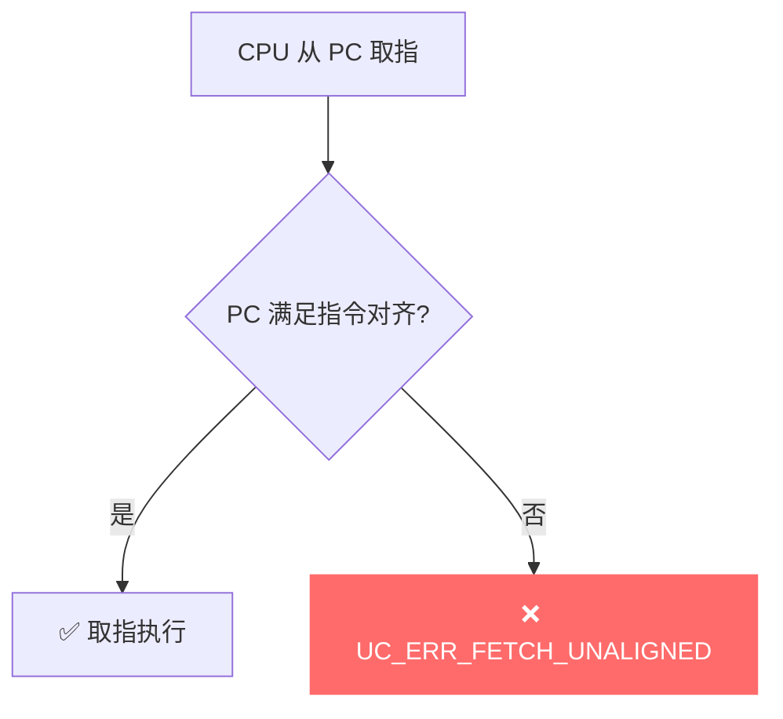
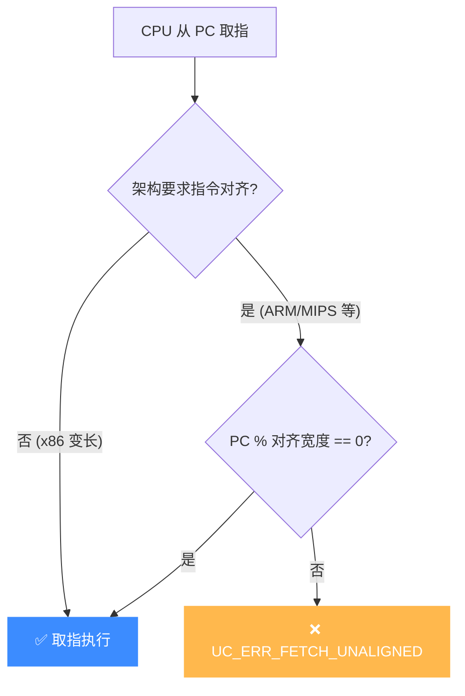

# UC_ERR_FETCH_UNALIGNED — 取指未对齐

本页讲清 `UC_ERR_FETCH_UNALIGNED` 的成因：在要求指令对齐的架构上，PC 指向的取指地址未对齐。

## 🧠 含义

头文件注释：`Unaligned fetch`。 枚举定义见 [`unicorn.h#L191`](https://github.com/android-security-engineer/unicorn-skills/blob/master/include/unicorn/unicorn.h#L191)。多数 RISC 架构要求指令地址对齐（如 ARM 的 4 字节、Thumb 的 2 字节）。当 PC 不满足对齐要求时，取指失败返回此错误。

## 🎯 触发场景

- `uc_emu_start` 的起始地址未按指令对齐（如 ARM 传了奇数地址却非 Thumb 语义）。
- 跳转/返回目标地址未对齐（返回地址被破坏）。
- 混淆了 ARM/Thumb：Thumb 用地址最低位标记，误设置导致对齐判断出错。

| 模式 | 指令对齐 |
|------|----------|
| ARM (A32) | 4 字节 |
| Thumb (T32) | 2 字节 |
| ARM64 (A64) | 4 字节 |



## 🧪 复现/处理示例

```c
// ARM 模式下起始地址未 4 字节对齐
uc_err err = uc_emu_start(uc, 0x1002, 0x1100, 0, 0);
if (err == UC_ERR_FETCH_UNALIGNED)
    printf("非对齐取指: %s\n", uc_strerror(err));

// Thumb 切换靠地址最低位；ARM 代码须 4 字节对齐
err = uc_emu_start(uc, 0x1000, 0x1100, 0, 0);   // 对齐
```

## ⚠️ 触发时机

`UC_ERR_FETCH_UNALIGNED` 目前仅在 [`unicorn.h` L191](https://github.com/android-security-engineer/unicorn-skills/blob/master/include/unicorn/unicorn.h#L191) 枚举中定义，C 核心代码中无显式 `return`/赋值点——多数架构的取指非对齐会被映射为更具体的异常（如 MIPS 归入 `EXCP_AdEL` 即 `UC_ERR_READ_UNALIGNED`）。该码为「PC 取指地址违反指令对齐」这一语义预留，绑定或未来版本可在取指路径抛出。

**各架构指令对齐要求**：

| 架构 / 模式 | 指令对齐 | 说明 |
|-------------|----------|------|
| ARM (A32) | 4 字节 | PC 必须 4 对齐 |
| Thumb (T32) | 2 字节 | bit0 标记 Thumb 语义，不算对齐位 |
| ARM64 (A64) | 4 字节 | 严格 4 对齐 |
| MIPS | 4 字节 | 取指非对齐归入 AdEL |
| x86 | 1 字节 | 变长指令，无对齐要求 |



## 💻 典型场景

::: warning 常见错误
ARM 模式下 `uc_emu_start` 起始地址传了奇数，或返回地址被破坏成非对齐值：
```c
// ❌ ARM (A32) 须 4 对齐，0x1002 非对齐
uc_emu_start(uc, 0x1002, 0x1100, 0, 0);
// ❌ 把 Thumb 的 bit0 当普通地址位传给 ARM 模式
uc_emu_start(uc, 0x1001, 0x1100, 0, 0); // 既非对齐又语义混淆
```
:::

```c
// ✅ 正确：ARM 用 4 对齐起始地址；切换 Thumb 靠目标地址 bit0
uc_emu_start(uc, 0x1000, 0x1100, 0, 0);          // ARM 对齐
uc_emu_start(uc, thumb_target | 1u, end, 0, 0);  // bit0=1 表示进 Thumb
```

## 🔧 排查思路

1. ARM/A64 代码地址按 4 字节对齐；Thumb 按 2 字节。
2. ARM↔Thumb 切换通过目标地址 **bit0**（=1 表示 Thumb），别把它当对齐位。
3. 返回地址错乱常导致取指非对齐：用 [code Hook](/hooks/code) 追踪 PC 与跳转目标。
4. 确认 `uc_emu_start` 的 begin 参数本身已对齐；若是间接跳转目标，检查被仿真代码的分支目标计算。

## 📂 相关源码

| 文件 | 角色 |
|------|------|
| [`include/unicorn/unicorn.h`](https://github.com/android-security-engineer/unicorn-skills/blob/master/include/unicorn/unicorn.h#L191) | [L191](https://github.com/android-security-engineer/unicorn-skills/blob/master/include/unicorn/unicorn.h#L191) `UC_ERR_FETCH_UNALIGNED` 枚举定义（架构对齐检查抛出） |

## 相关页面

- [错误码总览](/errors/)
- [UC_ERR_READ_UNALIGNED — 读未对齐](/errors/read-unaligned)
- [UC_ERR_FETCH_UNMAPPED — 取指未映射](/errors/fetch-unmapped)
- [uc_emu_start — 启动仿真](/api/emu-start)
