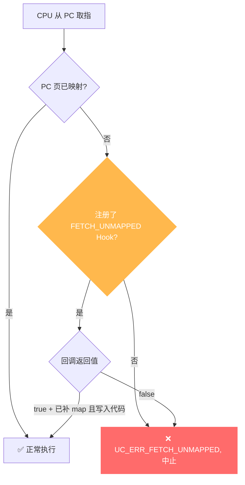

# UC_ERR_FETCH_UNMAPPED — 取指未映射内存

本页讲清 `UC_ERR_FETCH_UNMAPPED` 的成因：CPU 试图从一处未映射地址**取指令执行**；并说明如何用 Hook 补映射后继续。

## 🧠 含义

头文件注释：`Quit emulation due to FETCH on unmapped memory: uc_emu_start()`。 枚举定义见 [`unicorn.h#L175`](https://github.com/android-security-engineer/unicorn-skills/blob/master/include/unicorn/unicorn.h#L175)。仿真的 PC 落到了没有映射的地址，取指失败，引擎中止。

## 🎯 触发场景

- `uc_emu_start` 的起始地址所在页未映射代码。
- 跳转/返回到未映射地址（如 `ret` 时栈上的返回地址是垃圾值）。
- 函数指针错误、跳表越界导致控制流跑飞。



## 🧪 复现/处理示例

```c
// 起始地址未映射代码 -> 立即取指失败
uc_err err = uc_emu_start(uc, 0x400000, 0x400100, 0, 0);
if (err == UC_ERR_FETCH_UNMAPPED)
    printf("取指于未映射地址: %s\n", uc_strerror(err));

// Hook 补映射（注意还需写入可执行代码，否则页是空的）
static bool on_fu(uc_engine *uc, uc_mem_type t, uint64_t addr,
                  int size, int64_t val, void *ud) {
    uint64_t page = addr & ~0xfffULL;
    if (uc_mem_map(uc, page, 0x1000, UC_PROT_READ | UC_PROT_EXEC) != UC_ERR_OK)
        return false;
    // 通常还需 uc_mem_write 把该页的真实指令写进去
    return true;
}
uc_hook h;
uc_hook_add(uc, &h, UC_HOOK_MEM_FETCH_UNMAPPED, on_fu, NULL, 1, 0);
```

::: warning 补映射后要写入代码
取指补映射后，页内容默认为 0；若不 `uc_mem_write` 真实指令，会紧接着触发 [UC_ERR_INSN_INVALID](/errors/insn-invalid) 或执行到全 0。
:::

::: tip 排查建议
- 用 [UC_HOOK_MEM_FETCH_UNMAPPED](/hooks/mem-fetch-unmapped) 拦截，常用于惰性加载代码段。
- 确认 `uc_emu_start` 的 begin 地址已映射 `UC_PROT_EXEC` 并写入指令。
- 控制流跑飞往往是栈/返回地址被破坏，用 [code Hook](/hooks/code) 追踪 PC 变化。
:::

## 📂 相关源码

| 文件 | 角色 |
|------|------|
| [`qemu/accel/tcg/cputlb.c`](https://github.com/android-security-engineer/unicorn-skills/blob/master/qemu/accel/tcg/cputlb.c#L1565) | [L1565](https://github.com/android-security-engineer/unicorn-skills/blob/master/qemu/accel/tcg/cputlb.c#L1565) 取指未映射时设置错误码 |

## 相关页面

- [错误码总览](/errors/)
- [UC_HOOK_MEM_FETCH_UNMAPPED — 拦截修复](/hooks/mem-fetch-unmapped)
- [UC_ERR_INSN_INVALID — 无效指令](/errors/insn-invalid)
- [uc_emu_start — 启动仿真](/api/emu-start)
