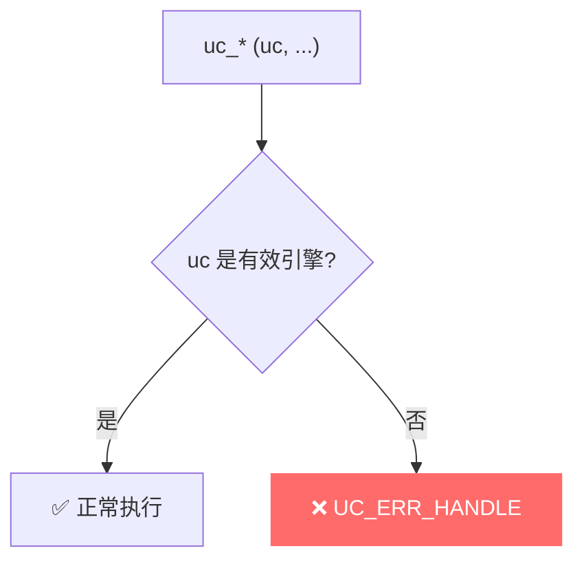
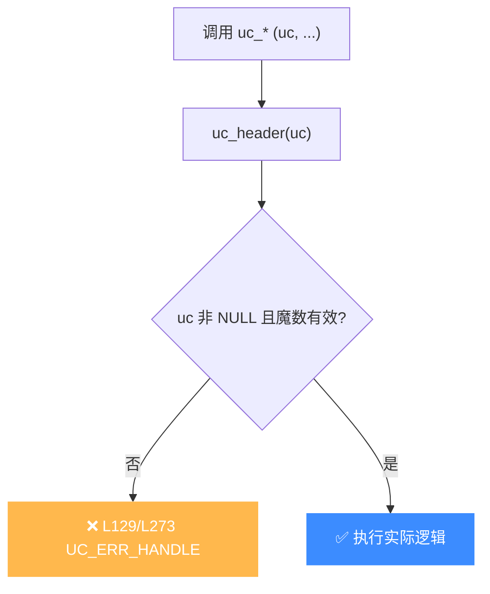

# UC_ERR_HANDLE — 无效句柄

本页讲清 `UC_ERR_HANDLE` 的成因：传给 `uc_*` 函数的 `uc_engine *` 句柄无效。

## 🧠 含义

头文件注释：`Invalid handle`。 枚举定义见 [`unicorn.h#L168`](https://github.com/android-security-engineer/unicorn-skills/blob/master/include/unicorn/unicorn.h#L168)。表示传入的引擎句柄（`uc_engine *uc`）不是一个有效的、由 `uc_open` 创建且尚未 `uc_close` 的对象。

## 🎯 触发场景

| 情形 | 说明 |
|------|------|
| 空指针 | `uc == NULL`（`uc_open` 失败后未检查就使用） |
| 已关闭 | 句柄已被 `uc_close` 释放后继续使用（use-after-free） |
| 野指针 | 未初始化或被覆盖的指针 |
| 类型错误 | 传入了非引擎对象的指针 |



## 🧪 复现/处理示例

```c
uc_engine *uc = NULL;
if (uc_open(UC_ARCH_X86, UC_MODE_64, &uc) != UC_ERR_OK)
    return 1;                 // uc 可能仍为 NULL，必须先判

uc_close(uc);
// 错误：uc 已释放，再用会得到 UC_ERR_HANDLE
uc_err err = uc_mem_map(uc, 0x1000, 0x1000, UC_PROT_ALL);
// err == UC_ERR_HANDLE
uc = NULL;                    // 关闭后立刻置空，避免误用
```

## ⚠️ 触发时机

`uc.c` 中所有公开 API 入口都先走 `uc_header` 校验句柄，无效即返回 `UC_ERR_HANDLE`：

- [`uc.c` L129/L135](https://github.com/android-security-engineer/unicorn-skills/blob/master/uc.c#L129)：`uc_header` 在句柄为 `NULL`、未初始化或魔数不符时返回 `UC_ERR_HANDLE`。
- [`uc.c` L273](https://github.com/android-security-engineer/unicorn-skills/blob/master/uc.c#L273)：API 入口宏统一调用 `uc_header`，任一 `uc_*` 传入坏句柄都先在此拦截。



## 💻 典型场景

::: warning 常见错误
`uc_open` 失败后没判返回值就继续用，句柄仍是 `NULL`：
```c
// ❌ open 可能失败，uc 未被赋值即传入
uc_engine *uc;
uc_open(UC_ARCH_X86, UC_MODE_64, &uc); // 忽略返回值
uc_mem_map(uc, ...);                    // uc == NULL → UC_ERR_HANDLE
```
:::

```c
// ✅ 正确：判返回值 + close 后置空
uc_engine *uc = NULL;
if (uc_open(...) != UC_ERR_OK) return 1;
// ... 使用 ...
uc_close(uc); uc = NULL;
```

## 🔧 排查思路

1. 任何 `uc_*` 报 `UC_ERR_HANDLE`，先用调试器看 `uc` 是否 `NULL`。
2. `uc_open` 失败时 `uc` 未必被赋值——必须判返回值再用句柄。
3. `uc_close` 后立即将句柄置 `NULL`，杜绝 use-after-free。
4. 多线程下确认句柄未被其它线程提前 `uc_close`。

## 📂 相关源码

| 文件 | 角色 |
|------|------|
| [`uc.c`](https://github.com/android-security-engineer/unicorn-skills/blob/master/uc.c#L129) | [L129](https://github.com/android-security-engineer/unicorn-skills/blob/master/uc.c#L129) `uc_header` 校验句柄、[L273](https://github.com/android-security-engineer/unicorn-skills/blob/master/uc.c#L273) API 入口校验句柄 |

## 相关页面

- [错误码总览](/errors/)
- [uc_open — 创建引擎](/api/open)
- [uc_close — 关闭引擎](/api/close)
